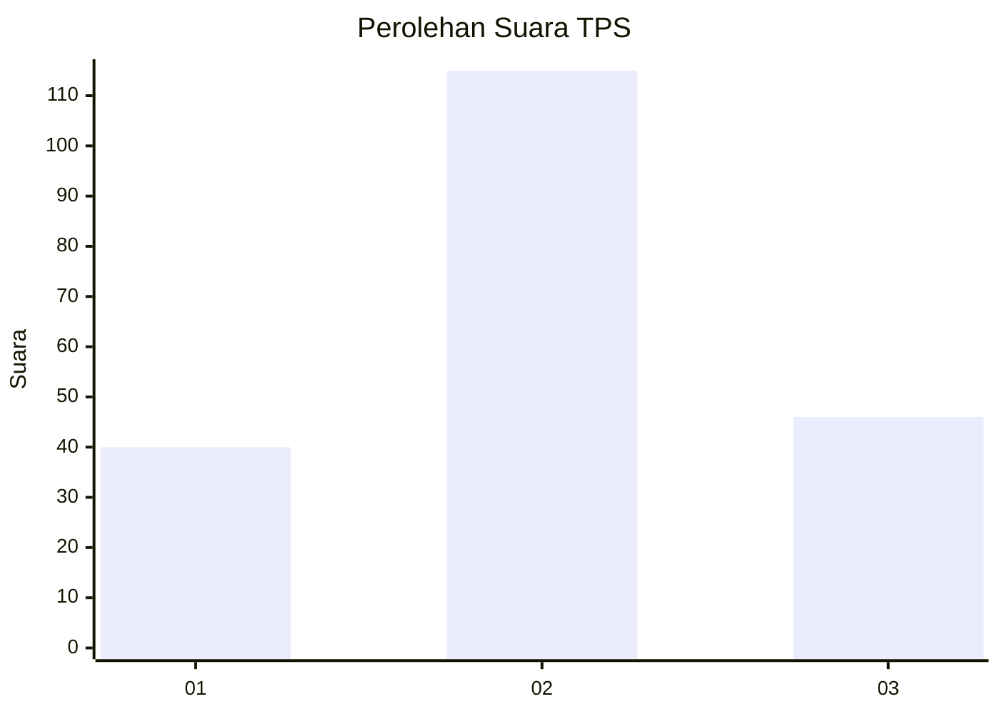
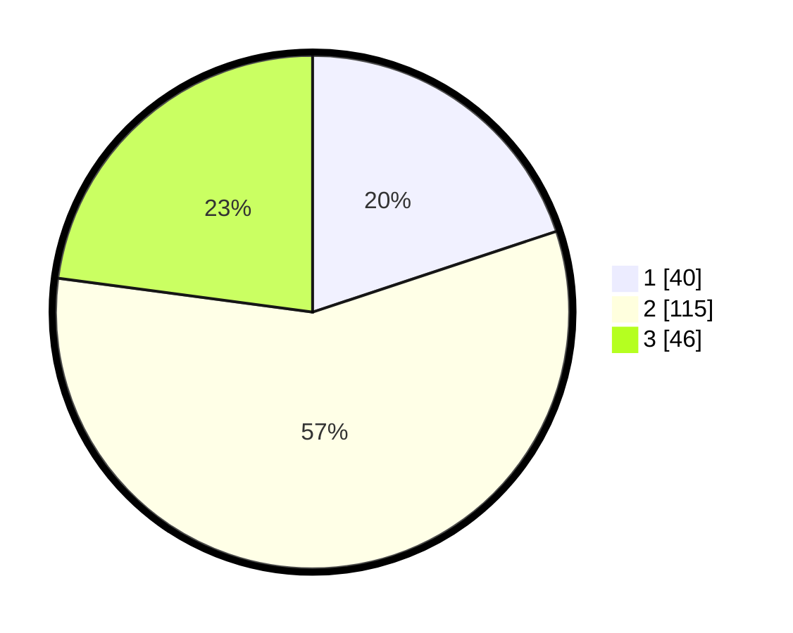

# Hasil

## Grafik

## Tabel

| No. | Nama Paslon    | Suara | Suara (raw) | Persentase |
|:--- |:-------------- | -----:| -----------:| ----------:|
| 1   | ANIES MUHAIMIN | 40    | [40][p-1]   | 19,90      |
| 2   | PRABOWO GIBRAN | 115   | [115][p-2]  | 57,21      |
| 3   | GANJAR MAHFUD  | 46    | [46][p-3]   | 22,89      |

[p-1]: https://github.com/gigit-pemilu/pemilu-2024-51-bali/blob/main/pilpres/hitung-suara/sub/51-bali/sub/03-badung/sub/04-petang/sub/2002-petang/sub/011-tps/sub/paslon-1.txt
[p-2]: https://github.com/gigit-pemilu/pemilu-2024-51-bali/blob/main/pilpres/hitung-suara/sub/51-bali/sub/03-badung/sub/04-petang/sub/2002-petang/sub/011-tps/sub/paslon-2.txt
[p-3]: https://github.com/gigit-pemilu/pemilu-2024-51-bali/blob/main/pilpres/hitung-suara/sub/51-bali/sub/03-badung/sub/04-petang/sub/2002-petang/sub/011-tps/sub/paslon-3.txt

## Foto C Plano

https://sirekap-obj-formc.kpu.go.id/3a48/pemilu/ppwp/51/03/04/20/02/5103042002011-20240215-034549--68488da4-b910-40ca-a372-3c117d89051d.jpg

https://sirekap-obj-formc.kpu.go.id/3a48/pemilu/ppwp/51/03/04/20/02/5103042002011-20240215-034606--3f0e0c2c-d408-4f14-86a7-62e64d7eab7a.jpg

https://sirekap-obj-formc.kpu.go.id/3a48/pemilu/ppwp/51/03/04/20/02/5103042002011-20240215-034635--f7a4cfe0-0b98-4591-ad45-747b866f595f.jpg

## Metadata

| Key        | Value               |
| ---------- | ------------------- |
| Time Stamp | 2024-02-15 12:00:28 |

## DATA PEMILIH TETAP

Jumlah pemilih dalam DPT: **241**.
 * L: **115**.
 * P: **126**.

## DATA PENGGUNA HAK PILIH

Jumlah pengguna hak pilih dalam DPT: **206**.
 * L: **97**.
 * P: **109**.

Jumlah pengguna hak pilih dalam DPTb: **0**.
 * L: **0**.
 * P: **0**.

Jumlah pengguna hak pilih dalam DPK: **0**.
 * L: **0**.
 * P: **0**.

Jumlah pengguna hak pilih: **206**.
 * L: **97**.
 * P: **109**.

## JUMLAH SUARA SAH DAN TIDAK SAH

JUMLAH SELURUH SUARA SAH: **201**.

JUMLAH SUARA TIDAK SAH: **5**.

JUMLAH SELURUH SUARA SAH DAN SUARA TIDAK SAH: **206**.

