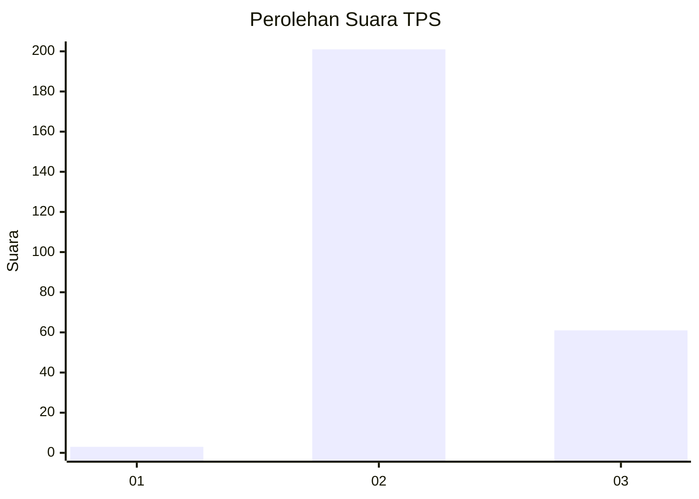
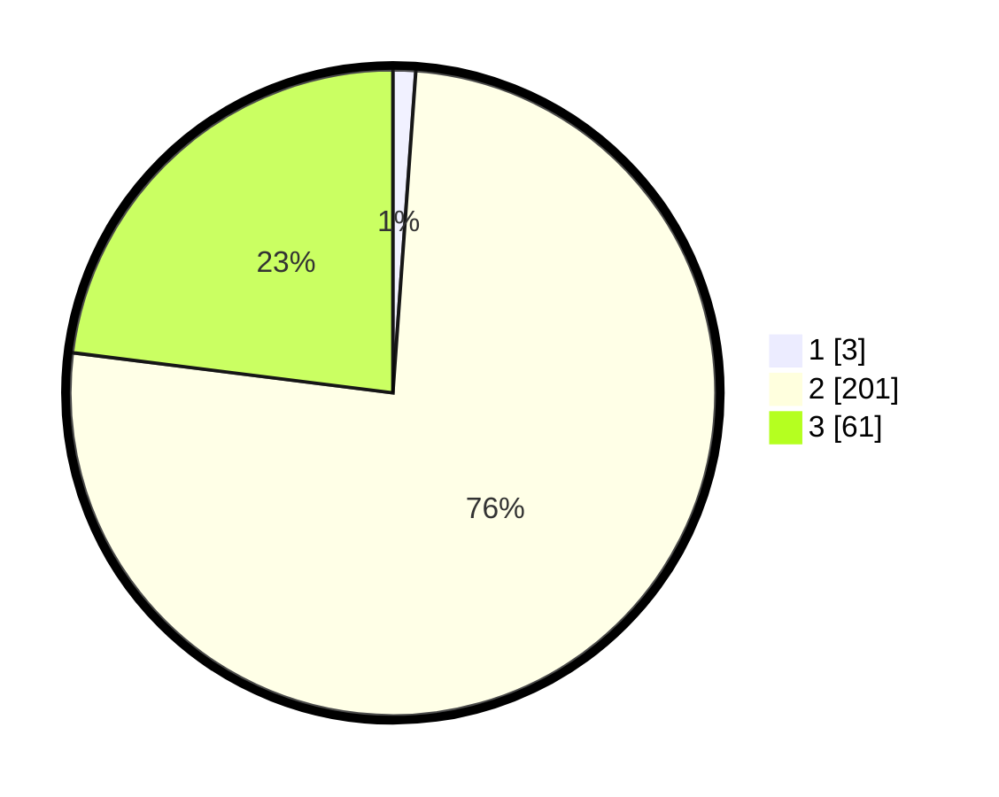

# Hasil

## Grafik

## Tabel

| No. | Nama Paslon    | Suara | Suara (raw) | Persentase |
|:--- |:-------------- | -----:| -----------:| ----------:|
| 1   | ANIES MUHAIMIN | 3     | [3][p-1]    | 1,13       |
| 2   | PRABOWO GIBRAN | 201   | [201][p-2]  | 75,85      |
| 3   | GANJAR MAHFUD  | 61    | [61][p-3]   | 23,02      |

[p-1]: https://github.com/gigit-pemilu/pemilu-2024-51-bali/blob/main/pilpres/hitung-suara/sub/51-bali/sub/03-badung/sub/04-petang/sub/2004-pelaga/sub/004-tps/sub/paslon-1.txt
[p-2]: https://github.com/gigit-pemilu/pemilu-2024-51-bali/blob/main/pilpres/hitung-suara/sub/51-bali/sub/03-badung/sub/04-petang/sub/2004-pelaga/sub/004-tps/sub/paslon-2.txt
[p-3]: https://github.com/gigit-pemilu/pemilu-2024-51-bali/blob/main/pilpres/hitung-suara/sub/51-bali/sub/03-badung/sub/04-petang/sub/2004-pelaga/sub/004-tps/sub/paslon-3.txt

## Foto C Plano

https://sirekap-obj-formc.kpu.go.id/1512/pemilu/ppwp/51/03/04/20/04/5103042004004-20240214-202733--f1b3267b-7616-48c0-a82c-8a195b84de47.jpg

https://sirekap-obj-formc.kpu.go.id/1512/pemilu/ppwp/51/03/04/20/04/5103042004004-20240214-203032--2a099987-3f32-4740-9fdf-12aa9449c1d6.jpg

https://sirekap-obj-formc.kpu.go.id/1512/pemilu/ppwp/51/03/04/20/04/5103042004004-20240214-203250--57c07c2c-bbe6-423c-bd99-33760635dedc.jpg

## Metadata

| Key        | Value               |
| ---------- | ------------------- |
| Time Stamp | 2024-02-24 22:31:28 |

