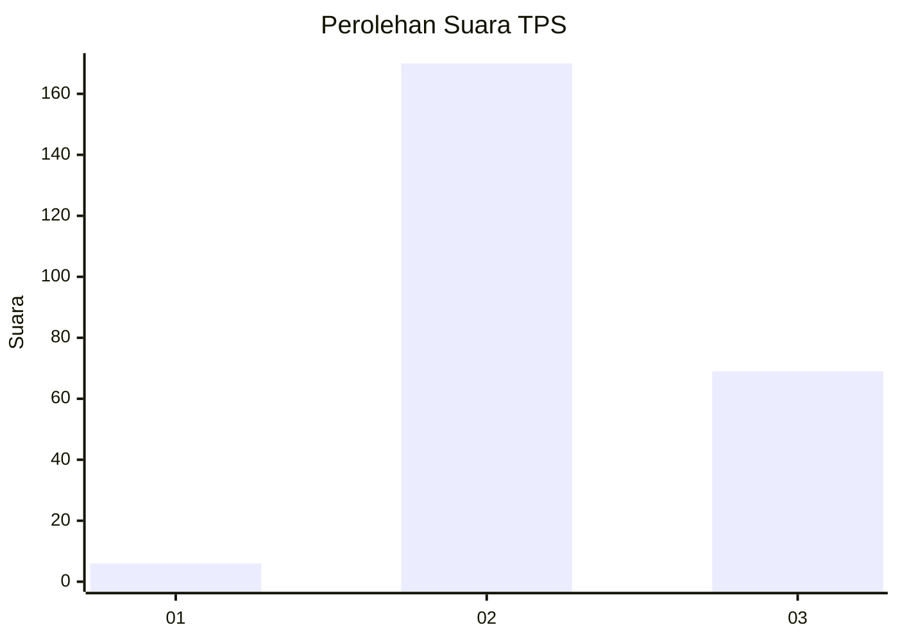
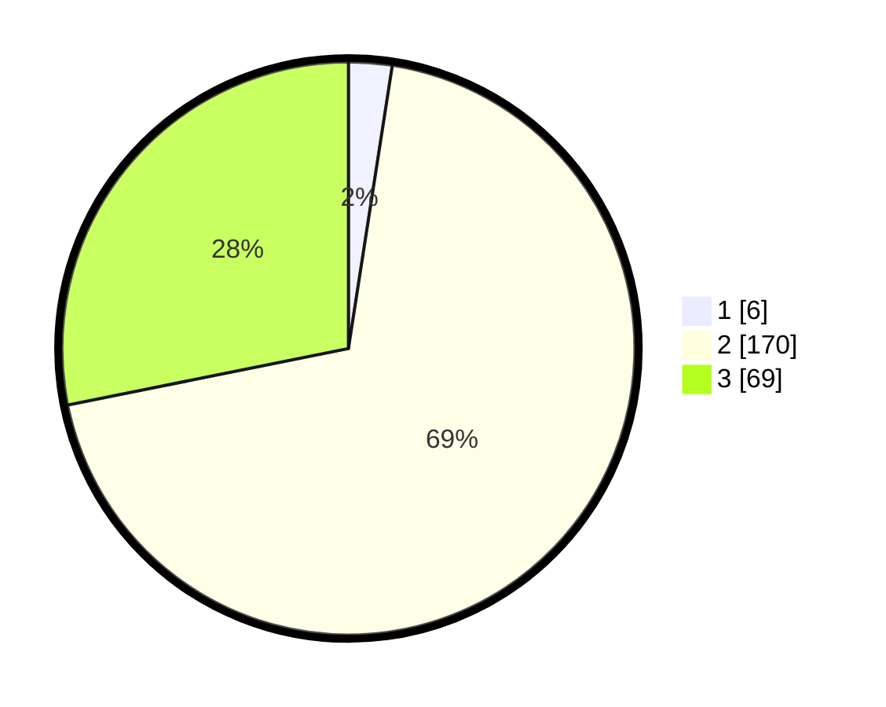

# Hasil

## Grafik

## Tabel

| No. | Nama Paslon    | Suara | Suara (raw) | Persentase |
|:--- |:-------------- | -----:| -----------:| ----------:|
| 1   | ANIES MUHAIMIN | 6     | [6][p-1]    | 2,45       |
| 2   | PRABOWO GIBRAN | 170   | [170][p-2]  | 69,39      |
| 3   | GANJAR MAHFUD  | 69    | [69][p-3]   | 28,16      |

[p-1]: https://github.com/gigit-pemilu/pemilu-2024-51-bali/blob/main/pilpres/hitung-suara/sub/51-bali/sub/03-badung/sub/04-petang/sub/2004-pelaga/sub/005-tps/sub/paslon-1.txt
[p-2]: https://github.com/gigit-pemilu/pemilu-2024-51-bali/blob/main/pilpres/hitung-suara/sub/51-bali/sub/03-badung/sub/04-petang/sub/2004-pelaga/sub/005-tps/sub/paslon-2.txt
[p-3]: https://github.com/gigit-pemilu/pemilu-2024-51-bali/blob/main/pilpres/hitung-suara/sub/51-bali/sub/03-badung/sub/04-petang/sub/2004-pelaga/sub/005-tps/sub/paslon-3.txt

## Foto C Plano

https://sirekap-obj-formc.kpu.go.id/9546/pemilu/ppwp/51/03/04/20/04/5103042004005-20240216-130919--6d145a58-d096-4d32-8a65-8ec43916fe18.jpg

https://sirekap-obj-formc.kpu.go.id/9546/pemilu/ppwp/51/03/04/20/04/5103042004005-20240216-130922--a01cb402-8df1-4c2e-8369-0568d384de1a.jpg

https://sirekap-obj-formc.kpu.go.id/9546/pemilu/ppwp/51/03/04/20/04/5103042004005-20240216-130920--95c2cc63-5105-4e37-b540-94905256711d.jpg

## Metadata

| Key        | Value               |
| ---------- | ------------------- |
| Time Stamp | 2024-02-21 13:00:00 |

## DATA PEMILIH TETAP

Jumlah pemilih dalam DPT: **287**.
 * L: **149**.
 * P: **138**.

## DATA PENGGUNA HAK PILIH

Jumlah pengguna hak pilih dalam DPT: **267**.
 * L: **137**.
 * P: **130**.

Jumlah pengguna hak pilih dalam DPTb: **1**.
 * L: **1**.
 * P: **0**.

Jumlah pengguna hak pilih dalam DPK: **0**.
 * L: **0**.
 * P: **0**.

Jumlah pengguna hak pilih: **268**.
 * L: **138**.
 * P: **130**.

## JUMLAH SUARA SAH DAN TIDAK SAH

JUMLAH SELURUH SUARA SAH: **245**.

JUMLAH SUARA TIDAK SAH: **23**.

JUMLAH SELURUH SUARA SAH DAN SUARA TIDAK SAH: **268**.

