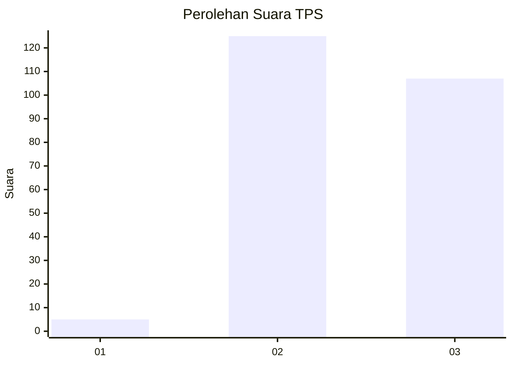
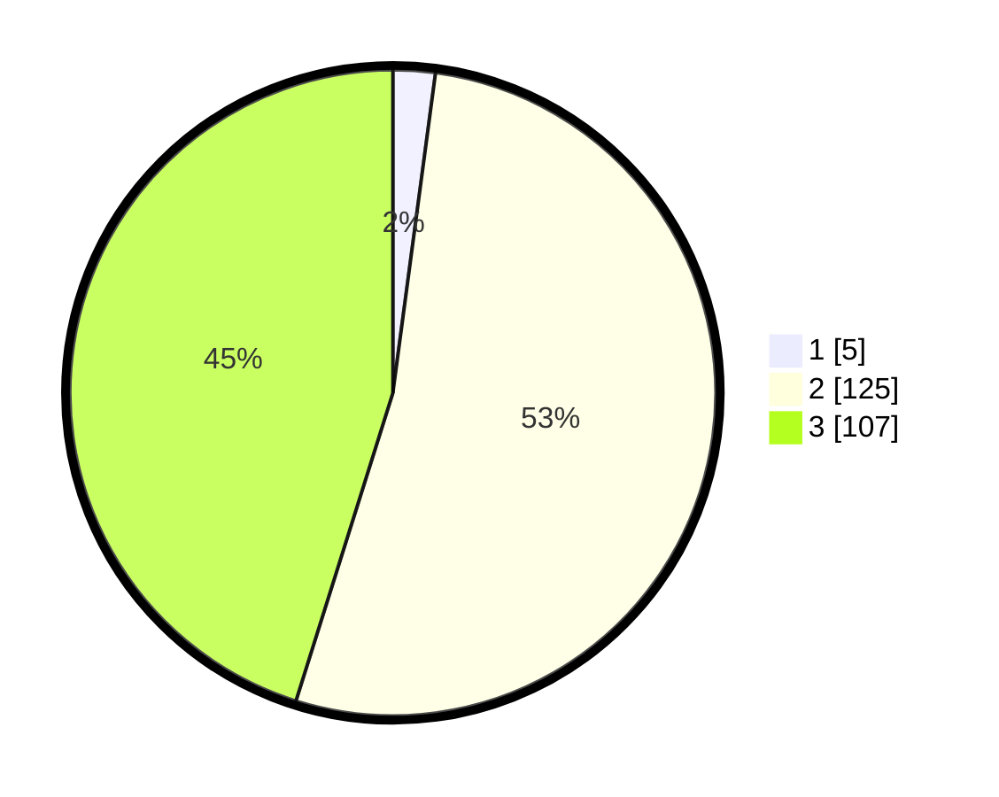

# Hasil

## Grafik

## Tabel

| No. | Nama Paslon    | Suara | Suara (raw) | Persentase |
|:--- |:-------------- | -----:| -----------:| ----------:|
| 1   | ANIES MUHAIMIN | 5     | [5][p-1]    | 2,11       |
| 2   | PRABOWO GIBRAN | 125   | [125][p-2]  | 52,74      |
| 3   | GANJAR MAHFUD  | 107   | [107][p-3]  | 45,15      |

[p-1]: https://github.com/gigit-pemilu/pemilu-2024-51-bali/blob/main/pilpres/hitung-suara/sub/51-bali/sub/03-badung/sub/04-petang/sub/2004-pelaga/sub/007-tps/sub/paslon-1.txt
[p-2]: https://github.com/gigit-pemilu/pemilu-2024-51-bali/blob/main/pilpres/hitung-suara/sub/51-bali/sub/03-badung/sub/04-petang/sub/2004-pelaga/sub/007-tps/sub/paslon-2.txt
[p-3]: https://github.com/gigit-pemilu/pemilu-2024-51-bali/blob/main/pilpres/hitung-suara/sub/51-bali/sub/03-badung/sub/04-petang/sub/2004-pelaga/sub/007-tps/sub/paslon-3.txt

## Foto C Plano

https://sirekap-obj-formc.kpu.go.id/0279/pemilu/ppwp/51/03/04/20/04/5103042004007-20240216-015421--c5245222-c23f-4c48-9a9e-7e00fa630b1e.jpg

https://sirekap-obj-formc.kpu.go.id/0279/pemilu/ppwp/51/03/04/20/04/5103042004007-20240216-015424--cfbe39c0-8895-40b9-b76a-724454c02329.jpg

https://sirekap-obj-formc.kpu.go.id/0279/pemilu/ppwp/51/03/04/20/04/5103042004007-20240216-015422--ff23f58d-1c95-4f11-8441-26efb3c3f876.jpg

## Metadata

| Key        | Value               |
| ---------- | ------------------- |
| Time Stamp | 2024-02-21 12:00:00 |

## DATA PEMILIH TETAP

Jumlah pemilih dalam DPT: **242**.
 * L: **127**.
 * P: **115**.

## DATA PENGGUNA HAK PILIH

Jumlah pengguna hak pilih dalam DPT: **237**.
 * L: **114**.
 * P: **123**.

Jumlah pengguna hak pilih dalam DPTb: **1**.
 * L: **1**.
 * P: **0**.

Jumlah pengguna hak pilih dalam DPK: **3**.
 * L: **2**.
 * P: **1**.

Jumlah pengguna hak pilih: **241**.
 * L: **117**.
 * P: **124**.

## JUMLAH SUARA SAH DAN TIDAK SAH

JUMLAH SELURUH SUARA SAH: **237**.

JUMLAH SUARA TIDAK SAH: **4**.

JUMLAH SELURUH SUARA SAH DAN SUARA TIDAK SAH: **241**.

