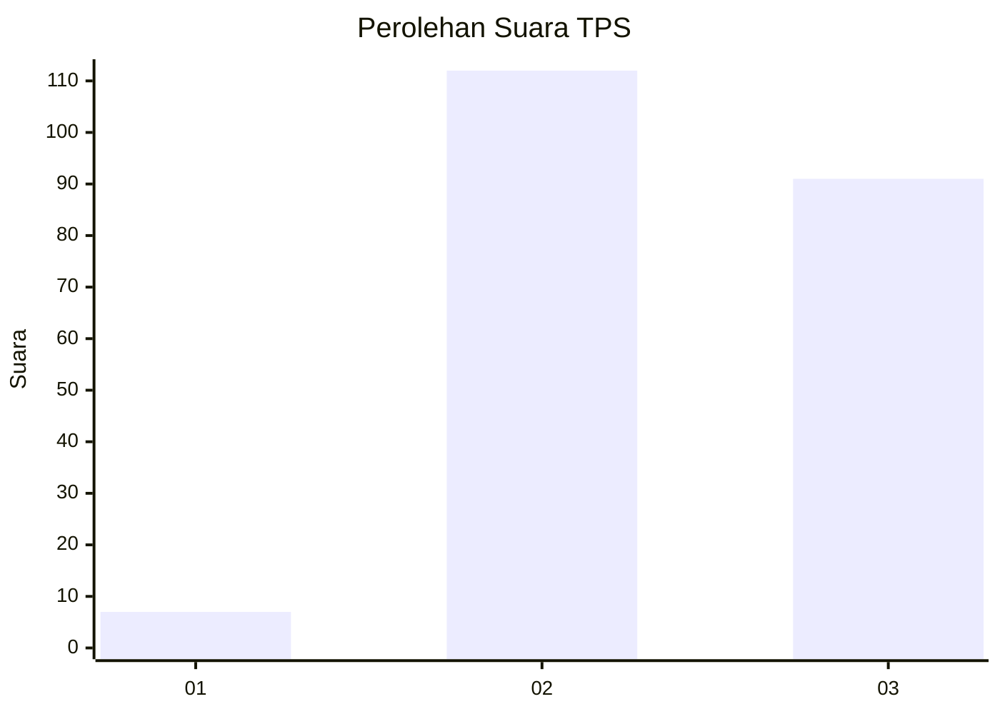
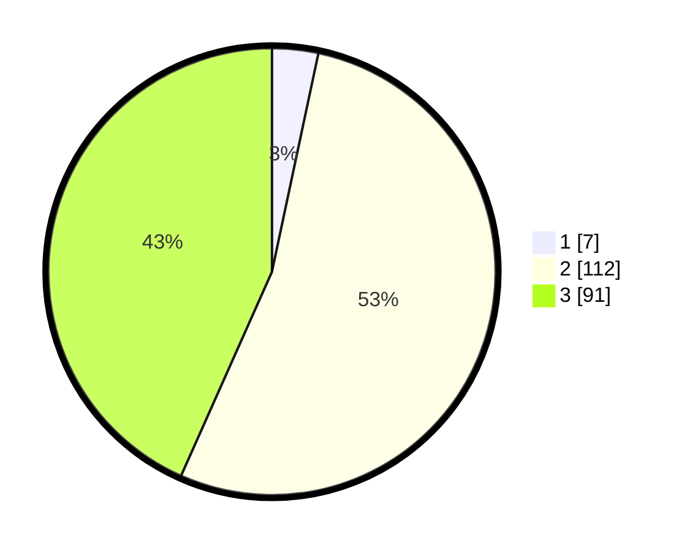

# Hasil

## Grafik

## Tabel

| No. | Nama Paslon    | Suara | Suara (raw) | Persentase |
|:--- |:-------------- | -----:| -----------:| ----------:|
| 1   | ANIES MUHAIMIN | 7     | [7][p-1]    | 3,33       |
| 2   | PRABOWO GIBRAN | 112   | [112][p-2]  | 53,33      |
| 3   | GANJAR MAHFUD  | 91    | [91][p-3]   | 43,33      |

[p-1]: https://github.com/gigit-pemilu/pemilu-2024-51-bali/blob/main/pilpres/hitung-suara/sub/51-bali/sub/03-badung/sub/04-petang/sub/2004-pelaga/sub/010-tps/sub/paslon-1.txt
[p-2]: https://github.com/gigit-pemilu/pemilu-2024-51-bali/blob/main/pilpres/hitung-suara/sub/51-bali/sub/03-badung/sub/04-petang/sub/2004-pelaga/sub/010-tps/sub/paslon-2.txt
[p-3]: https://github.com/gigit-pemilu/pemilu-2024-51-bali/blob/main/pilpres/hitung-suara/sub/51-bali/sub/03-badung/sub/04-petang/sub/2004-pelaga/sub/010-tps/sub/paslon-3.txt

## Foto C Plano

https://sirekap-obj-formc.kpu.go.id/614a/pemilu/ppwp/51/03/04/20/04/5103042004010-20240214-131951--b9264f49-6c68-4970-920d-7d677e40021c.jpg

https://sirekap-obj-formc.kpu.go.id/614a/pemilu/ppwp/51/03/04/20/04/5103042004010-20240214-132129--b4349021-ce21-4476-b86a-6ef04fceffd9.jpg

https://sirekap-obj-formc.kpu.go.id/614a/pemilu/ppwp/51/03/04/20/04/5103042004010-20240214-132200--990673a0-d733-4330-997d-bbdea46d09d3.jpg

## Metadata

| Key        | Value               |
| ---------- | ------------------- |
| Time Stamp | 2024-02-22 16:00:00 |

## DATA PEMILIH TETAP

Jumlah pemilih dalam DPT: **228**.
 * L: **119**.
 * P: **109**.

## DATA PENGGUNA HAK PILIH

Jumlah pengguna hak pilih dalam DPT: **224**.
 * L: **117**.
 * P: **107**.

Jumlah pengguna hak pilih dalam DPTb: **1**.
 * L: **1**.
 * P: **0**.

Jumlah pengguna hak pilih dalam DPK: **0**.
 * L: **0**.
 * P: **0**.

Jumlah pengguna hak pilih: **225**.
 * L: **118**.
 * P: **107**.

## JUMLAH SUARA SAH DAN TIDAK SAH

JUMLAH SELURUH SUARA SAH: **210**.

JUMLAH SUARA TIDAK SAH: **15**.

JUMLAH SELURUH SUARA SAH DAN SUARA TIDAK SAH: **225**.

