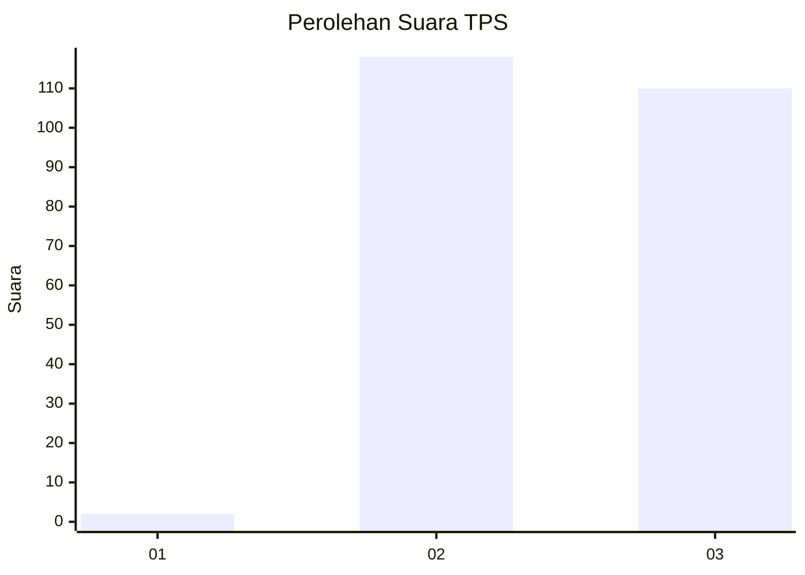
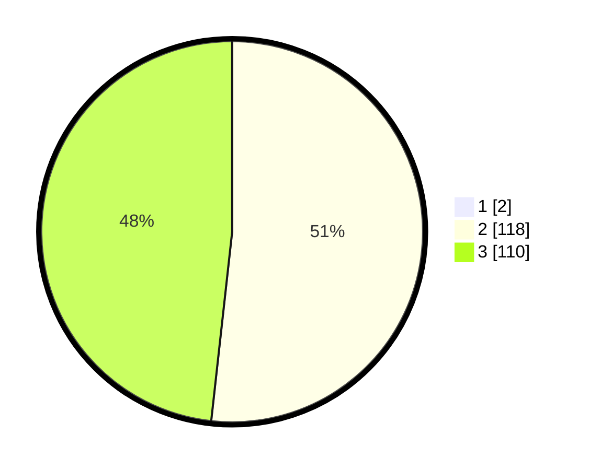

# Hasil

## Grafik

## Tabel

| No. | Nama Paslon    | Suara | Suara (raw) | Persentase |
|:--- |:-------------- | -----:| -----------:| ----------:|
| 1   | ANIES MUHAIMIN | 2     | [2][p-1]    | 0,87       |
| 2   | PRABOWO GIBRAN | 118   | [118][p-2]  | 51,30      |
| 3   | GANJAR MAHFUD  | 110   | [110][p-3]  | 47,83      |

[p-1]: https://github.com/gigit-pemilu/pemilu-2024-51-bali/blob/main/pilpres/hitung-suara/sub/51-bali/sub/03-badung/sub/04-petang/sub/2004-pelaga/sub/014-tps/sub/paslon-1.txt
[p-2]: https://github.com/gigit-pemilu/pemilu-2024-51-bali/blob/main/pilpres/hitung-suara/sub/51-bali/sub/03-badung/sub/04-petang/sub/2004-pelaga/sub/014-tps/sub/paslon-2.txt
[p-3]: https://github.com/gigit-pemilu/pemilu-2024-51-bali/blob/main/pilpres/hitung-suara/sub/51-bali/sub/03-badung/sub/04-petang/sub/2004-pelaga/sub/014-tps/sub/paslon-3.txt

## Foto C Plano

https://sirekap-obj-formc.kpu.go.id/6ac5/pemilu/ppwp/51/03/04/20/04/5103042004014-20240214-190658--0d9a0533-89ec-4719-85a6-6fa6941a6e6e.jpg

https://sirekap-obj-formc.kpu.go.id/6ac5/pemilu/ppwp/51/03/04/20/04/5103042004014-20240214-190708--fe605501-8c3f-44b8-bdc1-ab122dc28b47.jpg

https://sirekap-obj-formc.kpu.go.id/6ac5/pemilu/ppwp/51/03/04/20/04/5103042004014-20240214-190715--20a6e21c-8dae-40db-8b21-b996cd91a26f.jpg

## Metadata

| Key        | Value               |
| ---------- | ------------------- |
| Time Stamp | 2024-02-24 22:31:28 |

