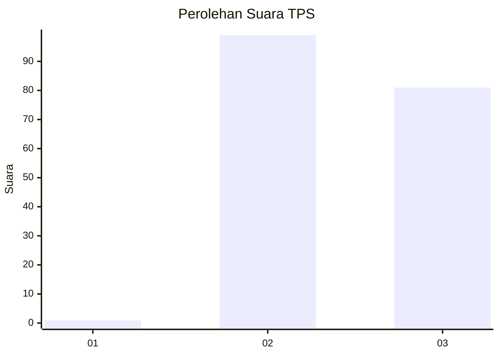
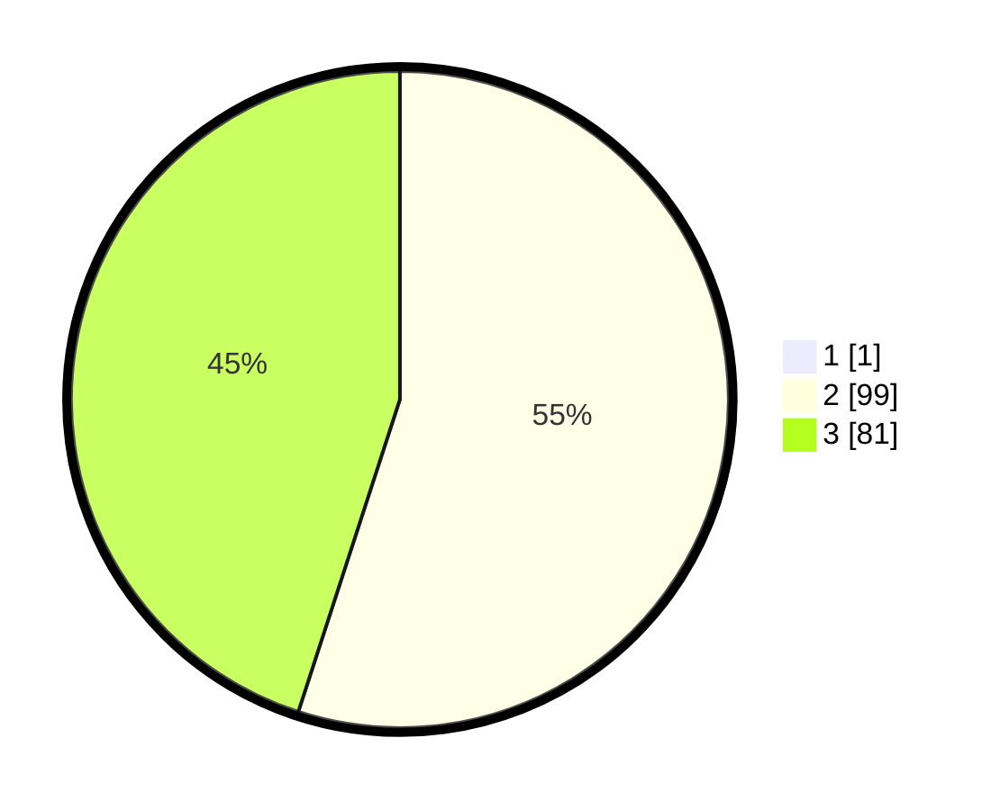

# Hasil

## Grafik

## Tabel

| No. | Nama Paslon    | Suara | Suara (raw) | Persentase |
|:--- |:-------------- | -----:| -----------:| ----------:|
| 1   | ANIES MUHAIMIN | 1     | [1][p-1]    | 0,55       |
| 2   | PRABOWO GIBRAN | 99    | [99][p-2]   | 54,70      |
| 3   | GANJAR MAHFUD  | 81    | [81][p-3]   | 44,75      |

[p-1]: https://github.com/gigit-pemilu/pemilu-2024-51-bali/blob/main/pilpres/hitung-suara/sub/51-bali/sub/03-badung/sub/04-petang/sub/2004-pelaga/sub/020-tps/sub/paslon-1.txt
[p-2]: https://github.com/gigit-pemilu/pemilu-2024-51-bali/blob/main/pilpres/hitung-suara/sub/51-bali/sub/03-badung/sub/04-petang/sub/2004-pelaga/sub/020-tps/sub/paslon-2.txt
[p-3]: https://github.com/gigit-pemilu/pemilu-2024-51-bali/blob/main/pilpres/hitung-suara/sub/51-bali/sub/03-badung/sub/04-petang/sub/2004-pelaga/sub/020-tps/sub/paslon-3.txt

## Foto C Plano

https://sirekap-obj-formc.kpu.go.id/9751/pemilu/ppwp/51/03/04/20/04/5103042004020-20240214-132138--32e966ca-95fb-40d4-8cb6-383476df2b68.jpg

https://sirekap-obj-formc.kpu.go.id/9751/pemilu/ppwp/51/03/04/20/04/5103042004020-20240214-132644--ab6f6202-2ace-414c-b658-6b1ec82fcac8.jpg

https://sirekap-obj-formc.kpu.go.id/9751/pemilu/ppwp/51/03/04/20/04/5103042004020-20240214-132448--f74748d4-aa1b-45ce-83f4-8c2d2d0294ec.jpg

## Metadata

| Key        | Value               |
| ---------- | ------------------- |
| Time Stamp | 2024-02-25 11:00:00 |

