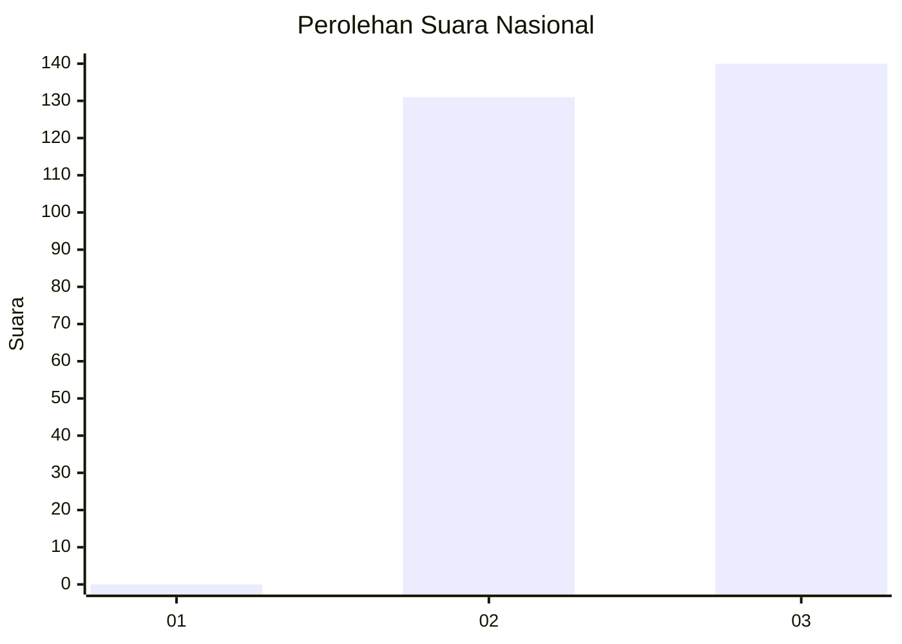
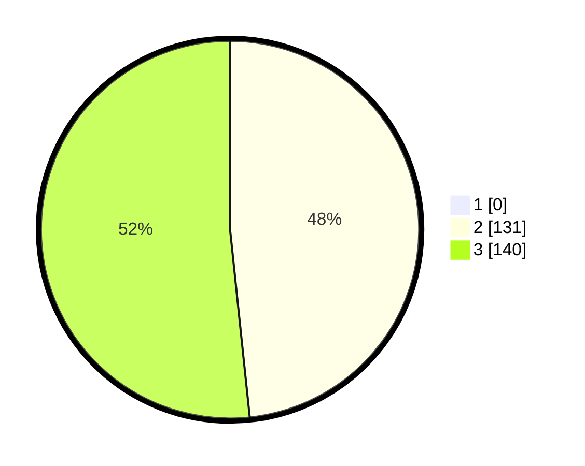

# Hasil

## Grafik

## Tabel

| No. | Nama Paslon    | Suara | Suara (raw) | Persentase |
|:--- |:-------------- | -----:| -----------:| ----------:|
| 1   | ANIES MUHAIMIN | 0     | [0][p-1]    | 0,00       |
| 2   | PRABOWO GIBRAN | 131   | [131][p-2]  | 48,34      |
| 3   | GANJAR MAHFUD  | 140   | [140][p-3]  | 51,66      |

[p-1]: https://github.com/gigit-pemilu/pemilu-2024/blob/main/pilpres/hitung-suara/sub/51-bali/sub/03-badung/sub/04-petang/sub/2006-pangsan/sub/001-tps/sub/paslon-1.txt
[p-2]: https://github.com/gigit-pemilu/pemilu-2024/blob/main/pilpres/hitung-suara/sub/51-bali/sub/03-badung/sub/04-petang/sub/2006-pangsan/sub/001-tps/sub/paslon-2.txt
[p-3]: https://github.com/gigit-pemilu/pemilu-2024/blob/main/pilpres/hitung-suara/sub/51-bali/sub/03-badung/sub/04-petang/sub/2006-pangsan/sub/001-tps/sub/paslon-3.txt

## Foto C Plano

https://sirekap-obj-formc.kpu.go.id/40b6/pemilu/ppwp/51/03/04/20/06/5103042006001-20240214-132916--7991787e-02d4-4106-960e-b71c1896deaf.jpg

https://sirekap-obj-formc.kpu.go.id/40b6/pemilu/ppwp/51/03/04/20/06/5103042006001-20240214-133354--dab7b547-d7c4-4b6c-9698-71f5894862f8.jpg

https://sirekap-obj-formc.kpu.go.id/40b6/pemilu/ppwp/51/03/04/20/06/5103042006001-20240214-133401--2477eef2-d759-41cd-9878-2a0eb6153a98.jpg

## Metadata

| Key        | Value               |
| ---------- | ------------------- |
| Time Stamp | 2024-02-24 22:31:28 |

