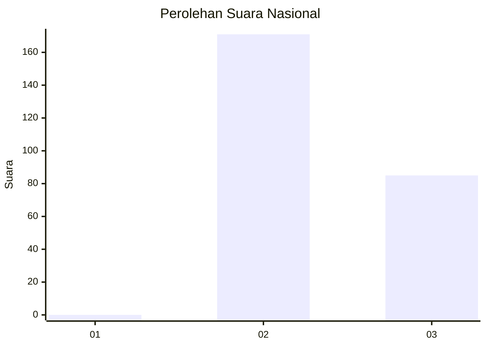
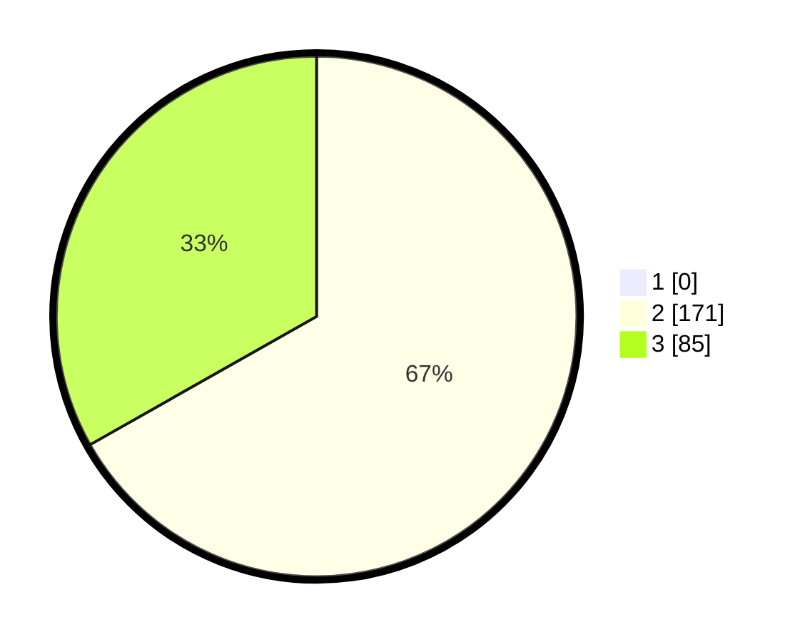

# Hasil

## Grafik

## Tabel

| No. | Nama Paslon    | Suara | Suara (raw) | Persentase |
|:--- |:-------------- | -----:| -----------:| ----------:|
| 1   | ANIES MUHAIMIN | 0     | [0][p-1]    | 0,00       |
| 2   | PRABOWO GIBRAN | 171   | [171][p-2]  | 66,80      |
| 3   | GANJAR MAHFUD  | 85    | [85][p-3]   | 33,20      |

[p-1]: https://github.com/gigit-pemilu/pemilu-2024/blob/main/pilpres/hitung-suara/sub/51-bali/sub/03-badung/sub/04-petang/sub/2006-pangsan/sub/002-tps/sub/paslon-1.txt
[p-2]: https://github.com/gigit-pemilu/pemilu-2024/blob/main/pilpres/hitung-suara/sub/51-bali/sub/03-badung/sub/04-petang/sub/2006-pangsan/sub/002-tps/sub/paslon-2.txt
[p-3]: https://github.com/gigit-pemilu/pemilu-2024/blob/main/pilpres/hitung-suara/sub/51-bali/sub/03-badung/sub/04-petang/sub/2006-pangsan/sub/002-tps/sub/paslon-3.txt

## Foto C Plano

https://sirekap-obj-formc.kpu.go.id/22f4/pemilu/ppwp/51/03/04/20/06/5103042006002-20240214-141633--e6c19060-5935-4db3-873f-120509e48f05.jpg

https://sirekap-obj-formc.kpu.go.id/22f4/pemilu/ppwp/51/03/04/20/06/5103042006002-20240214-141717--63649e23-5f29-4758-be3a-1894cfcc43b0.jpg

https://sirekap-obj-formc.kpu.go.id/22f4/pemilu/ppwp/51/03/04/20/06/5103042006002-20240214-141809--32292ed4-2b1d-42a9-bfb2-4bda63f2487a.jpg

## Metadata

| Key        | Value               |
| ---------- | ------------------- |
| Time Stamp | 2024-02-14 21:46:01 |

