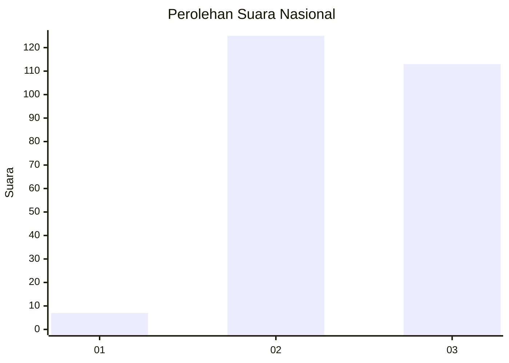
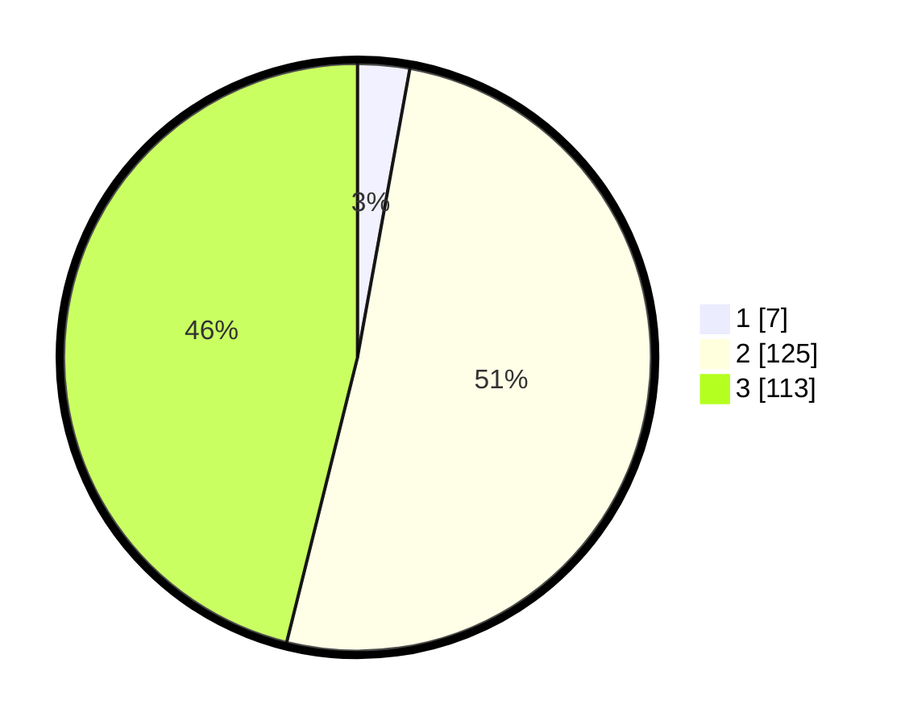

# Hasil

## Grafik

## Tabel

| No. | Nama Paslon    | Suara | Suara (raw) | Persentase |
|:--- |:-------------- | -----:| -----------:| ----------:|
| 1   | ANIES MUHAIMIN | 7     | [7][p-1]    | 2,86       |
| 2   | PRABOWO GIBRAN | 125   | [125][p-2]  | 51,02      |
| 3   | GANJAR MAHFUD  | 113   | [113][p-3]  | 46,12      |

[p-1]: https://github.com/gigit-pemilu/pemilu-2024/blob/main/pilpres/hitung-suara/sub/51-bali/sub/03-badung/sub/04-petang/sub/2006-pangsan/sub/006-tps/sub/paslon-1.txt
[p-2]: https://github.com/gigit-pemilu/pemilu-2024/blob/main/pilpres/hitung-suara/sub/51-bali/sub/03-badung/sub/04-petang/sub/2006-pangsan/sub/006-tps/sub/paslon-2.txt
[p-3]: https://github.com/gigit-pemilu/pemilu-2024/blob/main/pilpres/hitung-suara/sub/51-bali/sub/03-badung/sub/04-petang/sub/2006-pangsan/sub/006-tps/sub/paslon-3.txt

## Foto C Plano

https://sirekap-obj-formc.kpu.go.id/728f/pemilu/ppwp/51/03/04/20/06/5103042006006-20240220-144119--a30e21e8-9272-4d46-8715-6d428a0a7336.jpg

https://sirekap-obj-formc.kpu.go.id/728f/pemilu/ppwp/51/03/04/20/06/5103042006006-20240220-144148--63da60be-8b63-487f-99e2-3602165c6c7e.jpg

https://sirekap-obj-formc.kpu.go.id/728f/pemilu/ppwp/51/03/04/20/06/5103042006006-20240220-144204--199dd6e3-3be5-474d-86e4-d322a9fdb427.jpg

## Metadata

| Key        | Value               |
| ---------- | ------------------- |
| Time Stamp | 2024-02-24 22:31:28 |

