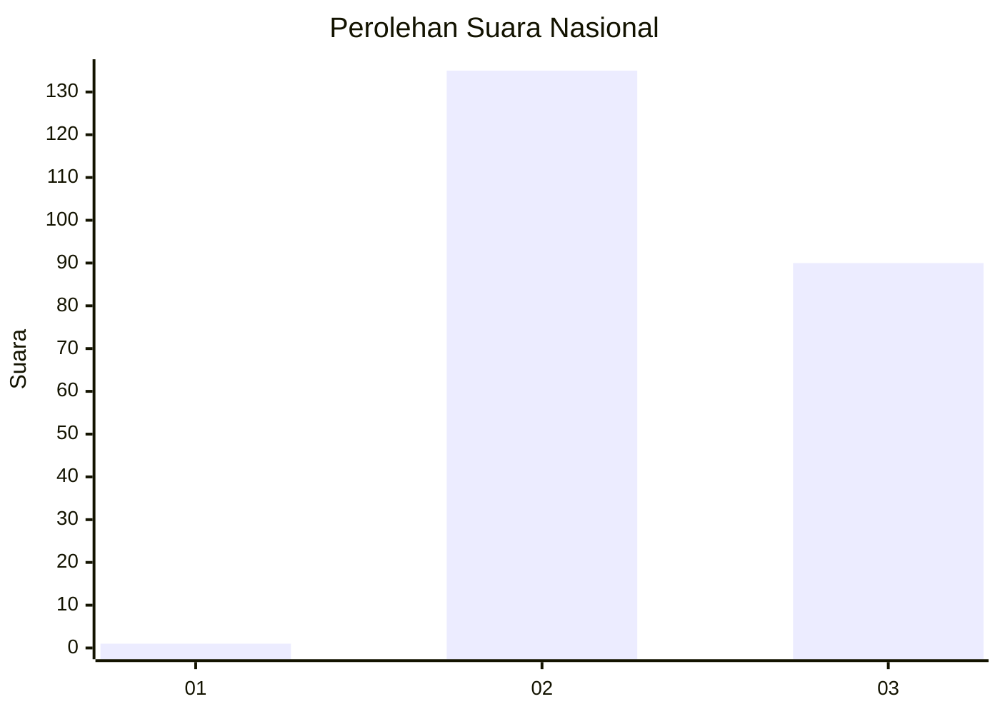
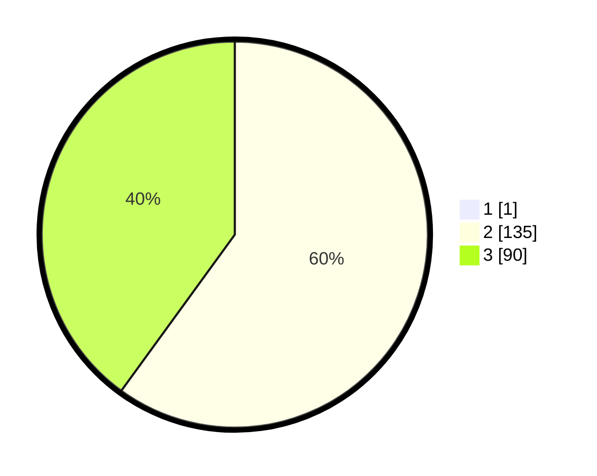

# Hasil

## Grafik

## Tabel

| No. | Nama Paslon    | Suara | Suara (raw) | Persentase |
|:--- |:-------------- | -----:| -----------:| ----------:|
| 1   | ANIES MUHAIMIN | 1     | [1][p-1]    | 0,44       |
| 2   | PRABOWO GIBRAN | 135   | [135][p-2]  | 59,73      |
| 3   | GANJAR MAHFUD  | 90    | [90][p-3]   | 39,82      |

[p-1]: https://github.com/gigit-pemilu/pemilu-2024/blob/main/pilpres/hitung-suara/sub/51-bali/sub/03-badung/sub/05-kuta-selatan/sub/1004-benoa/sub/001-tps/sub/paslon-1.txt
[p-2]: https://github.com/gigit-pemilu/pemilu-2024/blob/main/pilpres/hitung-suara/sub/51-bali/sub/03-badung/sub/05-kuta-selatan/sub/1004-benoa/sub/001-tps/sub/paslon-2.txt
[p-3]: https://github.com/gigit-pemilu/pemilu-2024/blob/main/pilpres/hitung-suara/sub/51-bali/sub/03-badung/sub/05-kuta-selatan/sub/1004-benoa/sub/001-tps/sub/paslon-3.txt

## Foto C Plano

https://sirekap-obj-formc.kpu.go.id/20bf/pemilu/ppwp/51/03/05/10/04/5103051004001-20240214-221005--d4b318ec-7d70-497a-a617-3606552ad26b.jpg

https://sirekap-obj-formc.kpu.go.id/20bf/pemilu/ppwp/51/03/05/10/04/5103051004001-20240214-221102--dacb0a27-6a57-4280-9032-9fb98d462854.jpg

https://sirekap-obj-formc.kpu.go.id/20bf/pemilu/ppwp/51/03/05/10/04/5103051004001-20240214-221313--1a1b0140-ccd0-4bcb-bc2f-7eac7b8ac91f.jpg

## Metadata

| Key        | Value               |
| ---------- | ------------------- |
| Time Stamp | 2024-02-15 21:01:18 |

