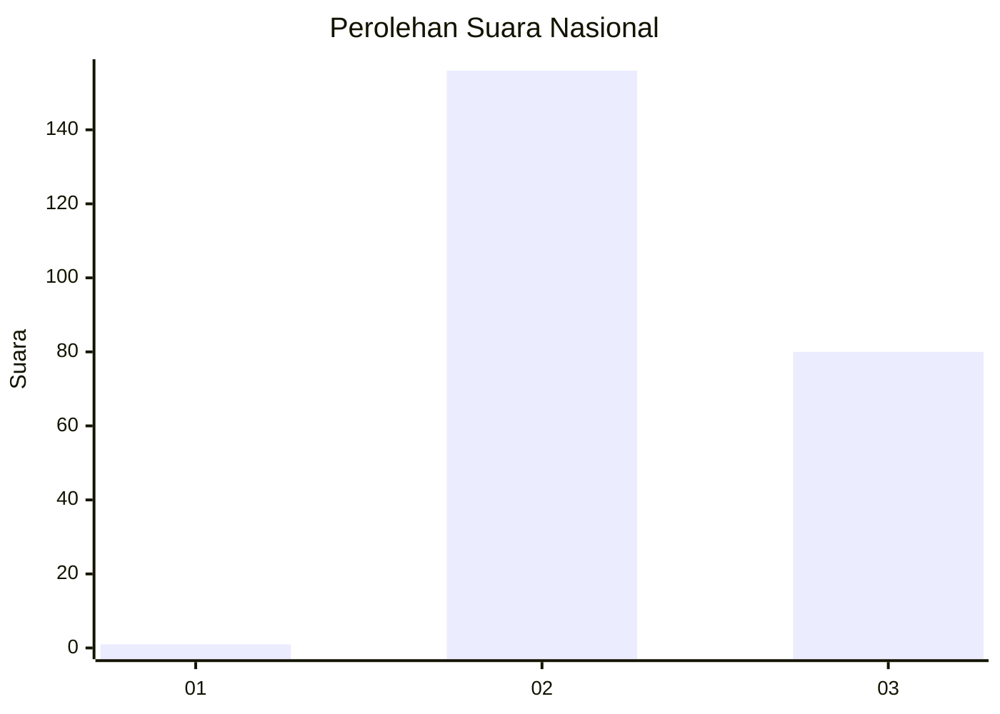
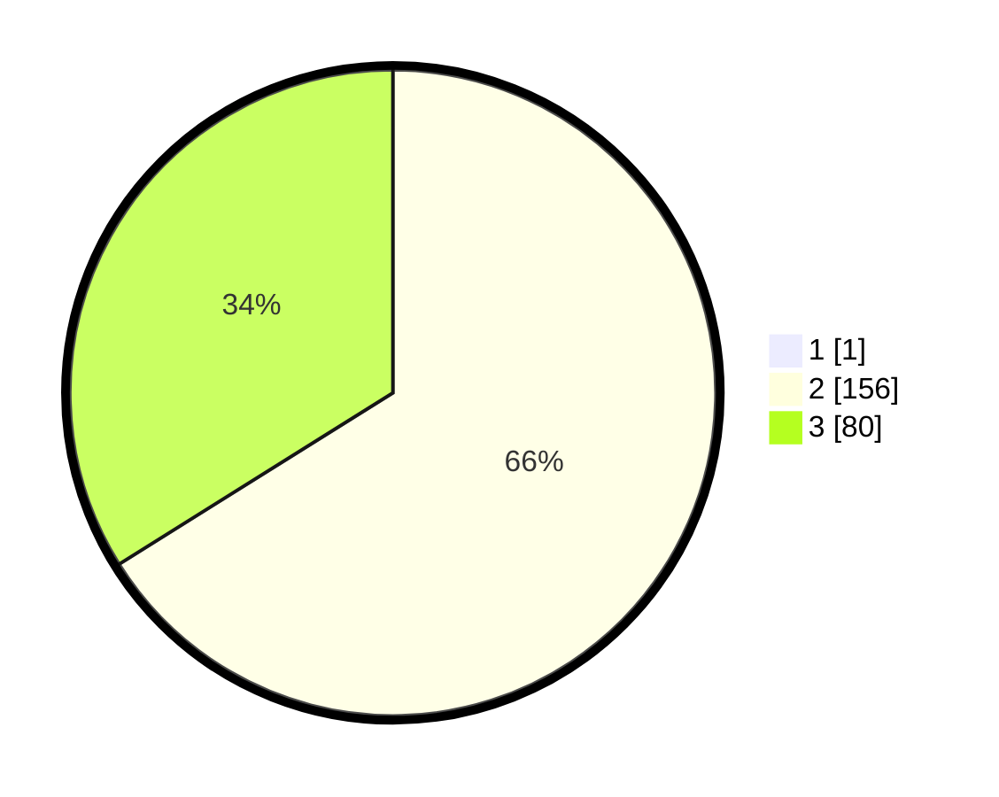

# Hasil

## Grafik

## Tabel

| No. | Nama Paslon    | Suara | Suara (raw) | Persentase |
|:--- |:-------------- | -----:| -----------:| ----------:|
| 1   | ANIES MUHAIMIN | 1     | [1][p-1]    | 0,42       |
| 2   | PRABOWO GIBRAN | 156   | [156][p-2]  | 65,82      |
| 3   | GANJAR MAHFUD  | 80    | [80][p-3]   | 33,76      |

[p-1]: https://github.com/gigit-pemilu/pemilu-2024/blob/main/pilpres/hitung-suara/sub/51-bali/sub/03-badung/sub/05-kuta-selatan/sub/1004-benoa/sub/002-tps/sub/paslon-1.txt
[p-2]: https://github.com/gigit-pemilu/pemilu-2024/blob/main/pilpres/hitung-suara/sub/51-bali/sub/03-badung/sub/05-kuta-selatan/sub/1004-benoa/sub/002-tps/sub/paslon-2.txt
[p-3]: https://github.com/gigit-pemilu/pemilu-2024/blob/main/pilpres/hitung-suara/sub/51-bali/sub/03-badung/sub/05-kuta-selatan/sub/1004-benoa/sub/002-tps/sub/paslon-3.txt

## Foto C Plano

https://sirekap-obj-formc.kpu.go.id/e64a/pemilu/ppwp/51/03/05/10/04/5103051004002-20240215-223233--949bf176-e28a-40ad-b599-2d70e27edd45.jpg

https://sirekap-obj-formc.kpu.go.id/e64a/pemilu/ppwp/51/03/05/10/04/5103051004002-20240215-223235--780f345e-0317-4465-b907-85623085a3d5.jpg

https://sirekap-obj-formc.kpu.go.id/e64a/pemilu/ppwp/51/03/05/10/04/5103051004002-20240215-223234--13941188-52a1-4882-ae78-e19c213d871c.jpg

## Metadata

| Key        | Value               |
| ---------- | ------------------- |
| Time Stamp | 2024-02-21 09:00:00 |

## DATA PEMILIH TETAP

Jumlah pemilih dalam DPT: **265**.
 * L: **125**.
 * P: **140**.

## DATA PENGGUNA HAK PILIH

Jumlah pengguna hak pilih dalam DPT: **234**.
 * L: **115**.
 * P: **119**.

Jumlah pengguna hak pilih dalam DPTb: **5**.
 * L: **2**.
 * P: **3**.

Jumlah pengguna hak pilih dalam DPK: **1**.
 * L: **1**.
 * P: **0**.

Jumlah pengguna hak pilih: **240**.
 * L: **118**.
 * P: **122**.

## JUMLAH SUARA SAH DAN TIDAK SAH

JUMLAH SELURUH SUARA SAH: **237**.

JUMLAH SUARA TIDAK SAH: **3**.

JUMLAH SELURUH SUARA SAH DAN SUARA TIDAK SAH: **240**.

