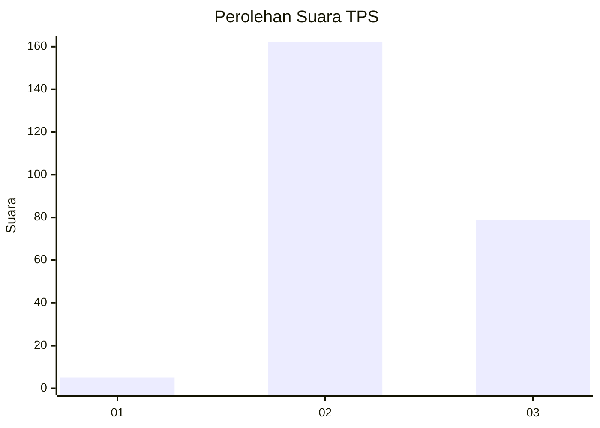
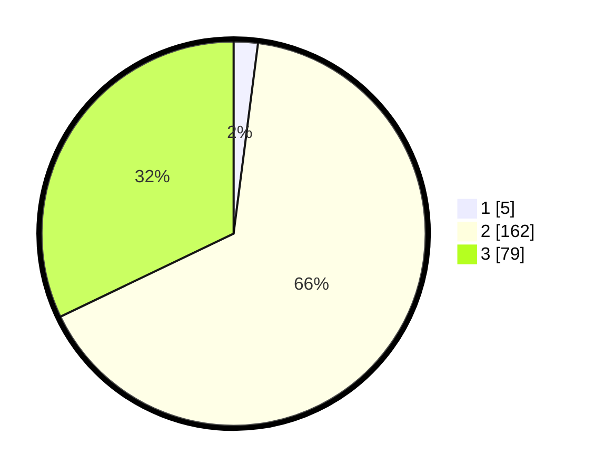

# Hasil

## Grafik

## Tabel

| No. | Nama Paslon    | Suara | Suara (raw) | Persentase |
|:--- |:-------------- | -----:| -----------:| ----------:|
| 1   | ANIES MUHAIMIN | 5     | [5][p-1]    | 2,03       |
| 2   | PRABOWO GIBRAN | 162   | [162][p-2]  | 65,85      |
| 3   | GANJAR MAHFUD  | 79    | [79][p-3]   | 32,11      |

[p-1]: https://github.com/gigit-pemilu/pemilu-2024-51-bali/blob/main/pilpres/hitung-suara/sub/51-bali/sub/03-badung/sub/05-kuta-selatan/sub/1004-benoa/sub/004-tps/sub/paslon-1.txt
[p-2]: https://github.com/gigit-pemilu/pemilu-2024-51-bali/blob/main/pilpres/hitung-suara/sub/51-bali/sub/03-badung/sub/05-kuta-selatan/sub/1004-benoa/sub/004-tps/sub/paslon-2.txt
[p-3]: https://github.com/gigit-pemilu/pemilu-2024-51-bali/blob/main/pilpres/hitung-suara/sub/51-bali/sub/03-badung/sub/05-kuta-selatan/sub/1004-benoa/sub/004-tps/sub/paslon-3.txt

## Foto C Plano

https://sirekap-obj-formc.kpu.go.id/0a97/pemilu/ppwp/51/03/05/10/04/5103051004004-20240214-215435--64a280c1-7ae4-4a09-a889-b7f83035f377.jpg

https://sirekap-obj-formc.kpu.go.id/0a97/pemilu/ppwp/51/03/05/10/04/5103051004004-20240214-215338--0d0bfdb6-7981-4974-801f-e5d63d75f40e.jpg

## Metadata

| Key        | Value               |
| ---------- | ------------------- |
| Time Stamp | 2024-02-15 21:01:18 |

