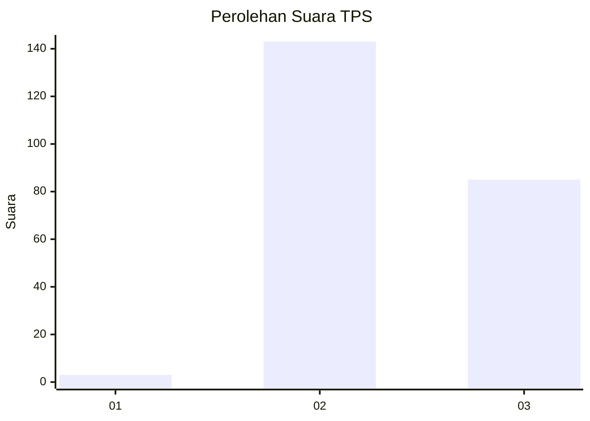
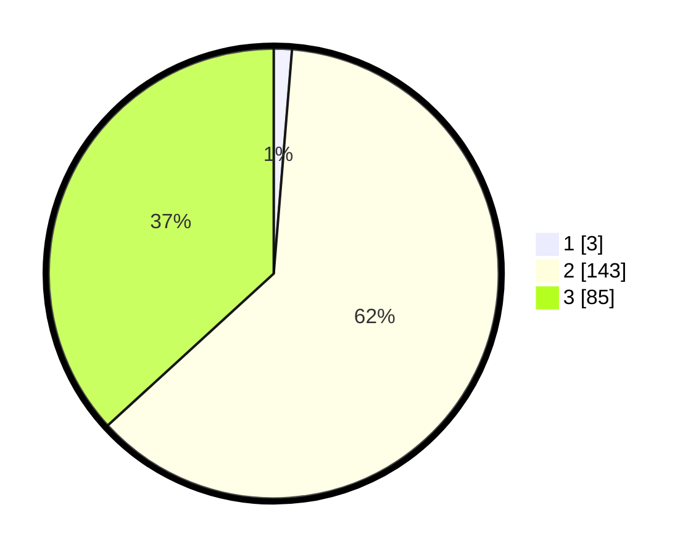

# Hasil

## Grafik

## Tabel

| No. | Nama Paslon    | Suara | Suara (raw) | Persentase |
|:--- |:-------------- | -----:| -----------:| ----------:|
| 1   | ANIES MUHAIMIN | 3     | [3][p-1]    | 1,30       |
| 2   | PRABOWO GIBRAN | 143   | [143][p-2]  | 61,90      |
| 3   | GANJAR MAHFUD  | 85    | [85][p-3]   | 36,80      |

[p-1]: https://github.com/gigit-pemilu/pemilu-2024-51-bali/blob/main/pilpres/hitung-suara/sub/51-bali/sub/03-badung/sub/05-kuta-selatan/sub/1004-benoa/sub/005-tps/sub/paslon-1.txt
[p-2]: https://github.com/gigit-pemilu/pemilu-2024-51-bali/blob/main/pilpres/hitung-suara/sub/51-bali/sub/03-badung/sub/05-kuta-selatan/sub/1004-benoa/sub/005-tps/sub/paslon-2.txt
[p-3]: https://github.com/gigit-pemilu/pemilu-2024-51-bali/blob/main/pilpres/hitung-suara/sub/51-bali/sub/03-badung/sub/05-kuta-selatan/sub/1004-benoa/sub/005-tps/sub/paslon-3.txt

## Foto C Plano

https://sirekap-obj-formc.kpu.go.id/5c78/pemilu/ppwp/51/03/05/10/04/5103051004005-20240216-014210--0492302e-53ed-4f52-8aab-0b361d839ef6.jpg

https://sirekap-obj-formc.kpu.go.id/5c78/pemilu/ppwp/51/03/05/10/04/5103051004005-20240216-014221--ff7c4865-7259-4423-af34-b336fdc38f9b.jpg

https://sirekap-obj-formc.kpu.go.id/5c78/pemilu/ppwp/51/03/05/10/04/5103051004005-20240216-014216--87e86982-5269-4589-b563-fee12392e58c.jpg

## Metadata

| Key        | Value               |
| ---------- | ------------------- |
| Time Stamp | 2024-02-24 22:31:28 |

## DATA PEMILIH TETAP

Jumlah pemilih dalam DPT: **261**.
 * L: **133**.
 * P: **128**.

## DATA PENGGUNA HAK PILIH

Jumlah pengguna hak pilih dalam DPT: **229**.
 * L: **119**.
 * P: **110**.

Jumlah pengguna hak pilih dalam DPTb: **1**.
 * L: **0**.
 * P: **1**.

Jumlah pengguna hak pilih dalam DPK: **2**.
 * L: **1**.
 * P: **1**.

Jumlah pengguna hak pilih: **232**.
 * L: **120**.
 * P: **112**.

## JUMLAH SUARA SAH DAN TIDAK SAH

JUMLAH SELURUH SUARA SAH: **231**.

JUMLAH SUARA TIDAK SAH: **1**.

JUMLAH SELURUH SUARA SAH DAN SUARA TIDAK SAH: **232**.

