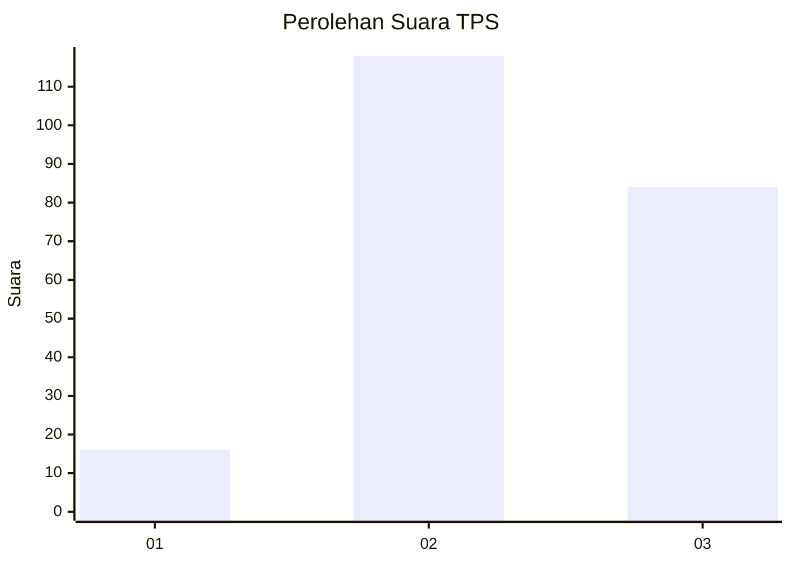
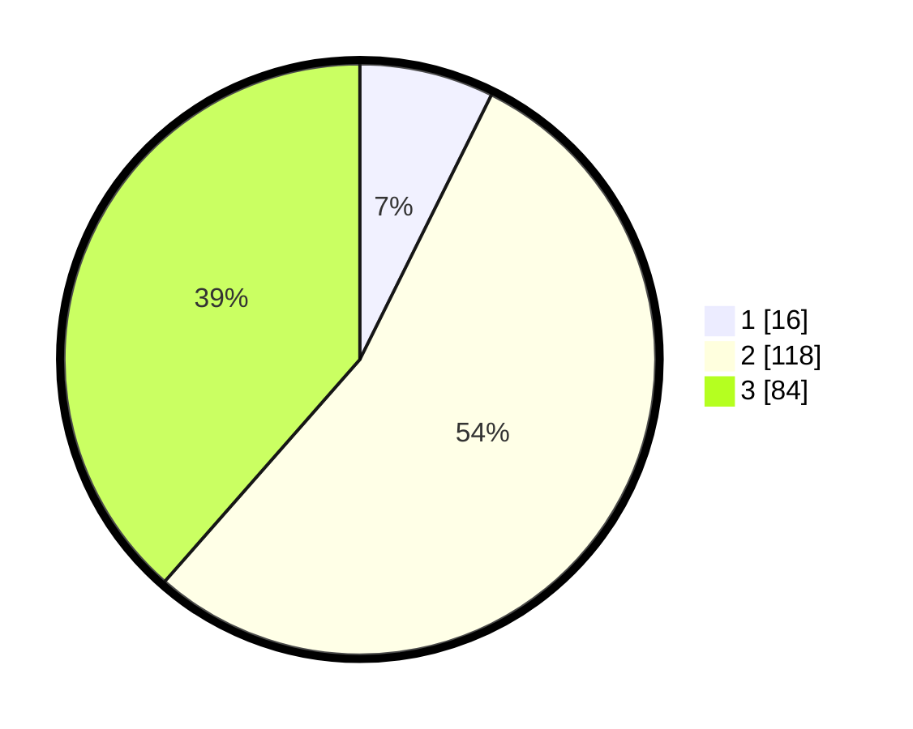

# Hasil

## Grafik

## Tabel

| No. | Nama Paslon    | Suara | Suara (raw) | Persentase |
|:--- |:-------------- | -----:| -----------:| ----------:|
| 1   | ANIES MUHAIMIN | 16    | [16][p-1]   | 7,34       |
| 2   | PRABOWO GIBRAN | 118   | [118][p-2]  | 54,13      |
| 3   | GANJAR MAHFUD  | 84    | [84][p-3]   | 38,53      |

[p-1]: https://github.com/gigit-pemilu/pemilu-2024-51-bali/blob/main/pilpres/hitung-suara/sub/51-bali/sub/03-badung/sub/05-kuta-selatan/sub/1004-benoa/sub/006-tps/sub/paslon-1.txt
[p-2]: https://github.com/gigit-pemilu/pemilu-2024-51-bali/blob/main/pilpres/hitung-suara/sub/51-bali/sub/03-badung/sub/05-kuta-selatan/sub/1004-benoa/sub/006-tps/sub/paslon-2.txt
[p-3]: https://github.com/gigit-pemilu/pemilu-2024-51-bali/blob/main/pilpres/hitung-suara/sub/51-bali/sub/03-badung/sub/05-kuta-selatan/sub/1004-benoa/sub/006-tps/sub/paslon-3.txt

## Foto C Plano

https://sirekap-obj-formc.kpu.go.id/35a4/pemilu/ppwp/51/03/05/10/04/5103051004006-20240216-003642--947d4bf0-eb1c-4b29-b075-d5e80614a797.jpg

https://sirekap-obj-formc.kpu.go.id/35a4/pemilu/ppwp/51/03/05/10/04/5103051004006-20240216-003651--6337d96e-7427-4db3-aff3-950838562fa6.jpg

https://sirekap-obj-formc.kpu.go.id/35a4/pemilu/ppwp/51/03/05/10/04/5103051004006-20240216-003647--911d73bd-bcb0-4794-91cd-fb709399b2c7.jpg

## Metadata

| Key        | Value               |
| ---------- | ------------------- |
| Time Stamp | 2024-02-21 11:00:00 |

## DATA PEMILIH TETAP

Jumlah pemilih dalam DPT: **276**.
 * L: **130**.
 * P: **146**.

## DATA PENGGUNA HAK PILIH

Jumlah pengguna hak pilih dalam DPT: **205**.
 * L: **95**.
 * P: **110**.

Jumlah pengguna hak pilih dalam DPTb: **4**.
 * L: **2**.
 * P: **2**.

Jumlah pengguna hak pilih dalam DPK: **11**.
 * L: **4**.
 * P: **7**.

Jumlah pengguna hak pilih: **220**.
 * L: **101**.
 * P: **119**.

## JUMLAH SUARA SAH DAN TIDAK SAH

JUMLAH SELURUH SUARA SAH: **218**.

JUMLAH SUARA TIDAK SAH: **2**.

JUMLAH SELURUH SUARA SAH DAN SUARA TIDAK SAH: **220**.

