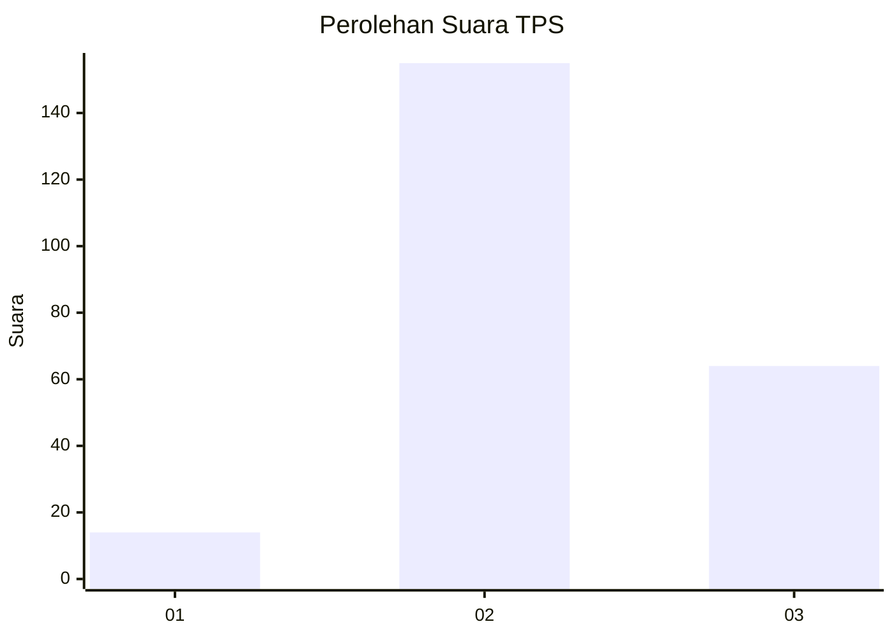

# Hasil

## Grafik

## Tabel

| No. | Nama Paslon    | Suara | Suara (raw) | Persentase |
|:--- |:-------------- | -----:| -----------:| ----------:|
| 1   | ANIES MUHAIMIN | 14    | [14][p-1]   | 6,01       |
| 2   | PRABOWO GIBRAN | 155   | [155][p-2]  | 66,52      |
| 3   | GANJAR MAHFUD  | 64    | [64][p-3]   | 27,47      |

[p-1]: https://github.com/gigit-pemilu/pemilu-2024-51-bali/blob/main/pilpres/hitung-suara/sub/51-bali/sub/03-badung/sub/05-kuta-selatan/sub/1004-benoa/sub/009-tps/sub/paslon-1.txt
[p-2]: https://github.com/gigit-pemilu/pemilu-2024-51-bali/blob/main/pilpres/hitung-suara/sub/51-bali/sub/03-badung/sub/05-kuta-selatan/sub/1004-benoa/sub/009-tps/sub/paslon-2.txt
[p-3]: https://github.com/gigit-pemilu/pemilu-2024-51-bali/blob/main/pilpres/hitung-suara/sub/51-bali/sub/03-badung/sub/05-kuta-selatan/sub/1004-benoa/sub/009-tps/sub/paslon-3.txt

## Foto C Plano

https://sirekap-obj-formc.kpu.go.id/59b4/pemilu/ppwp/51/03/05/10/04/5103051004009-20240216-043205--6c4d1664-89c9-4332-a363-8e2f44911963.jpg

https://sirekap-obj-formc.kpu.go.id/59b4/pemilu/ppwp/51/03/05/10/04/5103051004009-20240216-043206--eac0da19-3213-4c9e-aacb-f34befbee847.jpg

https://sirekap-obj-formc.kpu.go.id/59b4/pemilu/ppwp/51/03/05/10/04/5103051004009-20240216-001840--6803ceac-cb2e-4ca5-b723-09c3f621f89b.jpg

## Metadata

| Key        | Value               |
| ---------- | ------------------- |
| Time Stamp | 2024-02-24 22:31:28 |

## DATA PEMILIH TETAP

Jumlah pemilih dalam DPT: **271**.
 * L: **136**.
 * P: **135**.

## DATA PENGGUNA HAK PILIH

Jumlah pengguna hak pilih dalam DPT: **232**.
 * L: **119**.
 * P: **113**.

Jumlah pengguna hak pilih dalam DPTb: **5**.
 * L: **0**.
 * P: **5**.

Jumlah pengguna hak pilih dalam DPK: **0**.
 * L: **0**.
 * P: **0**.

Jumlah pengguna hak pilih: **237**.
 * L: **119**.
 * P: **118**.

## JUMLAH SUARA SAH DAN TIDAK SAH

JUMLAH SELURUH SUARA SAH: **233**.

JUMLAH SUARA TIDAK SAH: **4**.

JUMLAH SELURUH SUARA SAH DAN SUARA TIDAK SAH: **237**.

