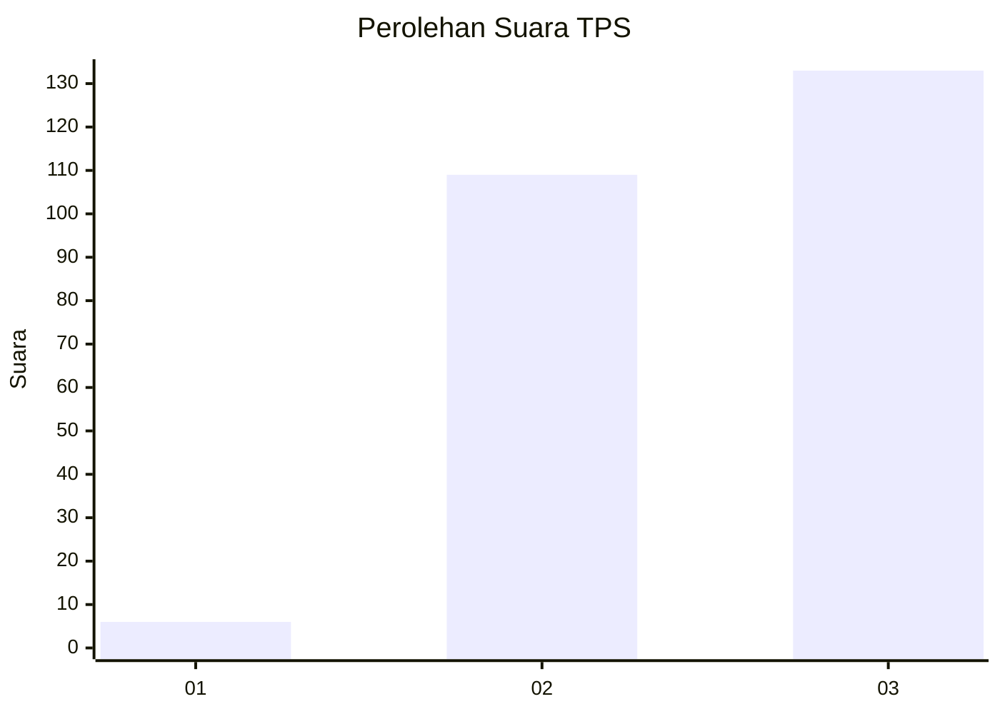
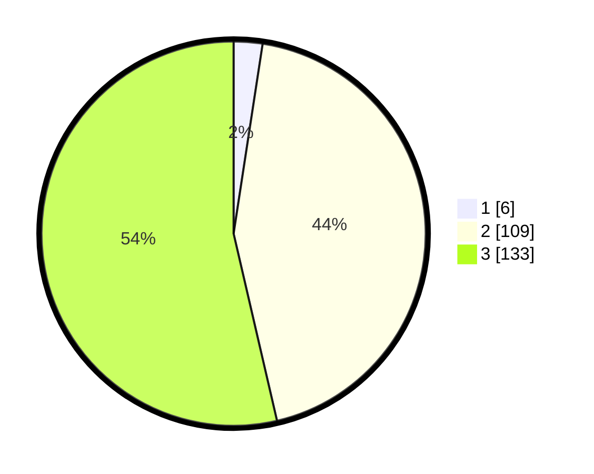

# Hasil

## Grafik

## Tabel

| No. | Nama Paslon    | Suara | Suara (raw) | Persentase |
|:--- |:-------------- | -----:| -----------:| ----------:|
| 1   | ANIES MUHAIMIN | 6     | [6][p-1]    | 2,42       |
| 2   | PRABOWO GIBRAN | 109   | [109][p-2]  | 43,95      |
| 3   | GANJAR MAHFUD  | 133   | [133][p-3]  | 53,63      |

[p-1]: https://github.com/gigit-pemilu/pemilu-2024-51-bali/blob/main/pilpres/hitung-suara/sub/51-bali/sub/03-badung/sub/05-kuta-selatan/sub/1004-benoa/sub/011-tps/sub/paslon-1.txt
[p-2]: https://github.com/gigit-pemilu/pemilu-2024-51-bali/blob/main/pilpres/hitung-suara/sub/51-bali/sub/03-badung/sub/05-kuta-selatan/sub/1004-benoa/sub/011-tps/sub/paslon-2.txt
[p-3]: https://github.com/gigit-pemilu/pemilu-2024-51-bali/blob/main/pilpres/hitung-suara/sub/51-bali/sub/03-badung/sub/05-kuta-selatan/sub/1004-benoa/sub/011-tps/sub/paslon-3.txt

## Foto C Plano

https://sirekap-obj-formc.kpu.go.id/ce8f/pemilu/ppwp/51/03/05/10/04/5103051004011-20240214-203706--f711594b-1ae4-4e3c-9fc3-464f033e4574.jpg

https://sirekap-obj-formc.kpu.go.id/ce8f/pemilu/ppwp/51/03/05/10/04/5103051004011-20240214-203924--0362f4af-4bd5-42b9-82b1-05ae678624be.jpg

https://sirekap-obj-formc.kpu.go.id/ce8f/pemilu/ppwp/51/03/05/10/04/5103051004011-20240214-204119--8246812e-f3b6-4e72-835b-f9a97d08dd3d.jpg

## Metadata

| Key        | Value               |
| ---------- | ------------------- |
| Time Stamp | 2024-02-15 21:30:27 |

## DATA PEMILIH TETAP

Jumlah pemilih dalam DPT: **272**.
 * L: **143**.
 * P: **129**.

## DATA PENGGUNA HAK PILIH

Jumlah pengguna hak pilih dalam DPT: **235**.
 * L: **128**.
 * P: **107**.

Jumlah pengguna hak pilih dalam DPTb: **5**.
 * L: **1**.
 * P: **4**.

Jumlah pengguna hak pilih dalam DPK: **10**.
 * L: **4**.
 * P: **6**.

Jumlah pengguna hak pilih: **250**.
 * L: **133**.
 * P: **117**.

## JUMLAH SUARA SAH DAN TIDAK SAH

JUMLAH SELURUH SUARA SAH: **248**.

JUMLAH SUARA TIDAK SAH: **2**.

JUMLAH SELURUH SUARA SAH DAN SUARA TIDAK SAH: **250**.

