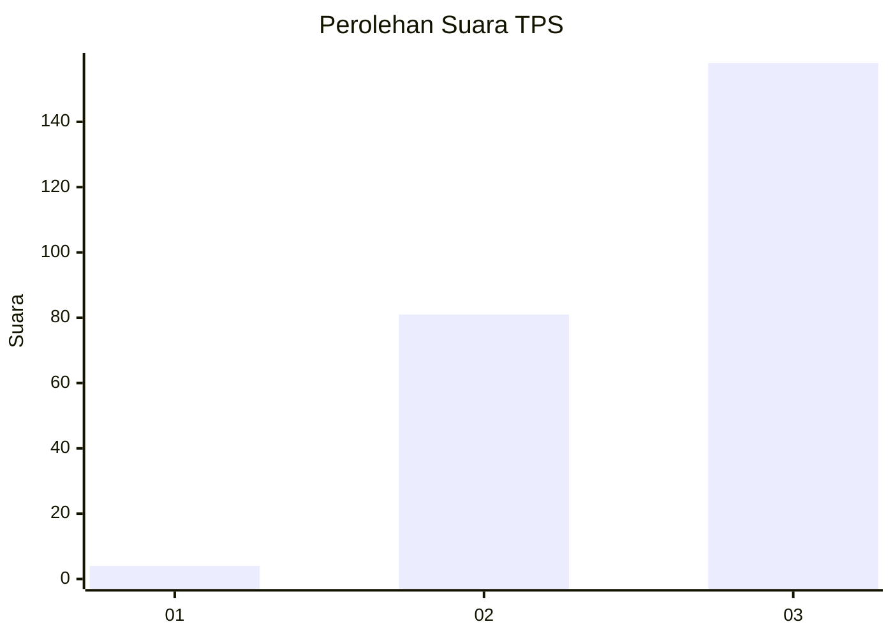
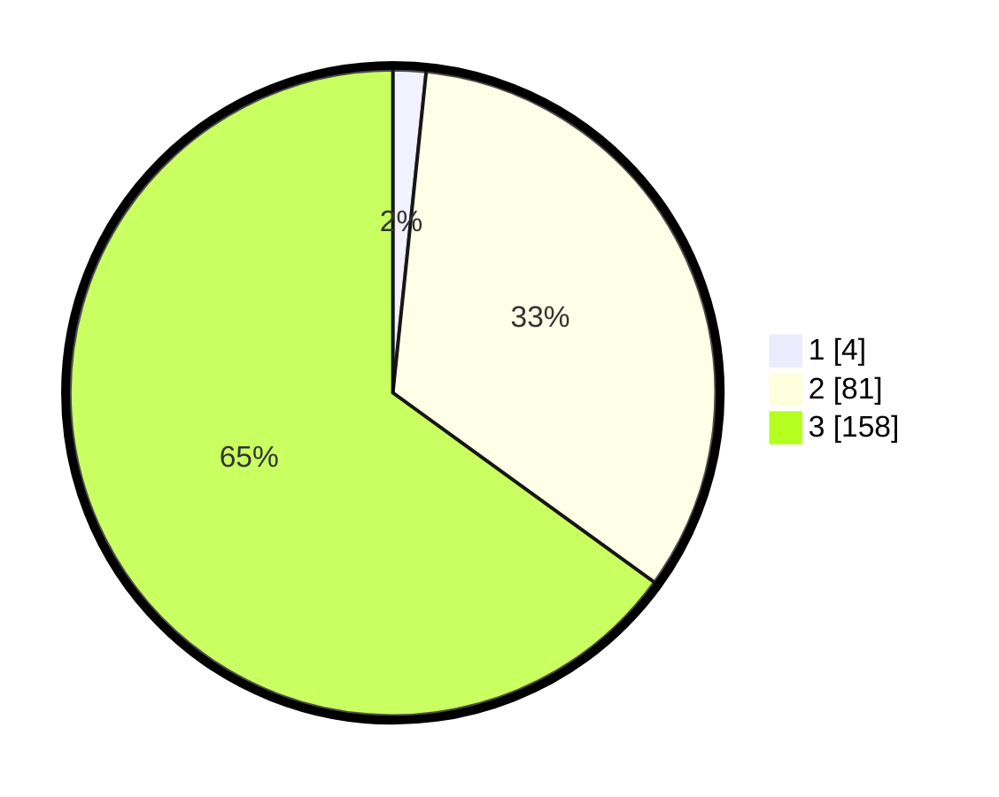

# Hasil

## Grafik

## Tabel

| No. | Nama Paslon    | Suara | Suara (raw) | Persentase |
|:--- |:-------------- | -----:| -----------:| ----------:|
| 1   | ANIES MUHAIMIN | 4     | [4][p-1]    | 1,65       |
| 2   | PRABOWO GIBRAN | 81    | [81][p-2]   | 33,33      |
| 3   | GANJAR MAHFUD  | 158   | [158][p-3]  | 65,02      |

[p-1]: https://github.com/gigit-pemilu/pemilu-2024-51-bali/blob/main/pilpres/hitung-suara/sub/51-bali/sub/03-badung/sub/05-kuta-selatan/sub/1004-benoa/sub/012-tps/sub/paslon-1.txt
[p-2]: https://github.com/gigit-pemilu/pemilu-2024-51-bali/blob/main/pilpres/hitung-suara/sub/51-bali/sub/03-badung/sub/05-kuta-selatan/sub/1004-benoa/sub/012-tps/sub/paslon-2.txt
[p-3]: https://github.com/gigit-pemilu/pemilu-2024-51-bali/blob/main/pilpres/hitung-suara/sub/51-bali/sub/03-badung/sub/05-kuta-selatan/sub/1004-benoa/sub/012-tps/sub/paslon-3.txt

## Foto C Plano

https://sirekap-obj-formc.kpu.go.id/1863/pemilu/ppwp/51/03/05/10/04/5103051004012-20240214-233052--90d5c62c-01e8-4717-bc80-c3203188cce3.jpg

https://sirekap-obj-formc.kpu.go.id/1863/pemilu/ppwp/51/03/05/10/04/5103051004012-20240214-200520--23a136cb-761d-4bf6-88dd-82a9a527380e.jpg

https://sirekap-obj-formc.kpu.go.id/1863/pemilu/ppwp/51/03/05/10/04/5103051004012-20240214-200555--6ad65ce4-8c05-4a4a-84a8-691d64ed37a9.jpg

## Metadata

| Key        | Value               |
| ---------- | ------------------- |
| Time Stamp | 2024-02-15 07:00:44 |

