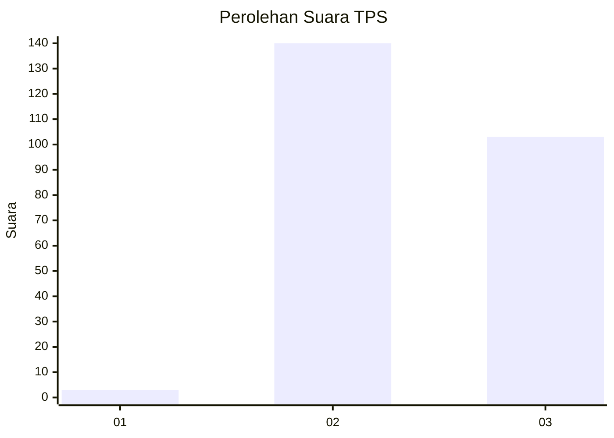
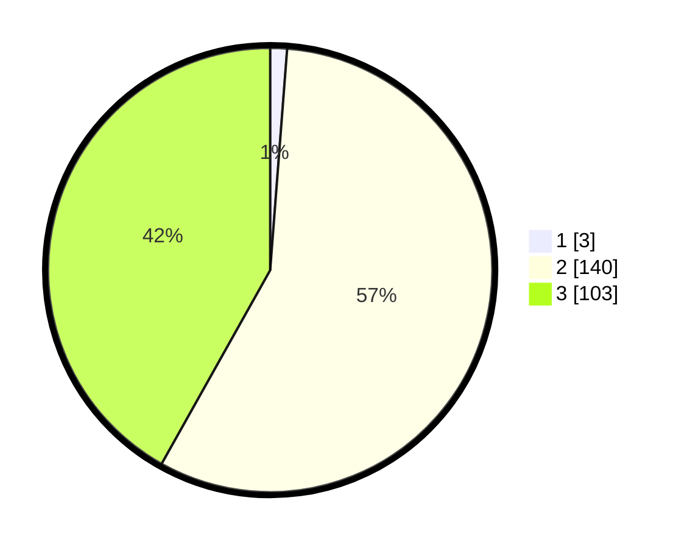

# Hasil

## Grafik

## Tabel

| No. | Nama Paslon    | Suara | Suara (raw) | Persentase |
|:--- |:-------------- | -----:| -----------:| ----------:|
| 1   | ANIES MUHAIMIN | 3     | [3][p-1]    | 1,22       |
| 2   | PRABOWO GIBRAN | 140   | [140][p-2]  | 56,91      |
| 3   | GANJAR MAHFUD  | 103   | [103][p-3]  | 41,87      |

[p-1]: https://github.com/gigit-pemilu/pemilu-2024-51-bali/blob/main/pilpres/hitung-suara/sub/51-bali/sub/03-badung/sub/05-kuta-selatan/sub/1004-benoa/sub/019-tps/sub/paslon-1.txt
[p-2]: https://github.com/gigit-pemilu/pemilu-2024-51-bali/blob/main/pilpres/hitung-suara/sub/51-bali/sub/03-badung/sub/05-kuta-selatan/sub/1004-benoa/sub/019-tps/sub/paslon-2.txt
[p-3]: https://github.com/gigit-pemilu/pemilu-2024-51-bali/blob/main/pilpres/hitung-suara/sub/51-bali/sub/03-badung/sub/05-kuta-selatan/sub/1004-benoa/sub/019-tps/sub/paslon-3.txt

## Foto C Plano

https://sirekap-obj-formc.kpu.go.id/1539/pemilu/ppwp/51/03/05/10/04/5103051004019-20240214-223843--bab9944a-435a-4dcc-8b34-ab07902416fc.jpg

https://sirekap-obj-formc.kpu.go.id/1539/pemilu/ppwp/51/03/05/10/04/5103051004019-20240214-224304--7fdff7d8-f7ff-46af-8c2c-28a78490db28.jpg

https://sirekap-obj-formc.kpu.go.id/1539/pemilu/ppwp/51/03/05/10/04/5103051004019-20240214-224514--f1c41c35-5f5e-43ab-a87d-d1439f3ffbe8.jpg

## Metadata

| Key        | Value               |
| ---------- | ------------------- |
| Time Stamp | 2024-02-15 21:30:27 |

