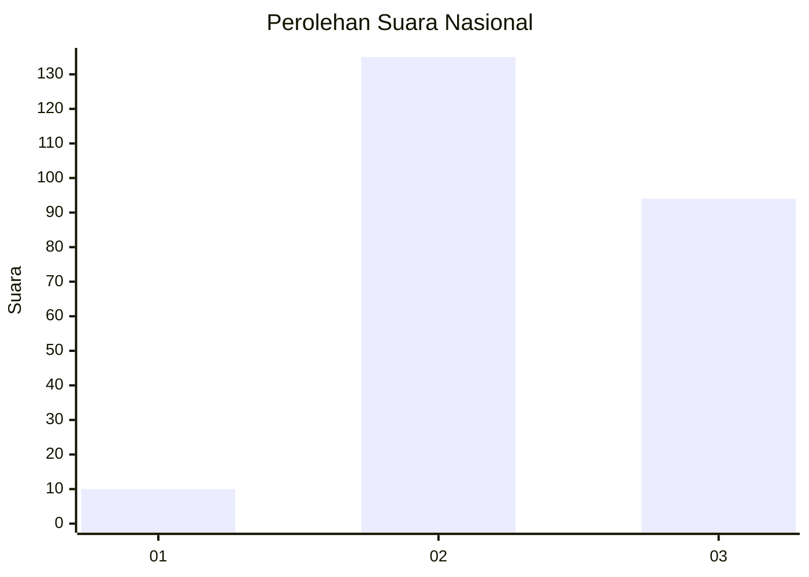
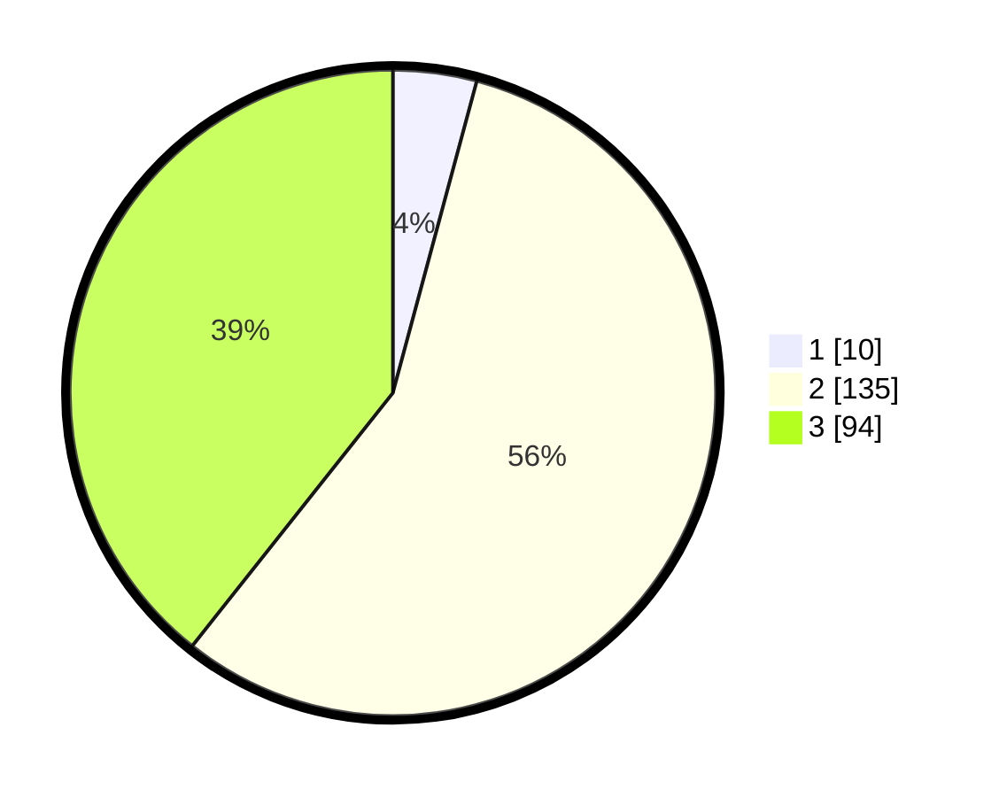

# Hasil

## Grafik

## Tabel

| No. | Nama Paslon    | Suara | Suara (raw) | Persentase |
|:--- |:-------------- | -----:| -----------:| ----------:|
| 1   | ANIES MUHAIMIN | 10    | [10][p-1]   | 4,18       |
| 2   | PRABOWO GIBRAN | 135   | [135][p-2]  | 56,49      |
| 3   | GANJAR MAHFUD  | 94    | [94][p-3]   | 39,33      |

[p-1]: https://github.com/gigit-pemilu/pemilu-2024/blob/main/pilpres/hitung-suara/sub/51-bali/sub/03-badung/sub/05-kuta-selatan/sub/1004-benoa/sub/020-tps/sub/paslon-1.txt
[p-2]: https://github.com/gigit-pemilu/pemilu-2024/blob/main/pilpres/hitung-suara/sub/51-bali/sub/03-badung/sub/05-kuta-selatan/sub/1004-benoa/sub/020-tps/sub/paslon-2.txt
[p-3]: https://github.com/gigit-pemilu/pemilu-2024/blob/main/pilpres/hitung-suara/sub/51-bali/sub/03-badung/sub/05-kuta-selatan/sub/1004-benoa/sub/020-tps/sub/paslon-3.txt

## Foto C Plano

https://sirekap-obj-formc.kpu.go.id/2cdb/pemilu/ppwp/51/03/05/10/04/5103051004020-20240214-133045--55e92d26-be88-4b95-bb1e-827c4b002e5a.jpg

https://sirekap-obj-formc.kpu.go.id/2cdb/pemilu/ppwp/51/03/05/10/04/5103051004020-20240214-133426--fca4122e-d655-41a8-8fe0-71b6a3a60482.jpg

https://sirekap-obj-formc.kpu.go.id/2cdb/pemilu/ppwp/51/03/05/10/04/5103051004020-20240214-133403--f4e56bad-3362-46ae-bf5e-2364d186e8e8.jpg

## Metadata

| Key        | Value               |
| ---------- | ------------------- |
| Time Stamp | 2024-02-15 21:30:27 |

