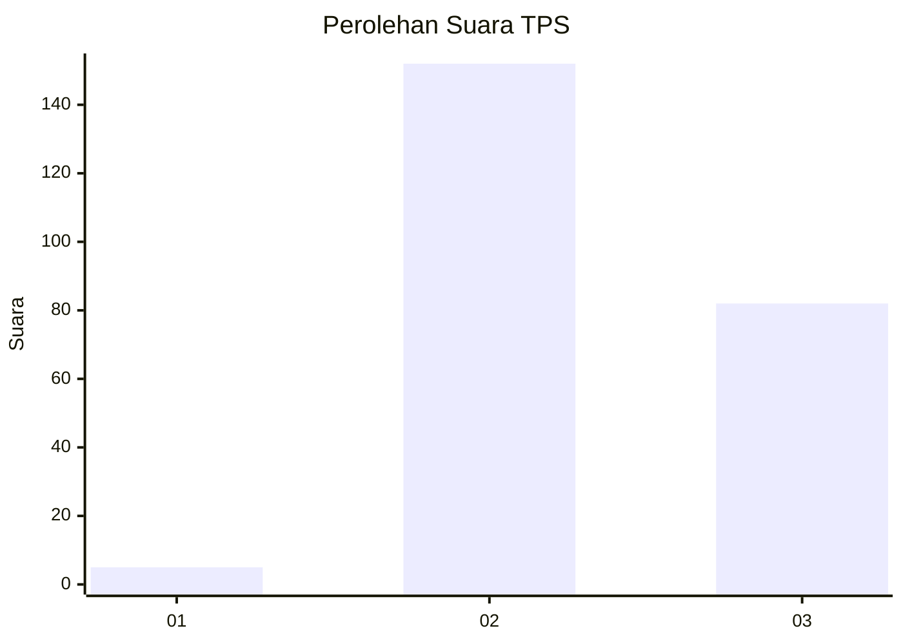
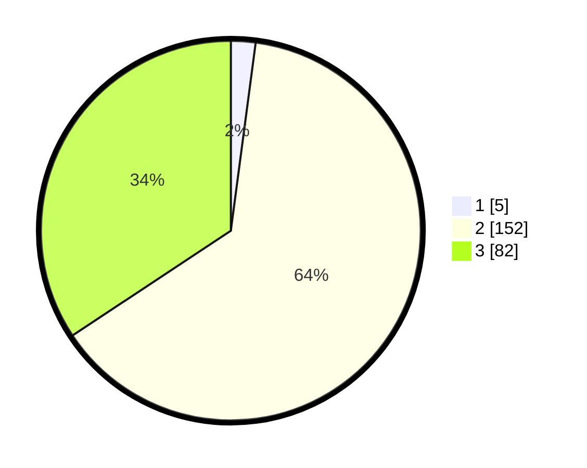

# Hasil

## Grafik

## Tabel

| No. | Nama Paslon    | Suara | Suara (raw) | Persentase |
|:--- |:-------------- | -----:| -----------:| ----------:|
| 1   | ANIES MUHAIMIN | 5     | [5][p-1]    | 2,09       |
| 2   | PRABOWO GIBRAN | 152   | [152][p-2]  | 63,60      |
| 3   | GANJAR MAHFUD  | 82    | [82][p-3]   | 34,31      |

[p-1]: https://github.com/gigit-pemilu/pemilu-2024-51-bali/blob/main/pilpres/hitung-suara/sub/51-bali/sub/03-badung/sub/05-kuta-selatan/sub/1004-benoa/sub/022-tps/sub/paslon-1.txt
[p-2]: https://github.com/gigit-pemilu/pemilu-2024-51-bali/blob/main/pilpres/hitung-suara/sub/51-bali/sub/03-badung/sub/05-kuta-selatan/sub/1004-benoa/sub/022-tps/sub/paslon-2.txt
[p-3]: https://github.com/gigit-pemilu/pemilu-2024-51-bali/blob/main/pilpres/hitung-suara/sub/51-bali/sub/03-badung/sub/05-kuta-selatan/sub/1004-benoa/sub/022-tps/sub/paslon-3.txt

## Foto C Plano

https://sirekap-obj-formc.kpu.go.id/81eb/pemilu/ppwp/51/03/05/10/04/5103051004022-20240214-230116--63b47724-1eca-4052-a4fd-87ecd37268d1.jpg

https://sirekap-obj-formc.kpu.go.id/81eb/pemilu/ppwp/51/03/05/10/04/5103051004022-20240214-230656--a4ba4b84-125a-45d0-a4e1-6663def6c4ed.jpg

https://sirekap-obj-formc.kpu.go.id/81eb/pemilu/ppwp/51/03/05/10/04/5103051004022-20240214-230800--778b680d-90dc-4bef-9704-f2b186960a15.jpg

## Metadata

| Key        | Value               |
| ---------- | ------------------- |
| Time Stamp | 2024-02-15 22:00:27 |

