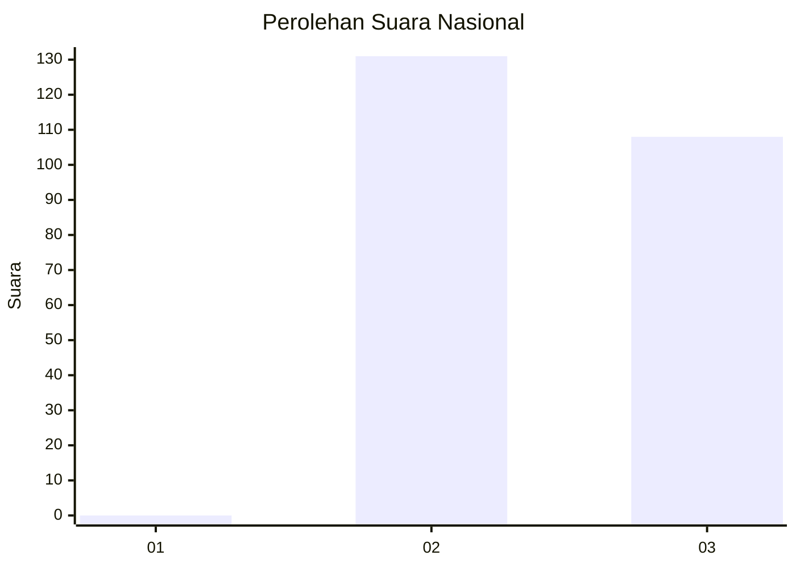
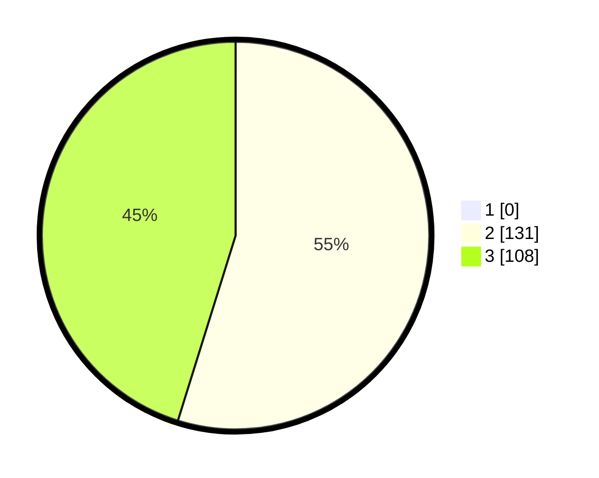

# Hasil

## Grafik

## Tabel

| No. | Nama Paslon    | Suara | Suara (raw) | Persentase |
|:--- |:-------------- | -----:| -----------:| ----------:|
| 1   | ANIES MUHAIMIN | 0     | [0][p-1]    | 0,00       |
| 2   | PRABOWO GIBRAN | 131   | [131][p-2]  | 54,81      |
| 3   | GANJAR MAHFUD  | 108   | [108][p-3]  | 45,19      |

[p-1]: https://github.com/gigit-pemilu/pemilu-2024/blob/main/pilpres/hitung-suara/sub/51-bali/sub/03-badung/sub/05-kuta-selatan/sub/1004-benoa/sub/024-tps/sub/paslon-1.txt
[p-2]: https://github.com/gigit-pemilu/pemilu-2024/blob/main/pilpres/hitung-suara/sub/51-bali/sub/03-badung/sub/05-kuta-selatan/sub/1004-benoa/sub/024-tps/sub/paslon-2.txt
[p-3]: https://github.com/gigit-pemilu/pemilu-2024/blob/main/pilpres/hitung-suara/sub/51-bali/sub/03-badung/sub/05-kuta-selatan/sub/1004-benoa/sub/024-tps/sub/paslon-3.txt

## Foto C Plano

https://sirekap-obj-formc.kpu.go.id/76aa/pemilu/ppwp/51/03/05/10/04/5103051004024-20240217-163428--ed5b81ce-6020-4df0-bb96-0db0dee8f3ca.jpg

https://sirekap-obj-formc.kpu.go.id/76aa/pemilu/ppwp/51/03/05/10/04/5103051004024-20240214-192004--e49c1060-04bb-415a-8930-d8ad4a3e0aec.jpg

https://sirekap-obj-formc.kpu.go.id/76aa/pemilu/ppwp/51/03/05/10/04/5103051004024-20240217-163428--3cd37cea-9615-4610-80f8-89b376f5309f.jpg

## Metadata

| Key        | Value               |
| ---------- | ------------------- |
| Time Stamp | 2024-02-17 16:36:25 |

## DATA PEMILIH TETAP

Jumlah pemilih dalam DPT: **276**.
 * L: **144**.
 * P: **132**.

## DATA PENGGUNA HAK PILIH

Jumlah pengguna hak pilih dalam DPT: **243**.
 * L: **131**.
 * P: **112**.

Jumlah pengguna hak pilih dalam DPTb: **1**.
 * L: **0**.
 * P: **1**.

Jumlah pengguna hak pilih dalam DPK: **0**.
 * L: **0**.
 * P: **0**.

Jumlah pengguna hak pilih: **244**.
 * L: **131**.
 * P: **113**.

## JUMLAH SUARA SAH DAN TIDAK SAH

JUMLAH SELURUH SUARA SAH: **239**.

JUMLAH SUARA TIDAK SAH: **5**.

JUMLAH SELURUH SUARA SAH DAN SUARA TIDAK SAH: **244**.

