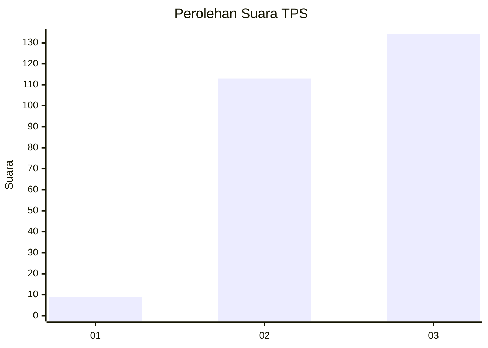
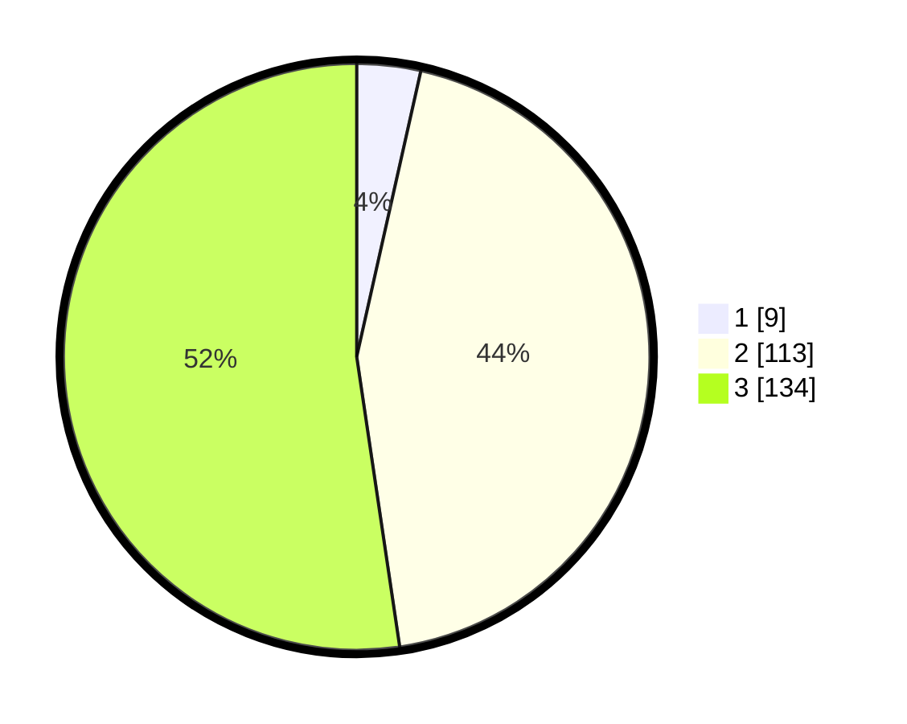

# Hasil

## Grafik

## Tabel

| No. | Nama Paslon    | Suara | Suara (raw) | Persentase |
|:--- |:-------------- | -----:| -----------:| ----------:|
| 1   | ANIES MUHAIMIN | 9     | [9][p-1]    | 3,52       |
| 2   | PRABOWO GIBRAN | 113   | [113][p-2]  | 44,14      |
| 3   | GANJAR MAHFUD  | 134   | [134][p-3]  | 52,34      |

[p-1]: https://github.com/gigit-pemilu/pemilu-2024-51-bali/blob/main/pilpres/hitung-suara/sub/51-bali/sub/03-badung/sub/05-kuta-selatan/sub/1004-benoa/sub/025-tps/sub/paslon-1.txt
[p-2]: https://github.com/gigit-pemilu/pemilu-2024-51-bali/blob/main/pilpres/hitung-suara/sub/51-bali/sub/03-badung/sub/05-kuta-selatan/sub/1004-benoa/sub/025-tps/sub/paslon-2.txt
[p-3]: https://github.com/gigit-pemilu/pemilu-2024-51-bali/blob/main/pilpres/hitung-suara/sub/51-bali/sub/03-badung/sub/05-kuta-selatan/sub/1004-benoa/sub/025-tps/sub/paslon-3.txt

## Foto C Plano

https://sirekap-obj-formc.kpu.go.id/a173/pemilu/ppwp/51/03/05/10/04/5103051004025-20240216-163814--16178bb4-f220-4f9b-b2ca-c3a89344f2c1.jpg

https://sirekap-obj-formc.kpu.go.id/a173/pemilu/ppwp/51/03/05/10/04/5103051004025-20240216-163816--4f8b8b20-b44d-4205-9fbd-dba696d8a521.jpg

https://sirekap-obj-formc.kpu.go.id/a173/pemilu/ppwp/51/03/05/10/04/5103051004025-20240216-163815--cfa539b3-7036-4d76-abc8-1b330d1e24cd.jpg

## Metadata

| Key        | Value               |
| ---------- | ------------------- |
| Time Stamp | 2024-02-21 15:00:00 |

## DATA PEMILIH TETAP

Jumlah pemilih dalam DPT: **276**.
 * L: **150**.
 * P: **126**.

## DATA PENGGUNA HAK PILIH

Jumlah pengguna hak pilih dalam DPT: **252**.
 * L: **136**.
 * P: **116**.

Jumlah pengguna hak pilih dalam DPTb: **8**.
 * L: **5**.
 * P: **3**.

Jumlah pengguna hak pilih dalam DPK: **0**.
 * L: **0**.
 * P: **0**.

Jumlah pengguna hak pilih: **260**.
 * L: **141**.
 * P: **119**.

## JUMLAH SUARA SAH DAN TIDAK SAH

JUMLAH SELURUH SUARA SAH: **256**.

JUMLAH SUARA TIDAK SAH: **4**.

JUMLAH SELURUH SUARA SAH DAN SUARA TIDAK SAH: **260**.

