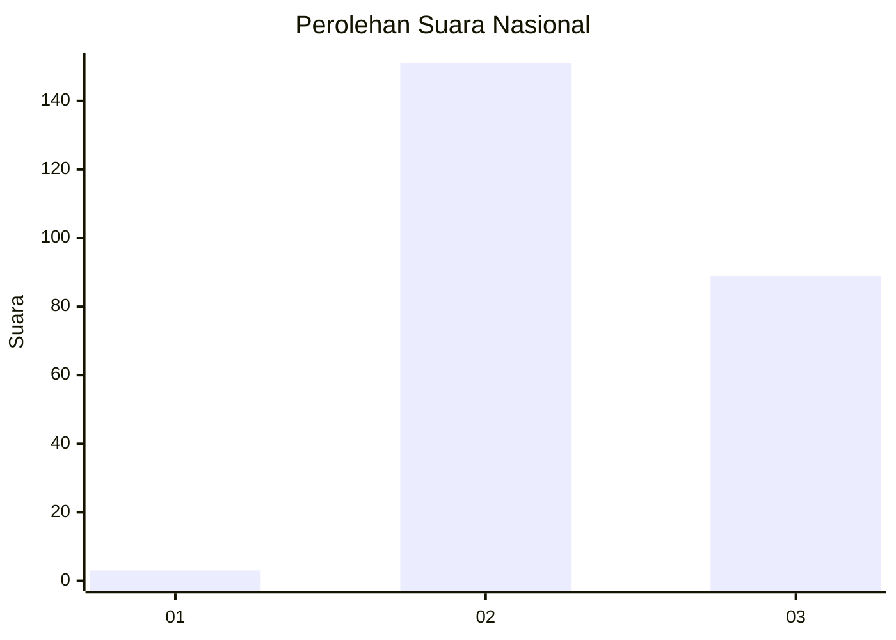
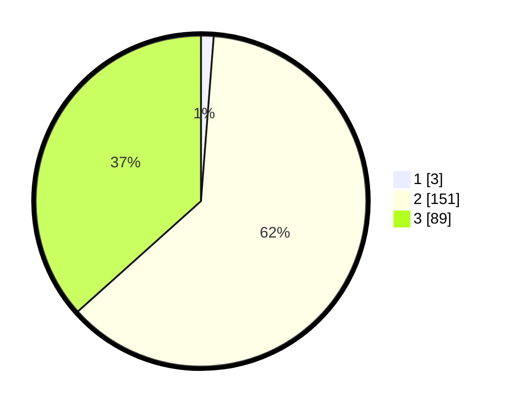

# Hasil

## Grafik

## Tabel

| No. | Nama Paslon    | Suara | Suara (raw) | Persentase |
|:--- |:-------------- | -----:| -----------:| ----------:|
| 1   | ANIES MUHAIMIN | 3     | [3][p-1]    | 1,23       |
| 2   | PRABOWO GIBRAN | 151   | [151][p-2]  | 62,14      |
| 3   | GANJAR MAHFUD  | 89    | [89][p-3]   | 36,63      |

[p-1]: https://github.com/gigit-pemilu/pemilu-2024/blob/main/pilpres/hitung-suara/sub/51-bali/sub/03-badung/sub/05-kuta-selatan/sub/1004-benoa/sub/028-tps/sub/paslon-1.txt
[p-2]: https://github.com/gigit-pemilu/pemilu-2024/blob/main/pilpres/hitung-suara/sub/51-bali/sub/03-badung/sub/05-kuta-selatan/sub/1004-benoa/sub/028-tps/sub/paslon-2.txt
[p-3]: https://github.com/gigit-pemilu/pemilu-2024/blob/main/pilpres/hitung-suara/sub/51-bali/sub/03-badung/sub/05-kuta-selatan/sub/1004-benoa/sub/028-tps/sub/paslon-3.txt

## Foto C Plano

https://sirekap-obj-formc.kpu.go.id/982f/pemilu/ppwp/51/03/05/10/04/5103051004028-20240215-212552--b4b27cdc-4810-4c9b-a5fa-4ef8485bd3c3.jpg

https://sirekap-obj-formc.kpu.go.id/982f/pemilu/ppwp/51/03/05/10/04/5103051004028-20240215-212554--ff5287b3-4dcb-4290-a97e-42420e42b21f.jpg

https://sirekap-obj-formc.kpu.go.id/982f/pemilu/ppwp/51/03/05/10/04/5103051004028-20240215-212552--efbcef3c-5648-4483-af23-5cdf8d97c02c.jpg

## Metadata

| Key        | Value               |
| ---------- | ------------------- |
| Time Stamp | 2024-02-22 21:00:00 |

## DATA PEMILIH TETAP

Jumlah pemilih dalam DPT: **269**.
 * L: **132**.
 * P: **137**.

## DATA PENGGUNA HAK PILIH

Jumlah pengguna hak pilih dalam DPT: **241**.
 * L: **117**.
 * P: **124**.

Jumlah pengguna hak pilih dalam DPTb: **241**.
 * L: **117**.
 * P: **124**.

Jumlah pengguna hak pilih dalam DPK: **5**.
 * L: **2**.
 * P: **3**.

Jumlah pengguna hak pilih: **247**.
 * L: **119**.
 * P: **128**.

## JUMLAH SUARA SAH DAN TIDAK SAH

JUMLAH SELURUH SUARA SAH: **243**.

JUMLAH SUARA TIDAK SAH: **4**.

JUMLAH SELURUH SUARA SAH DAN SUARA TIDAK SAH: **247**.

