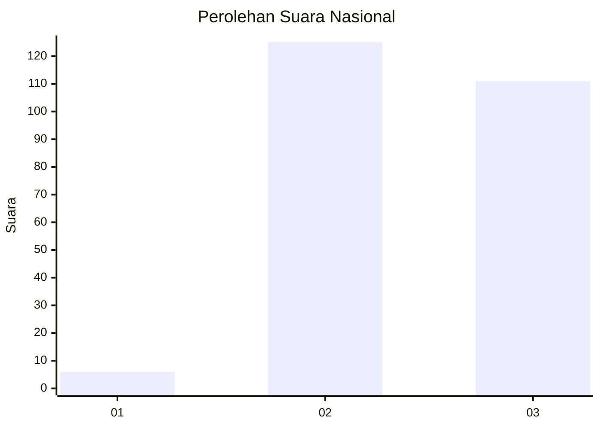
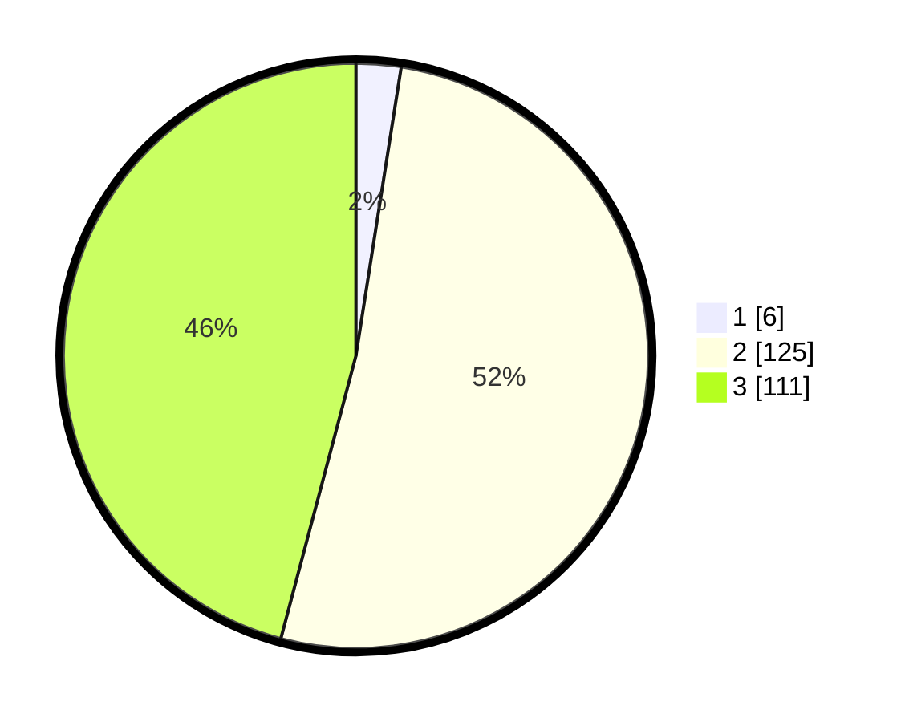

# Hasil

## Grafik

## Tabel

| No. | Nama Paslon    | Suara | Suara (raw) | Persentase |
|:--- |:-------------- | -----:| -----------:| ----------:|
| 1   | ANIES MUHAIMIN | 6     | [6][p-1]    | 2,48       |
| 2   | PRABOWO GIBRAN | 125   | [125][p-2]  | 51,65      |
| 3   | GANJAR MAHFUD  | 111   | [111][p-3]  | 45,87      |

[p-1]: https://github.com/gigit-pemilu/pemilu-2024/blob/main/pilpres/hitung-suara/sub/51-bali/sub/03-badung/sub/05-kuta-selatan/sub/1004-benoa/sub/030-tps/sub/paslon-1.txt
[p-2]: https://github.com/gigit-pemilu/pemilu-2024/blob/main/pilpres/hitung-suara/sub/51-bali/sub/03-badung/sub/05-kuta-selatan/sub/1004-benoa/sub/030-tps/sub/paslon-2.txt
[p-3]: https://github.com/gigit-pemilu/pemilu-2024/blob/main/pilpres/hitung-suara/sub/51-bali/sub/03-badung/sub/05-kuta-selatan/sub/1004-benoa/sub/030-tps/sub/paslon-3.txt

## Foto C Plano

https://sirekap-obj-formc.kpu.go.id/8d80/pemilu/ppwp/51/03/05/10/04/5103051004030-20240214-132109--de5ae7bc-3555-4f8b-8fc1-04fd41980f90.jpg

https://sirekap-obj-formc.kpu.go.id/8d80/pemilu/ppwp/51/03/05/10/04/5103051004030-20240214-132308--73f1986b-f657-4063-a561-713d781ac172.jpg

https://sirekap-obj-formc.kpu.go.id/8d80/pemilu/ppwp/51/03/05/10/04/5103051004030-20240214-132400--973dcd19-6f82-49d4-8917-009b3c5c6434.jpg

## Metadata

| Key        | Value               |
| ---------- | ------------------- |
| Time Stamp | 2024-02-15 00:41:44 |

## DATA PEMILIH TETAP

Jumlah pemilih dalam DPT: **266**.
 * L: **127**.
 * P: **139**.

## DATA PENGGUNA HAK PILIH

Jumlah pengguna hak pilih dalam DPT: **233**.
 * L: **115**.
 * P: **118**.

Jumlah pengguna hak pilih dalam DPTb: **0**.
 * L: **0**.
 * P: **0**.

Jumlah pengguna hak pilih dalam DPK: **9**.
 * L: **3**.
 * P: **6**.

Jumlah pengguna hak pilih: **242**.
 * L: **118**.
 * P: **124**.

## JUMLAH SUARA SAH DAN TIDAK SAH

JUMLAH SELURUH SUARA SAH: **242**.

JUMLAH SUARA TIDAK SAH: **0**.

JUMLAH SELURUH SUARA SAH DAN SUARA TIDAK SAH: **242**.

