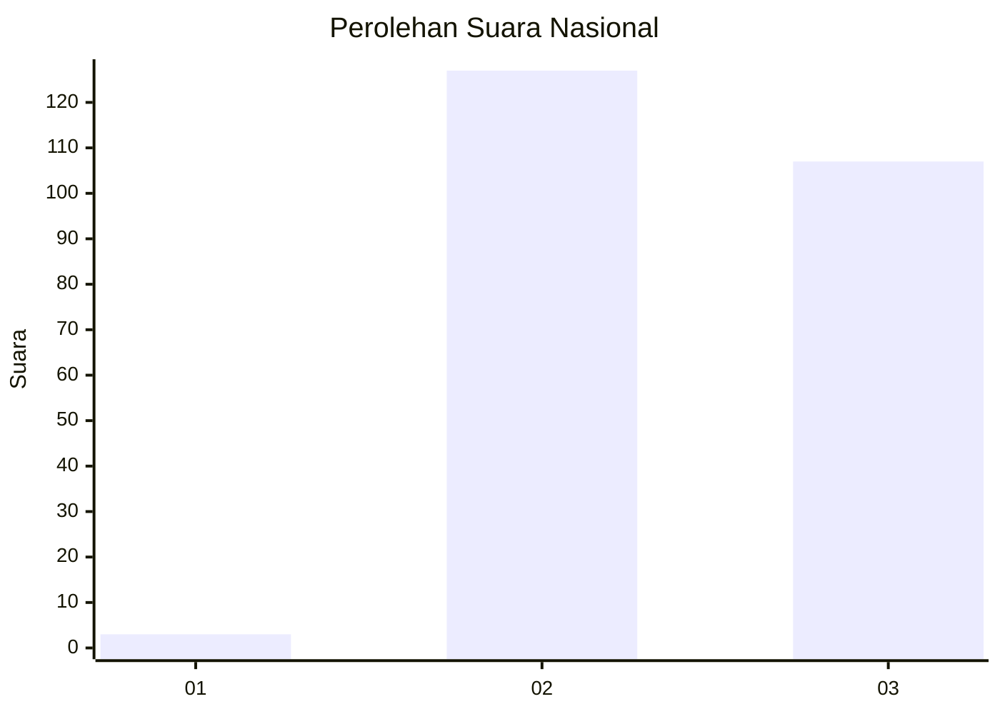
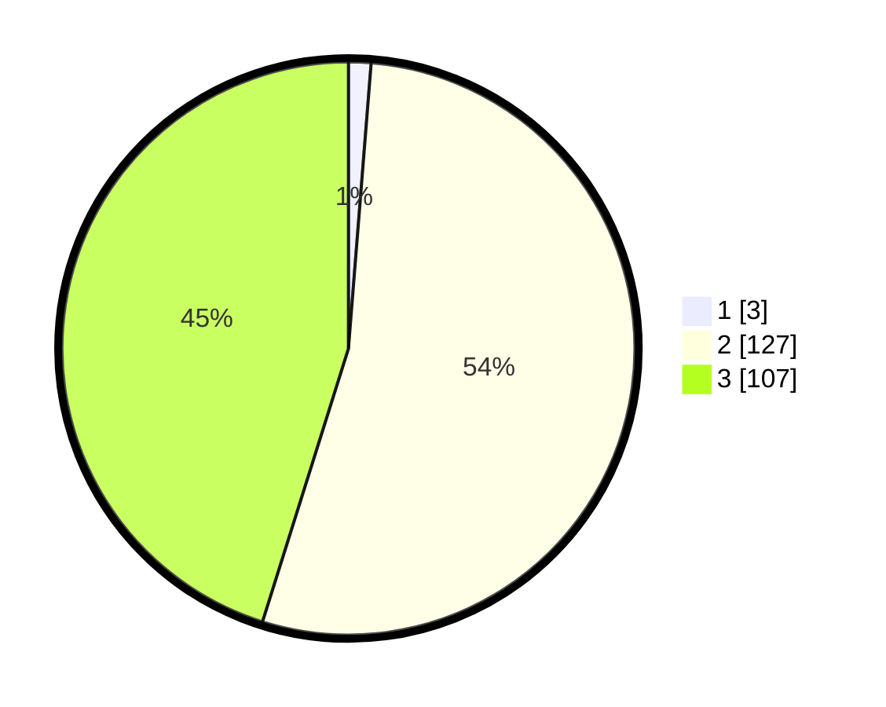

# Hasil

## Grafik

## Tabel

| No. | Nama Paslon    | Suara | Suara (raw) | Persentase |
|:--- |:-------------- | -----:| -----------:| ----------:|
| 1   | ANIES MUHAIMIN | 3     | [3][p-1]    | 1,27       |
| 2   | PRABOWO GIBRAN | 127   | [127][p-2]  | 53,59      |
| 3   | GANJAR MAHFUD  | 107   | [107][p-3]  | 45,15      |

[p-1]: https://github.com/gigit-pemilu/pemilu-2024/blob/main/pilpres/hitung-suara/sub/51-bali/sub/03-badung/sub/05-kuta-selatan/sub/1004-benoa/sub/031-tps/sub/paslon-1.txt
[p-2]: https://github.com/gigit-pemilu/pemilu-2024/blob/main/pilpres/hitung-suara/sub/51-bali/sub/03-badung/sub/05-kuta-selatan/sub/1004-benoa/sub/031-tps/sub/paslon-2.txt
[p-3]: https://github.com/gigit-pemilu/pemilu-2024/blob/main/pilpres/hitung-suara/sub/51-bali/sub/03-badung/sub/05-kuta-selatan/sub/1004-benoa/sub/031-tps/sub/paslon-3.txt

## Foto C Plano

https://sirekap-obj-formc.kpu.go.id/bac0/pemilu/ppwp/51/03/05/10/04/5103051004031-20240214-220246--54cba3d4-6518-4d24-83f6-938b406be2b8.jpg

https://sirekap-obj-formc.kpu.go.id/bac0/pemilu/ppwp/51/03/05/10/04/5103051004031-20240214-184538--366f9183-269d-4615-9b3a-6ffc36b53cf8.jpg

https://sirekap-obj-formc.kpu.go.id/bac0/pemilu/ppwp/51/03/05/10/04/5103051004031-20240214-185312--dceea37c-f534-46c7-a0e5-5c896b85c444.jpg

## Metadata

| Key        | Value               |
| ---------- | ------------------- |
| Time Stamp | 2024-02-15 00:41:44 |

