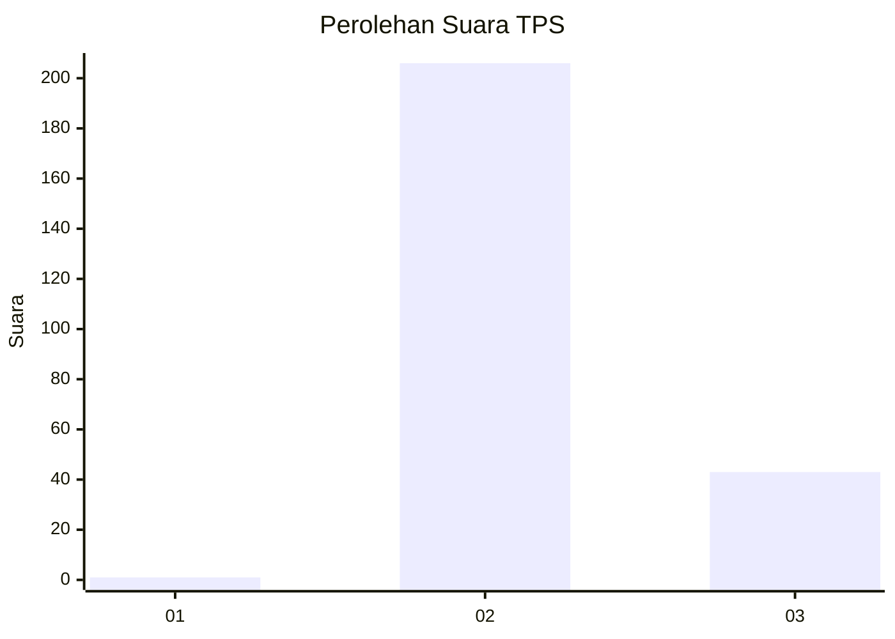
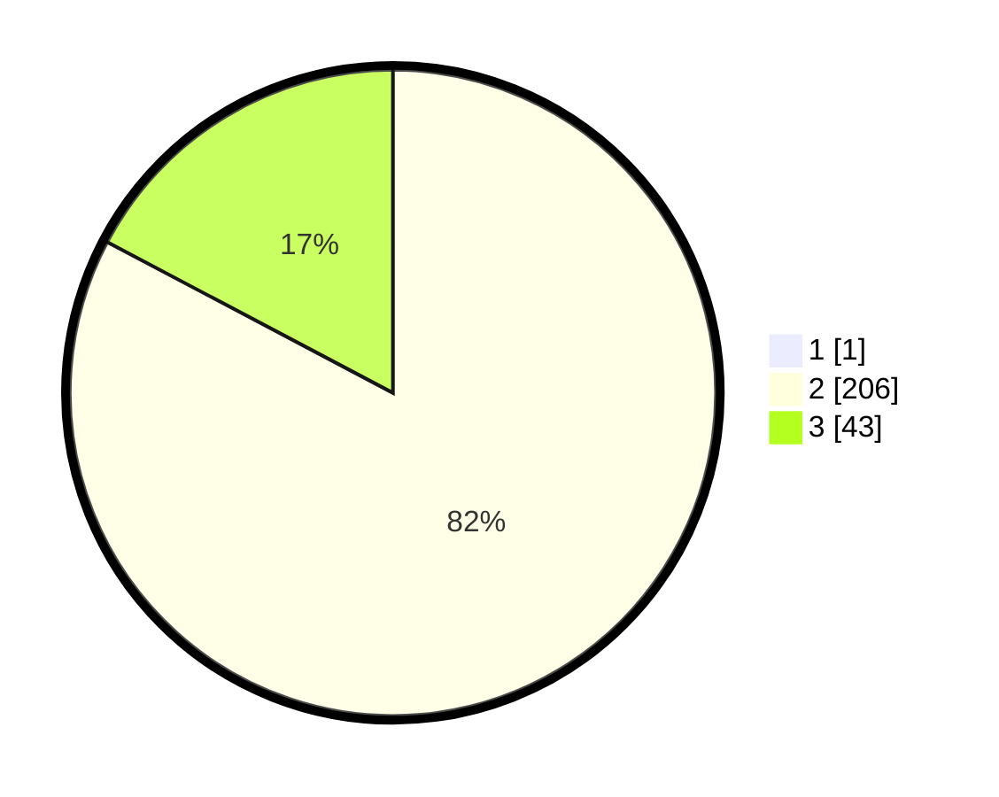

# Hasil

## Grafik

## Tabel

| No. | Nama Paslon    | Suara | Suara (raw) | Persentase |
|:--- |:-------------- | -----:| -----------:| ----------:|
| 1   | ANIES MUHAIMIN | 1     | [1][p-1]    | 0,40       |
| 2   | PRABOWO GIBRAN | 206   | [206][p-2]  | 82,40      |
| 3   | GANJAR MAHFUD  | 43    | [43][p-3]   | 17,20      |

[p-1]: https://github.com/gigit-pemilu/pemilu-2024-51-bali/blob/main/pilpres/hitung-suara/sub/51-bali/sub/03-badung/sub/05-kuta-selatan/sub/1004-benoa/sub/035-tps/sub/paslon-1.txt
[p-2]: https://github.com/gigit-pemilu/pemilu-2024-51-bali/blob/main/pilpres/hitung-suara/sub/51-bali/sub/03-badung/sub/05-kuta-selatan/sub/1004-benoa/sub/035-tps/sub/paslon-2.txt
[p-3]: https://github.com/gigit-pemilu/pemilu-2024-51-bali/blob/main/pilpres/hitung-suara/sub/51-bali/sub/03-badung/sub/05-kuta-selatan/sub/1004-benoa/sub/035-tps/sub/paslon-3.txt

## Foto C Plano

https://sirekap-obj-formc.kpu.go.id/8c3f/pemilu/ppwp/51/03/05/10/04/5103051004035-20240215-022200--2fcb246e-d39f-43ce-bf02-ff9b928444bc.jpg

https://sirekap-obj-formc.kpu.go.id/8c3f/pemilu/ppwp/51/03/05/10/04/5103051004035-20240215-022442--774a0464-4b42-4136-af6a-9cf7f96b5326.jpg

https://sirekap-obj-formc.kpu.go.id/8c3f/pemilu/ppwp/51/03/05/10/04/5103051004035-20240215-022645--3c5ff8f4-2ea6-451d-957d-b52a46ce8530.jpg

## Metadata

| Key        | Value               |
| ---------- | ------------------- |
| Time Stamp | 2024-02-24 22:31:28 |

## DATA PEMILIH TETAP

Jumlah pemilih dalam DPT: **275**.
 * L: **734**.
 * P: **141**.

## DATA PENGGUNA HAK PILIH

Jumlah pengguna hak pilih dalam DPT: **255**.
 * L: **126**.
 * P: **724**.

Jumlah pengguna hak pilih dalam DPTb: **68**.
 * L: **0**.
 * P: **0**.

Jumlah pengguna hak pilih dalam DPK: **6**.
 * L: **4**.
 * P: **2**.

Jumlah pengguna hak pilih: **256**.
 * L: **137**.
 * P: **126**.

## JUMLAH SUARA SAH DAN TIDAK SAH

JUMLAH SELURUH SUARA SAH: **249**.

JUMLAH SUARA TIDAK SAH: **6**.

JUMLAH SELURUH SUARA SAH DAN SUARA TIDAK SAH: **255**.

