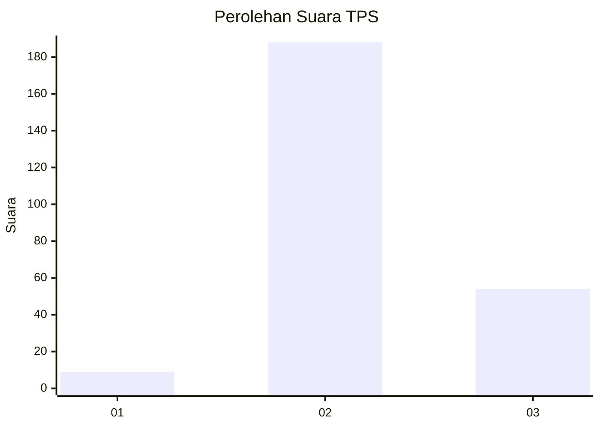

# Hasil

## Grafik

## Tabel

| No. | Nama Paslon    | Suara | Suara (raw) | Persentase |
|:--- |:-------------- | -----:| -----------:| ----------:|
| 1   | ANIES MUHAIMIN | 9     | [9][p-1]    | 3,59       |
| 2   | PRABOWO GIBRAN | 188   | [188][p-2]  | 74,90      |
| 3   | GANJAR MAHFUD  | 54    | [54][p-3]   | 21,51      |

[p-1]: https://github.com/gigit-pemilu/pemilu-2024-51-bali/blob/main/pilpres/hitung-suara/sub/51-bali/sub/03-badung/sub/05-kuta-selatan/sub/1004-benoa/sub/037-tps/sub/paslon-1.txt
[p-2]: https://github.com/gigit-pemilu/pemilu-2024-51-bali/blob/main/pilpres/hitung-suara/sub/51-bali/sub/03-badung/sub/05-kuta-selatan/sub/1004-benoa/sub/037-tps/sub/paslon-2.txt
[p-3]: https://github.com/gigit-pemilu/pemilu-2024-51-bali/blob/main/pilpres/hitung-suara/sub/51-bali/sub/03-badung/sub/05-kuta-selatan/sub/1004-benoa/sub/037-tps/sub/paslon-3.txt

## Foto C Plano

https://sirekap-obj-formc.kpu.go.id/93d8/pemilu/ppwp/51/03/05/10/04/5103051004037-20240214-232656--26c3d5eb-ceef-42ce-8335-bd50255a005d.jpg

https://sirekap-obj-formc.kpu.go.id/93d8/pemilu/ppwp/51/03/05/10/04/5103051004037-20240214-232709--05a95cee-4a0e-43c8-b017-4f645980c43e.jpg

https://sirekap-obj-formc.kpu.go.id/93d8/pemilu/ppwp/51/03/05/10/04/5103051004037-20240214-232724--8ccf6246-2b6c-456a-965f-a508f9002b1b.jpg

## Metadata

| Key        | Value               |
| ---------- | ------------------- |
| Time Stamp | 2024-02-21 12:00:00 |

## DATA PEMILIH TETAP

Jumlah pemilih dalam DPT: **272**.
 * L: **141**.
 * P: **131**.

## DATA PENGGUNA HAK PILIH

Jumlah pengguna hak pilih dalam DPT: **249**.
 * L: **127**.
 * P: **122**.

Jumlah pengguna hak pilih dalam DPTb: **0**.
 * L: **0**.
 * P: **0**.

Jumlah pengguna hak pilih dalam DPK: **6**.
 * L: **1**.
 * P: **5**.

Jumlah pengguna hak pilih: **255**.
 * L: **128**.
 * P: **127**.

## JUMLAH SUARA SAH DAN TIDAK SAH

JUMLAH SELURUH SUARA SAH: **251**.

JUMLAH SUARA TIDAK SAH: **4**.

JUMLAH SELURUH SUARA SAH DAN SUARA TIDAK SAH: **255**.

