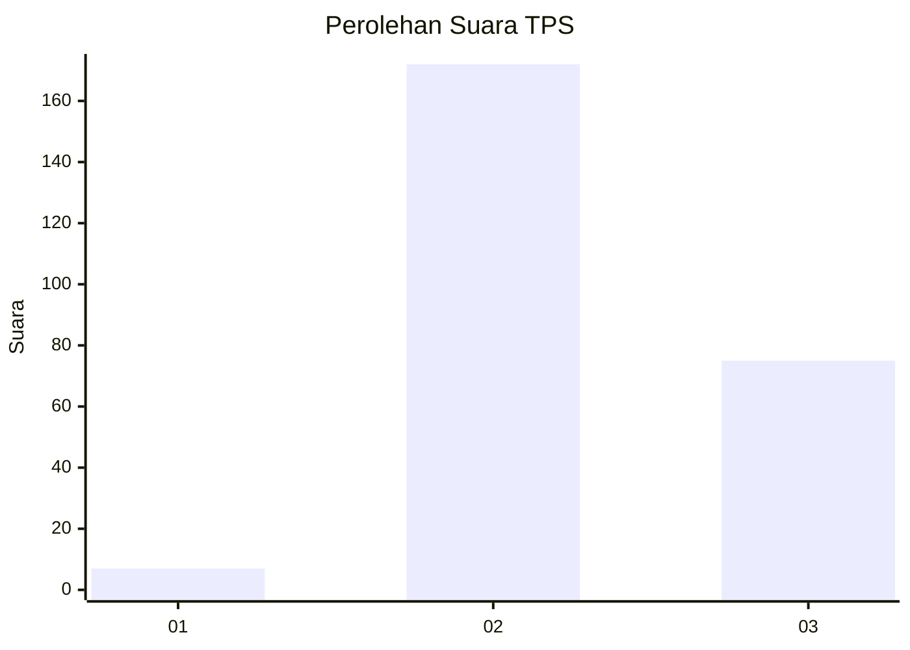

# Hasil

## Grafik

## Tabel

| No. | Nama Paslon    | Suara | Suara (raw) | Persentase |
|:--- |:-------------- | -----:| -----------:| ----------:|
| 1   | ANIES MUHAIMIN | 7     | [7][p-1]    | 2,76       |
| 2   | PRABOWO GIBRAN | 172   | [172][p-2]  | 67,72      |
| 3   | GANJAR MAHFUD  | 75    | [75][p-3]   | 29,53      |

[p-1]: https://github.com/gigit-pemilu/pemilu-2024-51-bali/blob/main/pilpres/hitung-suara/sub/51-bali/sub/03-badung/sub/05-kuta-selatan/sub/1004-benoa/sub/039-tps/sub/paslon-1.txt
[p-2]: https://github.com/gigit-pemilu/pemilu-2024-51-bali/blob/main/pilpres/hitung-suara/sub/51-bali/sub/03-badung/sub/05-kuta-selatan/sub/1004-benoa/sub/039-tps/sub/paslon-2.txt
[p-3]: https://github.com/gigit-pemilu/pemilu-2024-51-bali/blob/main/pilpres/hitung-suara/sub/51-bali/sub/03-badung/sub/05-kuta-selatan/sub/1004-benoa/sub/039-tps/sub/paslon-3.txt

## Foto C Plano

https://sirekap-obj-formc.kpu.go.id/5766/pemilu/ppwp/51/03/05/10/04/5103051004039-20240214-230706--17c5238f-be4c-46cc-93d9-2fea8ff1785f.jpg

https://sirekap-obj-formc.kpu.go.id/5766/pemilu/ppwp/51/03/05/10/04/5103051004039-20240214-230812--71c93276-fe57-4cfb-a524-b2bfe5d467e0.jpg

https://sirekap-obj-formc.kpu.go.id/5766/pemilu/ppwp/51/03/05/10/04/5103051004039-20240214-230934--dc609f1b-9197-481f-8e9e-862d35db42d4.jpg

## Metadata

| Key        | Value               |
| ---------- | ------------------- |
| Time Stamp | 2024-02-24 22:31:28 |

