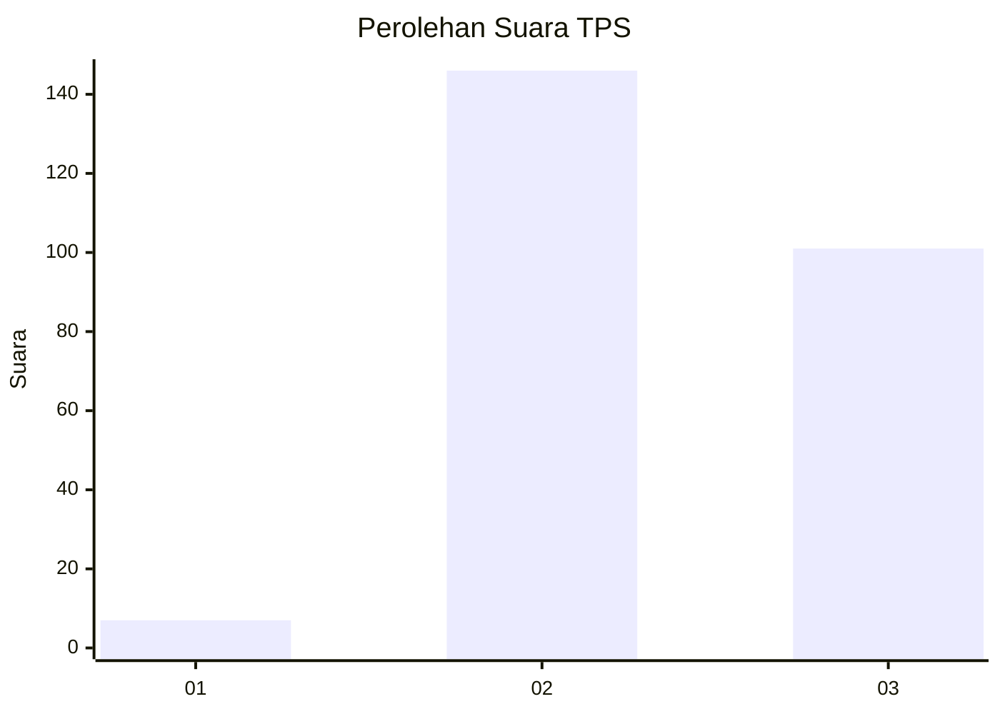
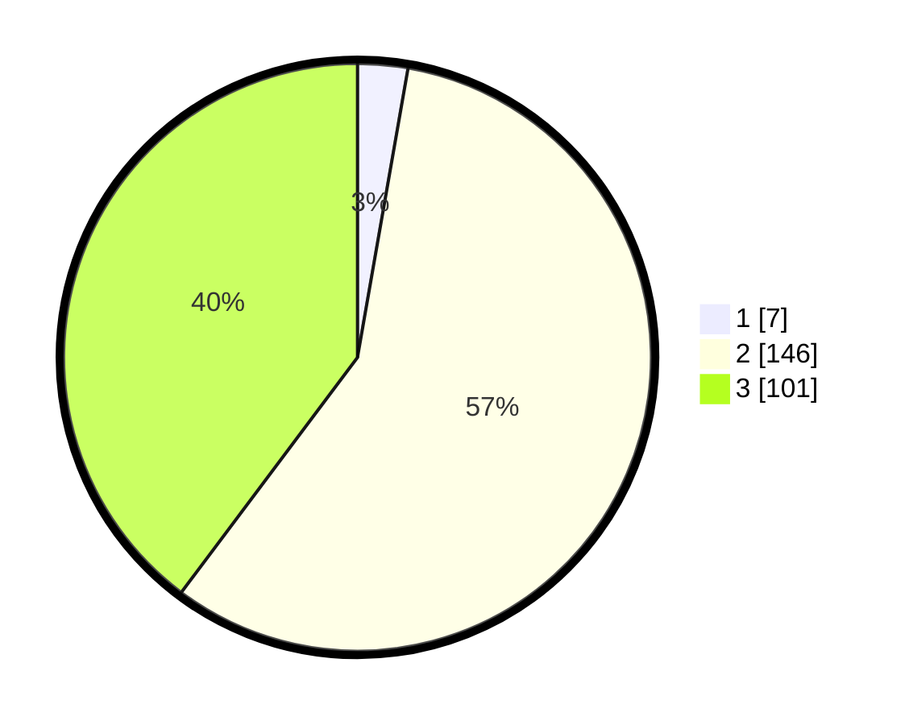

# Hasil

## Grafik

## Tabel

| No. | Nama Paslon    | Suara | Suara (raw) | Persentase |
|:--- |:-------------- | -----:| -----------:| ----------:|
| 1   | ANIES MUHAIMIN | 7     | [7][p-1]    | 2,76       |
| 2   | PRABOWO GIBRAN | 146   | [146][p-2]  | 57,48      |
| 3   | GANJAR MAHFUD  | 101   | [101][p-3]  | 39,76      |

[p-1]: https://github.com/gigit-pemilu/pemilu-2024-51-bali/blob/main/pilpres/hitung-suara/sub/51-bali/sub/03-badung/sub/05-kuta-selatan/sub/1004-benoa/sub/040-tps/sub/paslon-1.txt
[p-2]: https://github.com/gigit-pemilu/pemilu-2024-51-bali/blob/main/pilpres/hitung-suara/sub/51-bali/sub/03-badung/sub/05-kuta-selatan/sub/1004-benoa/sub/040-tps/sub/paslon-2.txt
[p-3]: https://github.com/gigit-pemilu/pemilu-2024-51-bali/blob/main/pilpres/hitung-suara/sub/51-bali/sub/03-badung/sub/05-kuta-selatan/sub/1004-benoa/sub/040-tps/sub/paslon-3.txt

## Foto C Plano

https://sirekap-obj-formc.kpu.go.id/1457/pemilu/ppwp/51/03/05/10/04/5103051004040-20240214-141620--02c9ef19-41fa-4bf4-be25-c9f26966ac62.jpg

https://sirekap-obj-formc.kpu.go.id/1457/pemilu/ppwp/51/03/05/10/04/5103051004040-20240214-141145--c90ee52c-4189-4202-8f45-a79667c1610b.jpg

https://sirekap-obj-formc.kpu.go.id/1457/pemilu/ppwp/51/03/05/10/04/5103051004040-20240214-141255--25bd2d45-fa6f-4b7b-a628-e1e9e896cd76.jpg

## Metadata

| Key        | Value               |
| ---------- | ------------------- |
| Time Stamp | 2024-02-15 00:41:44 |

