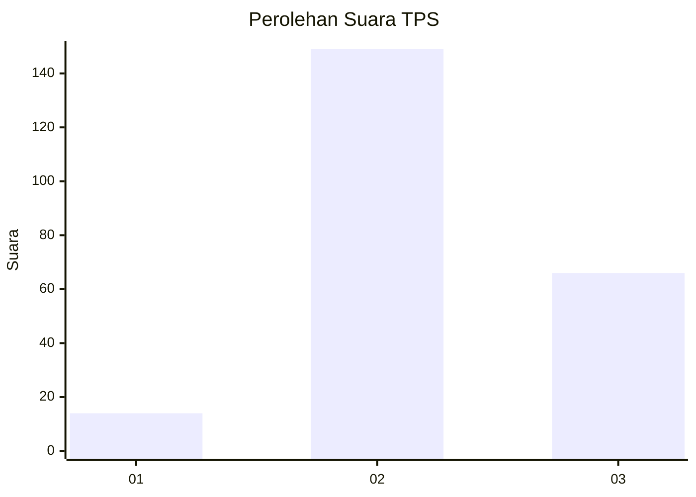
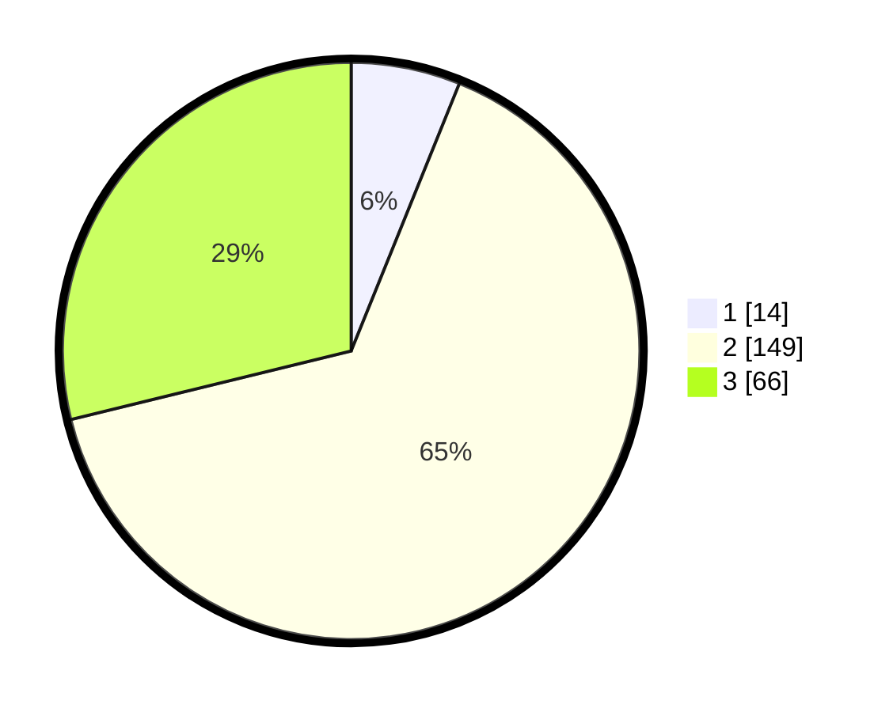

# Hasil

## Grafik

## Tabel

| No. | Nama Paslon    | Suara | Suara (raw) | Persentase |
|:--- |:-------------- | -----:| -----------:| ----------:|
| 1   | ANIES MUHAIMIN | 14    | [14][p-1]   | 6,11       |
| 2   | PRABOWO GIBRAN | 149   | [149][p-2]  | 65,07      |
| 3   | GANJAR MAHFUD  | 66    | [66][p-3]   | 28,82      |

[p-1]: https://github.com/gigit-pemilu/pemilu-2024-51-bali/blob/main/pilpres/hitung-suara/sub/51-bali/sub/03-badung/sub/05-kuta-selatan/sub/1004-benoa/sub/043-tps/sub/paslon-1.txt
[p-2]: https://github.com/gigit-pemilu/pemilu-2024-51-bali/blob/main/pilpres/hitung-suara/sub/51-bali/sub/03-badung/sub/05-kuta-selatan/sub/1004-benoa/sub/043-tps/sub/paslon-2.txt
[p-3]: https://github.com/gigit-pemilu/pemilu-2024-51-bali/blob/main/pilpres/hitung-suara/sub/51-bali/sub/03-badung/sub/05-kuta-selatan/sub/1004-benoa/sub/043-tps/sub/paslon-3.txt

## Foto C Plano

https://sirekap-obj-formc.kpu.go.id/44d0/pemilu/ppwp/51/03/05/10/04/5103051004043-20240214-194251--0e37fcab-44c1-4ec3-a095-a38d24a29a52.jpg

https://sirekap-obj-formc.kpu.go.id/44d0/pemilu/ppwp/51/03/05/10/04/5103051004043-20240216-151213--92ebfb3b-f295-456d-95f1-0a31c86ca91e.jpg

https://sirekap-obj-formc.kpu.go.id/44d0/pemilu/ppwp/51/03/05/10/04/5103051004043-20240216-151212--de7f200a-ef50-4d45-8470-005fff87af50.jpg

## Metadata

| Key        | Value               |
| ---------- | ------------------- |
| Time Stamp | 2024-02-21 11:00:00 |

## DATA PEMILIH TETAP

Jumlah pemilih dalam DPT: **275**.
 * L: **134**.
 * P: **141**.

## DATA PENGGUNA HAK PILIH

Jumlah pengguna hak pilih dalam DPT: **211**.
 * L: **103**.
 * P: **108**.

Jumlah pengguna hak pilih dalam DPTb: **6**.
 * L: **4**.
 * P: **2**.

Jumlah pengguna hak pilih dalam DPK: **15**.
 * L: **8**.
 * P: **7**.

Jumlah pengguna hak pilih: **232**.
 * L: **115**.
 * P: **117**.

## JUMLAH SUARA SAH DAN TIDAK SAH

JUMLAH SELURUH SUARA SAH: **229**.

JUMLAH SUARA TIDAK SAH: **3**.

JUMLAH SELURUH SUARA SAH DAN SUARA TIDAK SAH: **232**.

