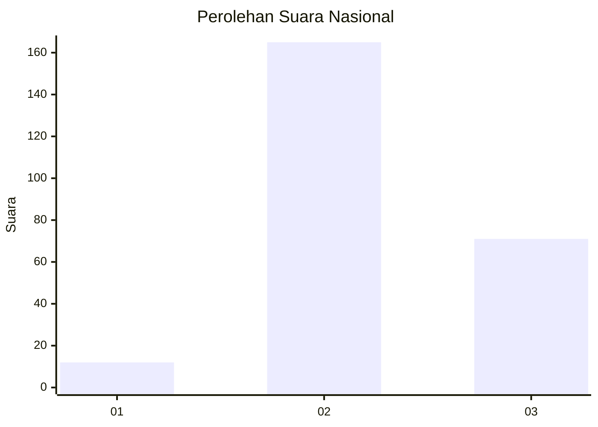
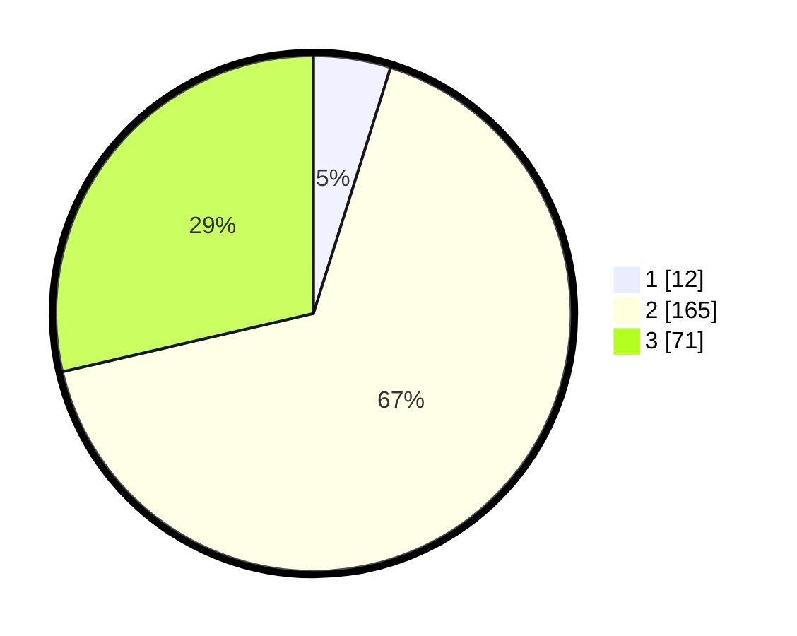

# Hasil

## Grafik

## Tabel

| No. | Nama Paslon    | Suara | Suara (raw) | Persentase |
|:--- |:-------------- | -----:| -----------:| ----------:|
| 1   | ANIES MUHAIMIN | 12    | [12][p-1]   | 4,84       |
| 2   | PRABOWO GIBRAN | 165   | [165][p-2]  | 66,53      |
| 3   | GANJAR MAHFUD  | 71    | [71][p-3]   | 28,63      |

[p-1]: https://github.com/gigit-pemilu/pemilu-2024/blob/main/pilpres/hitung-suara/sub/51-bali/sub/03-badung/sub/05-kuta-selatan/sub/1004-benoa/sub/047-tps/sub/paslon-1.txt
[p-2]: https://github.com/gigit-pemilu/pemilu-2024/blob/main/pilpres/hitung-suara/sub/51-bali/sub/03-badung/sub/05-kuta-selatan/sub/1004-benoa/sub/047-tps/sub/paslon-2.txt
[p-3]: https://github.com/gigit-pemilu/pemilu-2024/blob/main/pilpres/hitung-suara/sub/51-bali/sub/03-badung/sub/05-kuta-selatan/sub/1004-benoa/sub/047-tps/sub/paslon-3.txt

## Foto C Plano

https://sirekap-obj-formc.kpu.go.id/e76e/pemilu/ppwp/51/03/05/10/04/5103051004047-20240215-021718--7aeedc3b-7699-4daf-a4be-9dfc592bbe0f.jpg

https://sirekap-obj-formc.kpu.go.id/e76e/pemilu/ppwp/51/03/05/10/04/5103051004047-20240215-021803--f177b3a8-aa62-4da7-83d5-bd6abeefe844.jpg

https://sirekap-obj-formc.kpu.go.id/e76e/pemilu/ppwp/51/03/05/10/04/5103051004047-20240215-021909--97f0b0b7-fab1-44a9-ba8d-6f54d5c787df.jpg

## Metadata

| Key        | Value               |
| ---------- | ------------------- |
| Time Stamp | 2024-02-25 11:00:00 |

