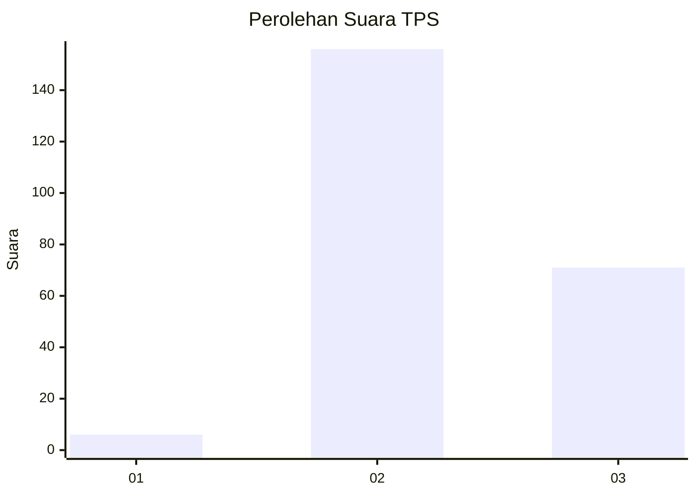

# Hasil

## Grafik

## Tabel

| No. | Nama Paslon    | Suara | Suara (raw) | Persentase |
|:--- |:-------------- | -----:| -----------:| ----------:|
| 1   | ANIES MUHAIMIN | 6     | [6][p-1]    | 2,58       |
| 2   | PRABOWO GIBRAN | 156   | [156][p-2]  | 66,95      |
| 3   | GANJAR MAHFUD  | 71    | [71][p-3]   | 30,47      |

[p-1]: https://github.com/gigit-pemilu/pemilu-2024-51-bali/blob/main/pilpres/hitung-suara/sub/51-bali/sub/03-badung/sub/05-kuta-selatan/sub/1004-benoa/sub/053-tps/sub/paslon-1.txt
[p-2]: https://github.com/gigit-pemilu/pemilu-2024-51-bali/blob/main/pilpres/hitung-suara/sub/51-bali/sub/03-badung/sub/05-kuta-selatan/sub/1004-benoa/sub/053-tps/sub/paslon-2.txt
[p-3]: https://github.com/gigit-pemilu/pemilu-2024-51-bali/blob/main/pilpres/hitung-suara/sub/51-bali/sub/03-badung/sub/05-kuta-selatan/sub/1004-benoa/sub/053-tps/sub/paslon-3.txt

## Foto C Plano

https://sirekap-obj-formc.kpu.go.id/1e60/pemilu/ppwp/51/03/05/10/04/5103051004053-20240214-225635--8f1fe35a-06cd-4184-9df8-a6675d7d00ce.jpg

https://sirekap-obj-formc.kpu.go.id/1e60/pemilu/ppwp/51/03/05/10/04/5103051004053-20240214-225748--469f7bb1-ae2f-41f8-ae16-8d41ce6410a0.jpg

https://sirekap-obj-formc.kpu.go.id/1e60/pemilu/ppwp/51/03/05/10/04/5103051004053-20240214-225836--43f4ccc9-f873-4f08-917e-ba65cc37dcbc.jpg

## Metadata

| Key        | Value               |
| ---------- | ------------------- |
| Time Stamp | 2024-02-24 22:31:28 |

## DATA PEMILIH TETAP

Jumlah pemilih dalam DPT: **272**.
 * L: **141**.
 * P: **131**.

## DATA PENGGUNA HAK PILIH

Jumlah pengguna hak pilih dalam DPT: **224**.
 * L: **118**.
 * P: **106**.

Jumlah pengguna hak pilih dalam DPTb: **3**.
 * L: **1**.
 * P: **2**.

Jumlah pengguna hak pilih dalam DPK: **8**.
 * L: **3**.
 * P: **5**.

Jumlah pengguna hak pilih: **235**.
 * L: **122**.
 * P: **113**.

## JUMLAH SUARA SAH DAN TIDAK SAH

JUMLAH SELURUH SUARA SAH: **233**.

JUMLAH SUARA TIDAK SAH: **2**.

JUMLAH SELURUH SUARA SAH DAN SUARA TIDAK SAH: **235**.

