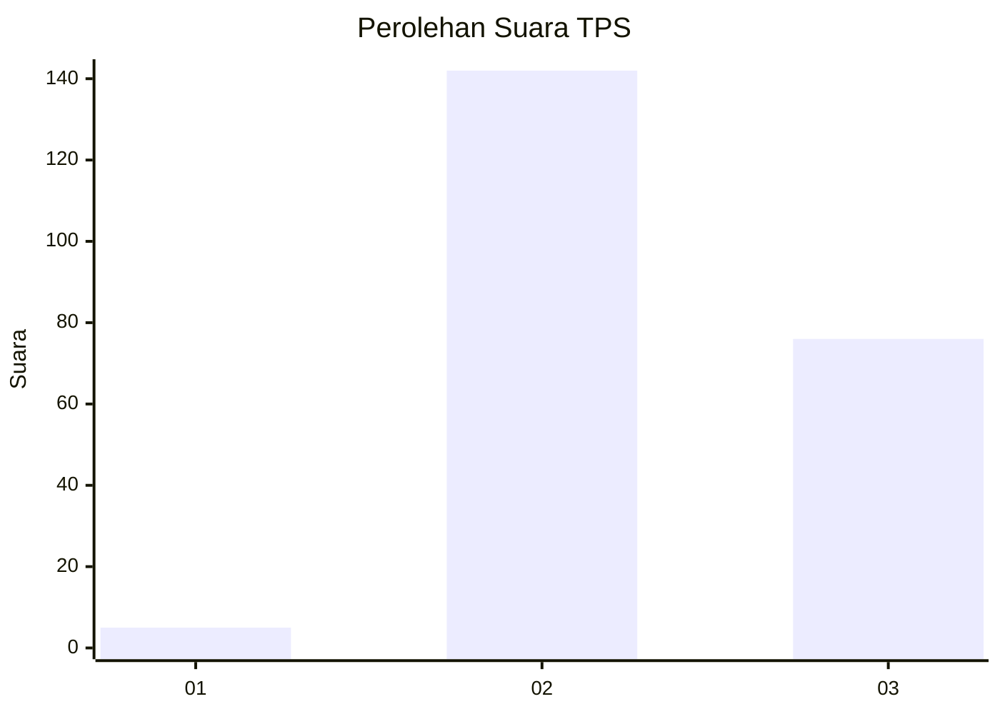
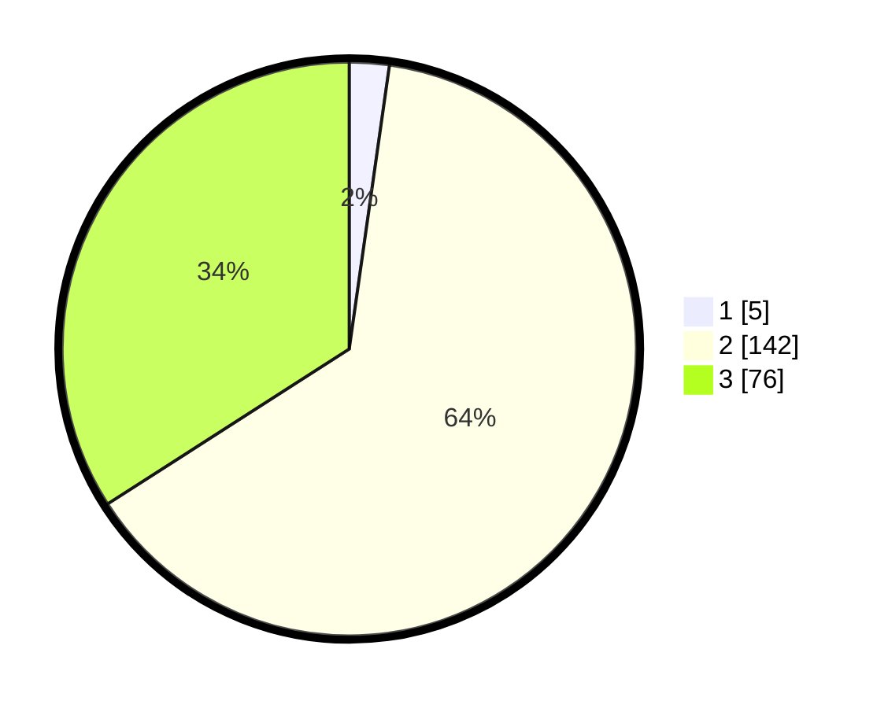

# Hasil

## Grafik

## Tabel

| No. | Nama Paslon    | Suara | Suara (raw) | Persentase |
|:--- |:-------------- | -----:| -----------:| ----------:|
| 1   | ANIES MUHAIMIN | 5     | [5][p-1]    | 2,24       |
| 2   | PRABOWO GIBRAN | 142   | [142][p-2]  | 63,68      |
| 3   | GANJAR MAHFUD  | 76    | [76][p-3]   | 34,08      |

[p-1]: https://github.com/gigit-pemilu/pemilu-2024-51-bali/blob/main/pilpres/hitung-suara/sub/51-bali/sub/03-badung/sub/05-kuta-selatan/sub/1004-benoa/sub/054-tps/sub/paslon-1.txt
[p-2]: https://github.com/gigit-pemilu/pemilu-2024-51-bali/blob/main/pilpres/hitung-suara/sub/51-bali/sub/03-badung/sub/05-kuta-selatan/sub/1004-benoa/sub/054-tps/sub/paslon-2.txt
[p-3]: https://github.com/gigit-pemilu/pemilu-2024-51-bali/blob/main/pilpres/hitung-suara/sub/51-bali/sub/03-badung/sub/05-kuta-selatan/sub/1004-benoa/sub/054-tps/sub/paslon-3.txt

## Foto C Plano

https://sirekap-obj-formc.kpu.go.id/c577/pemilu/ppwp/51/03/05/10/04/5103051004054-20240214-195555--c5026a97-1bc0-49a7-b495-0ceb7204a3e0.jpg

https://sirekap-obj-formc.kpu.go.id/c577/pemilu/ppwp/51/03/05/10/04/5103051004054-20240214-195631--c3474317-cd87-4072-8aba-da3e65aa4f06.jpg

https://sirekap-obj-formc.kpu.go.id/c577/pemilu/ppwp/51/03/05/10/04/5103051004054-20240214-195653--8d39d81b-1efa-4f77-ac66-64ec21632fef.jpg

## Metadata

| Key        | Value               |
| ---------- | ------------------- |
| Time Stamp | 2024-02-24 22:31:28 |

