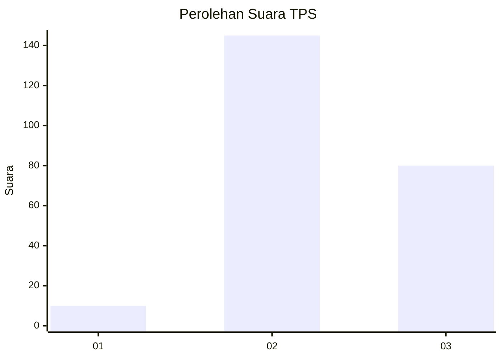
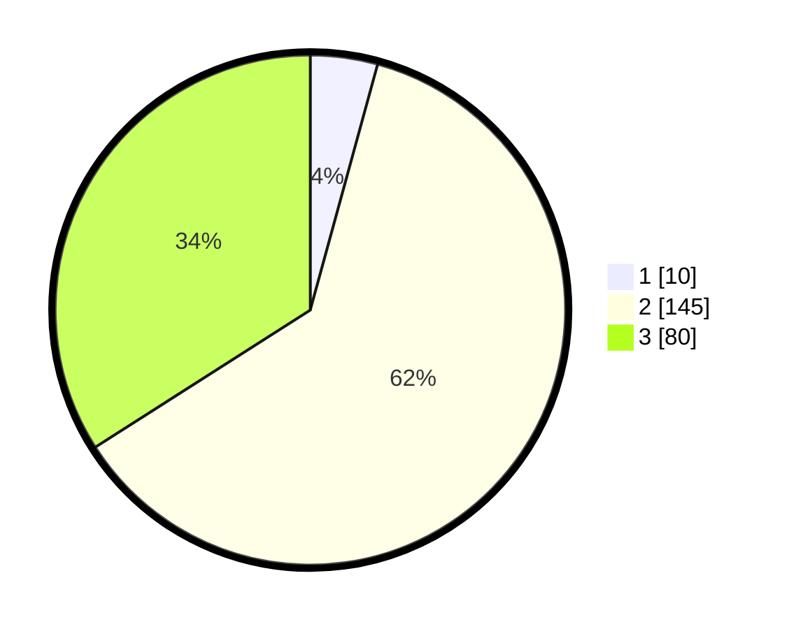

# Hasil

## Grafik

## Tabel

| No. | Nama Paslon    | Suara | Suara (raw) | Persentase |
|:--- |:-------------- | -----:| -----------:| ----------:|
| 1   | ANIES MUHAIMIN | 10    | [10][p-1]   | 4,26       |
| 2   | PRABOWO GIBRAN | 145   | [145][p-2]  | 61,70      |
| 3   | GANJAR MAHFUD  | 80    | [80][p-3]   | 34,04      |

[p-1]: https://github.com/gigit-pemilu/pemilu-2024-51-bali/blob/main/pilpres/hitung-suara/sub/51-bali/sub/03-badung/sub/05-kuta-selatan/sub/1004-benoa/sub/055-tps/sub/paslon-1.txt
[p-2]: https://github.com/gigit-pemilu/pemilu-2024-51-bali/blob/main/pilpres/hitung-suara/sub/51-bali/sub/03-badung/sub/05-kuta-selatan/sub/1004-benoa/sub/055-tps/sub/paslon-2.txt
[p-3]: https://github.com/gigit-pemilu/pemilu-2024-51-bali/blob/main/pilpres/hitung-suara/sub/51-bali/sub/03-badung/sub/05-kuta-selatan/sub/1004-benoa/sub/055-tps/sub/paslon-3.txt

## Foto C Plano

https://sirekap-obj-formc.kpu.go.id/b99b/pemilu/ppwp/51/03/05/10/04/5103051004055-20240214-214821--dba71fc6-bbc7-46db-bac6-26319cb28f71.jpg

https://sirekap-obj-formc.kpu.go.id/b99b/pemilu/ppwp/51/03/05/10/04/5103051004055-20240214-215034--885ea169-a441-43f3-9ee9-37901da93f81.jpg

https://sirekap-obj-formc.kpu.go.id/b99b/pemilu/ppwp/51/03/05/10/04/5103051004055-20240214-215026--90649d7f-8a7c-4cbe-ab05-923de591ca5c.jpg

## Metadata

| Key        | Value               |
| ---------- | ------------------- |
| Time Stamp | 2024-02-24 22:31:28 |

