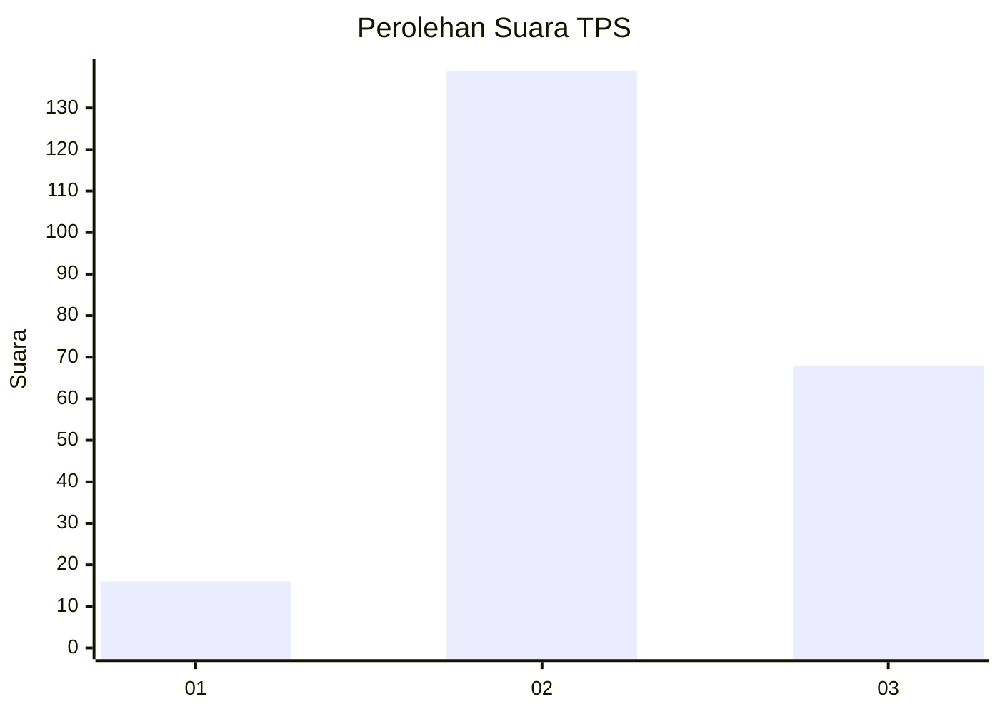
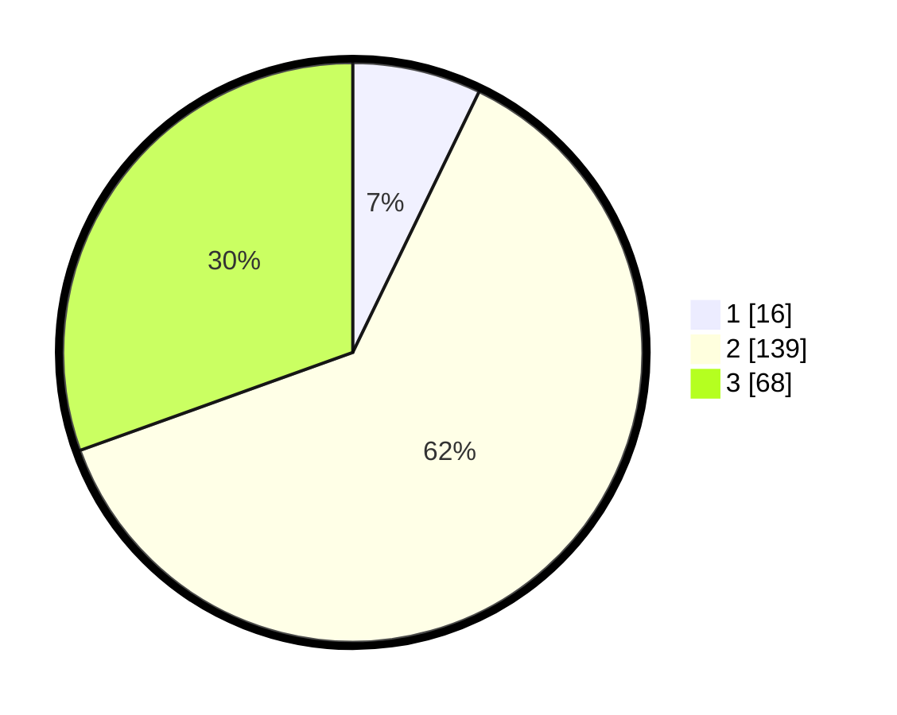

# Hasil

## Grafik

## Tabel

| No. | Nama Paslon    | Suara | Suara (raw) | Persentase |
|:--- |:-------------- | -----:| -----------:| ----------:|
| 1   | ANIES MUHAIMIN | 16    | [16][p-1]   | 7,17       |
| 2   | PRABOWO GIBRAN | 139   | [139][p-2]  | 62,33      |
| 3   | GANJAR MAHFUD  | 68    | [68][p-3]   | 30,49      |

[p-1]: https://github.com/gigit-pemilu/pemilu-2024-51-bali/blob/main/pilpres/hitung-suara/sub/51-bali/sub/03-badung/sub/05-kuta-selatan/sub/1004-benoa/sub/056-tps/sub/paslon-1.txt
[p-2]: https://github.com/gigit-pemilu/pemilu-2024-51-bali/blob/main/pilpres/hitung-suara/sub/51-bali/sub/03-badung/sub/05-kuta-selatan/sub/1004-benoa/sub/056-tps/sub/paslon-2.txt
[p-3]: https://github.com/gigit-pemilu/pemilu-2024-51-bali/blob/main/pilpres/hitung-suara/sub/51-bali/sub/03-badung/sub/05-kuta-selatan/sub/1004-benoa/sub/056-tps/sub/paslon-3.txt

## Foto C Plano

https://sirekap-obj-formc.kpu.go.id/76ae/pemilu/ppwp/51/03/05/10/04/5103051004056-20240214-132751--d0b574ff-a0c2-4ddf-b405-930fb7e45b9b.jpg

https://sirekap-obj-formc.kpu.go.id/76ae/pemilu/ppwp/51/03/05/10/04/5103051004056-20240214-133113--78f698fd-9634-4ffd-b124-7d48807ace1c.jpg

https://sirekap-obj-formc.kpu.go.id/76ae/pemilu/ppwp/51/03/05/10/04/5103051004056-20240216-120720--76833572-ba30-4af4-b93d-8ed280d9c609.jpg

## Metadata

| Key        | Value               |
| ---------- | ------------------- |
| Time Stamp | 2024-02-16 12:51:22 |

## DATA PEMILIH TETAP

Jumlah pemilih dalam DPT: **291**.
 * L: **147**.
 * P: **144**.

## DATA PENGGUNA HAK PILIH

Jumlah pengguna hak pilih dalam DPT: **208**.
 * L: **109**.
 * P: **99**.

Jumlah pengguna hak pilih dalam DPTb: **7**.
 * L: **4**.
 * P: **3**.

Jumlah pengguna hak pilih dalam DPK: **8**.
 * L: **4**.
 * P: **4**.

Jumlah pengguna hak pilih: **223**.
 * L: **117**.
 * P: **106**.

## JUMLAH SUARA SAH DAN TIDAK SAH

JUMLAH SELURUH SUARA SAH: **223**.

JUMLAH SUARA TIDAK SAH: **0**.

JUMLAH SELURUH SUARA SAH DAN SUARA TIDAK SAH: **223**.

