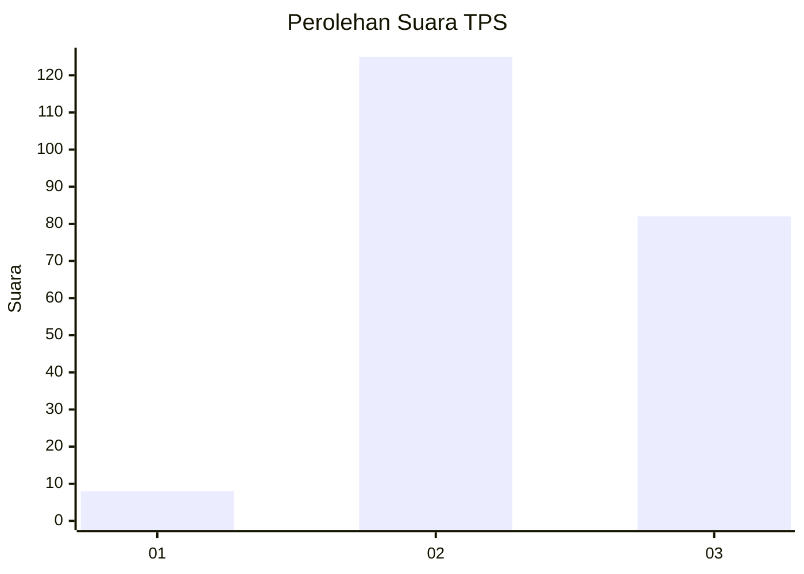
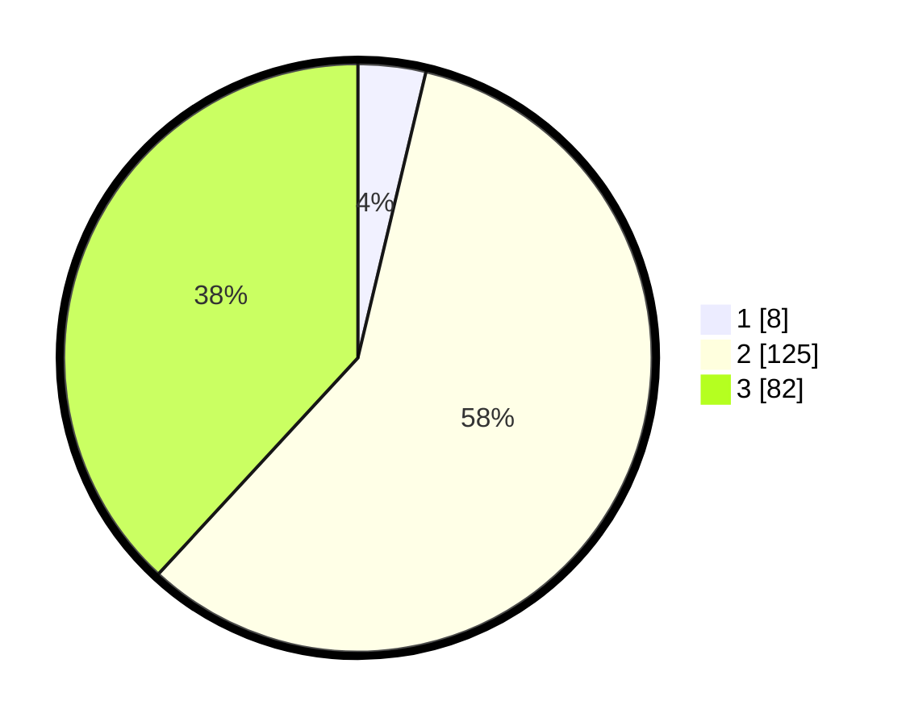

# Hasil

## Grafik

## Tabel

| No. | Nama Paslon    | Suara | Suara (raw) | Persentase |
|:--- |:-------------- | -----:| -----------:| ----------:|
| 1   | ANIES MUHAIMIN | 8     | [8][p-1]    | 3,72       |
| 2   | PRABOWO GIBRAN | 125   | [125][p-2]  | 58,14      |
| 3   | GANJAR MAHFUD  | 82    | [82][p-3]   | 38,14      |

[p-1]: https://github.com/gigit-pemilu/pemilu-2024-51-bali/blob/main/pilpres/hitung-suara/sub/51-bali/sub/03-badung/sub/05-kuta-selatan/sub/1004-benoa/sub/057-tps/sub/paslon-1.txt
[p-2]: https://github.com/gigit-pemilu/pemilu-2024-51-bali/blob/main/pilpres/hitung-suara/sub/51-bali/sub/03-badung/sub/05-kuta-selatan/sub/1004-benoa/sub/057-tps/sub/paslon-2.txt
[p-3]: https://github.com/gigit-pemilu/pemilu-2024-51-bali/blob/main/pilpres/hitung-suara/sub/51-bali/sub/03-badung/sub/05-kuta-selatan/sub/1004-benoa/sub/057-tps/sub/paslon-3.txt

## Foto C Plano

https://sirekap-obj-formc.kpu.go.id/9d3f/pemilu/ppwp/51/03/05/10/04/5103051004057-20240214-141800--c44c85f8-0fe9-42e6-8175-da6184b3137a.jpg

https://sirekap-obj-formc.kpu.go.id/9d3f/pemilu/ppwp/51/03/05/10/04/5103051004057-20240214-141854--665dc306-2a17-4648-8b09-9300f082d5cb.jpg

https://sirekap-obj-formc.kpu.go.id/9d3f/pemilu/ppwp/51/03/05/10/04/5103051004057-20240214-194800--eb4a3907-1879-4b38-8fae-b7bddd29cc55.jpg

## Metadata

| Key        | Value               |
| ---------- | ------------------- |
| Time Stamp | 2024-02-21 12:00:00 |

## DATA PEMILIH TETAP

Jumlah pemilih dalam DPT: **289**.
 * L: **138**.
 * P: **151**.

## DATA PENGGUNA HAK PILIH

Jumlah pengguna hak pilih dalam DPT: **205**.
 * L: **95**.
 * P: **110**.

Jumlah pengguna hak pilih dalam DPTb: **10**.
 * L: **3**.
 * P: **7**.

Jumlah pengguna hak pilih dalam DPK: **3**.
 * L: **1**.
 * P: **2**.

Jumlah pengguna hak pilih: **218**.
 * L: **99**.
 * P: **119**.

## JUMLAH SUARA SAH DAN TIDAK SAH

JUMLAH SELURUH SUARA SAH: **215**.

JUMLAH SUARA TIDAK SAH: **3**.

JUMLAH SELURUH SUARA SAH DAN SUARA TIDAK SAH: **218**.

