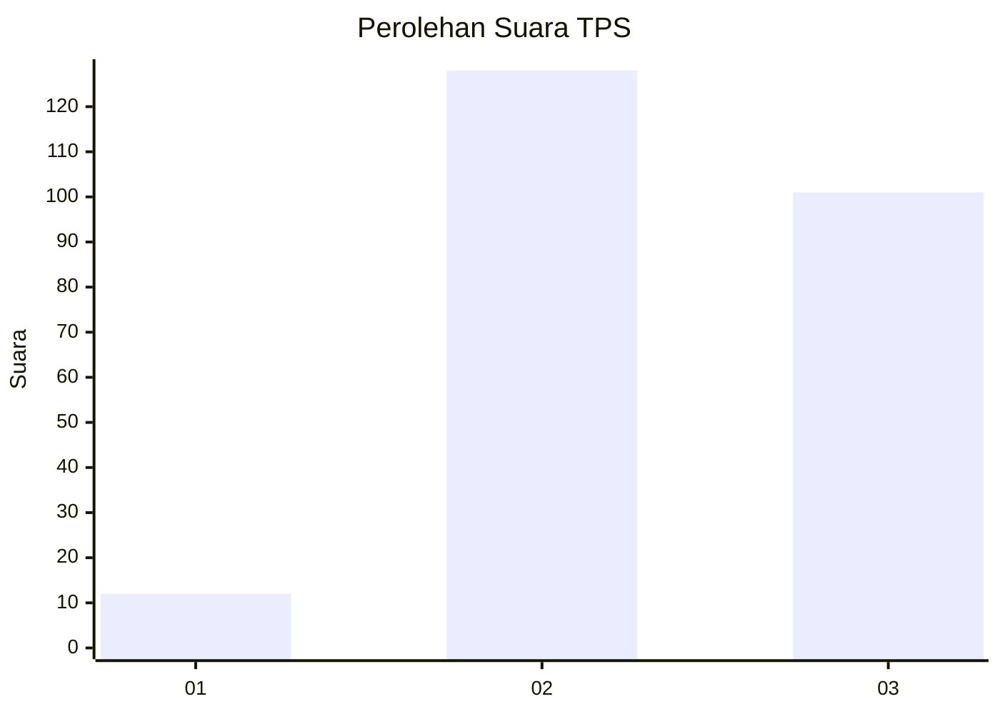
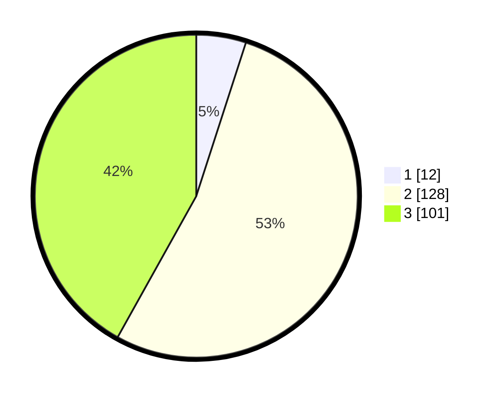

# Hasil

## Grafik

## Tabel

| No. | Nama Paslon    | Suara | Suara (raw) | Persentase |
|:--- |:-------------- | -----:| -----------:| ----------:|
| 1   | ANIES MUHAIMIN | 12    | [12][p-1]   | 4,98       |
| 2   | PRABOWO GIBRAN | 128   | [128][p-2]  | 53,11      |
| 3   | GANJAR MAHFUD  | 101   | [101][p-3]  | 41,91      |

[p-1]: https://github.com/gigit-pemilu/pemilu-2024-51-bali/blob/main/pilpres/hitung-suara/sub/51-bali/sub/03-badung/sub/05-kuta-selatan/sub/1004-benoa/sub/058-tps/sub/paslon-1.txt
[p-2]: https://github.com/gigit-pemilu/pemilu-2024-51-bali/blob/main/pilpres/hitung-suara/sub/51-bali/sub/03-badung/sub/05-kuta-selatan/sub/1004-benoa/sub/058-tps/sub/paslon-2.txt
[p-3]: https://github.com/gigit-pemilu/pemilu-2024-51-bali/blob/main/pilpres/hitung-suara/sub/51-bali/sub/03-badung/sub/05-kuta-selatan/sub/1004-benoa/sub/058-tps/sub/paslon-3.txt

## Foto C Plano

https://sirekap-obj-formc.kpu.go.id/66bb/pemilu/ppwp/51/03/05/10/04/5103051004058-20240214-202751--b8e97066-a1f9-4b90-a361-caacc2bd3853.jpg

https://sirekap-obj-formc.kpu.go.id/66bb/pemilu/ppwp/51/03/05/10/04/5103051004058-20240214-204527--0af9ae47-1dc7-4be0-8ca9-a0b9091bf209.jpg

https://sirekap-obj-formc.kpu.go.id/66bb/pemilu/ppwp/51/03/05/10/04/5103051004058-20240214-205314--1a8cded4-b964-4c5b-83a9-fb06004b8067.jpg

## Metadata

| Key        | Value               |
| ---------- | ------------------- |
| Time Stamp | 2024-02-24 22:31:28 |

## DATA PEMILIH TETAP

Jumlah pemilih dalam DPT: **289**.
 * L: **143**.
 * P: **146**.

## DATA PENGGUNA HAK PILIH

Jumlah pengguna hak pilih dalam DPT: **225**.
 * L: **117**.
 * P: **108**.

Jumlah pengguna hak pilih dalam DPTb: **7**.
 * L: **4**.
 * P: **3**.

Jumlah pengguna hak pilih dalam DPK: **13**.
 * L: **7**.
 * P: **6**.

Jumlah pengguna hak pilih: **245**.
 * L: **128**.
 * P: **117**.

## JUMLAH SUARA SAH DAN TIDAK SAH

JUMLAH SELURUH SUARA SAH: **241**.

JUMLAH SUARA TIDAK SAH: **4**.

JUMLAH SELURUH SUARA SAH DAN SUARA TIDAK SAH: **245**.

