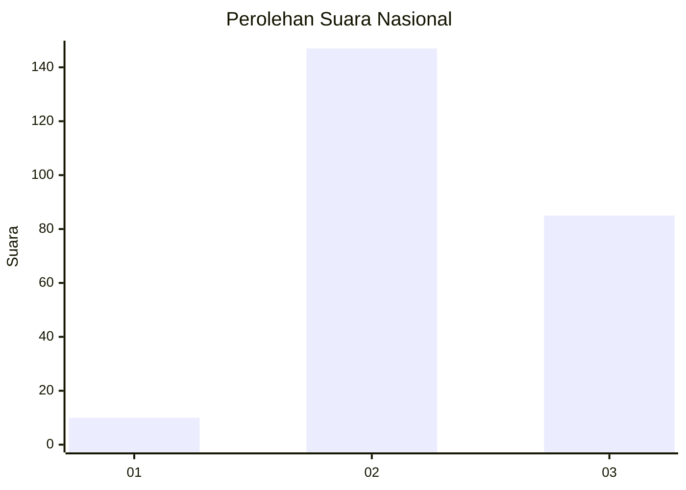
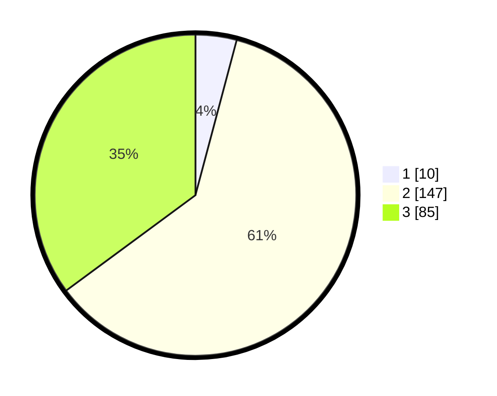

# Hasil

## Grafik

## Tabel

| No. | Nama Paslon    | Suara | Suara (raw) | Persentase |
|:--- |:-------------- | -----:| -----------:| ----------:|
| 1   | ANIES MUHAIMIN | 10    | [10][p-1]   | 4,13       |
| 2   | PRABOWO GIBRAN | 147   | [147][p-2]  | 60,74      |
| 3   | GANJAR MAHFUD  | 85    | [85][p-3]   | 35,12      |

[p-1]: https://github.com/gigit-pemilu/pemilu-2024/blob/main/pilpres/hitung-suara/sub/51-bali/sub/03-badung/sub/05-kuta-selatan/sub/1004-benoa/sub/061-tps/sub/paslon-1.txt
[p-2]: https://github.com/gigit-pemilu/pemilu-2024/blob/main/pilpres/hitung-suara/sub/51-bali/sub/03-badung/sub/05-kuta-selatan/sub/1004-benoa/sub/061-tps/sub/paslon-2.txt
[p-3]: https://github.com/gigit-pemilu/pemilu-2024/blob/main/pilpres/hitung-suara/sub/51-bali/sub/03-badung/sub/05-kuta-selatan/sub/1004-benoa/sub/061-tps/sub/paslon-3.txt

## Foto C Plano

https://sirekap-obj-formc.kpu.go.id/8b41/pemilu/ppwp/51/03/05/10/04/5103051004061-20240214-215911--1f63b76b-df23-40cf-ba85-c26654c4f234.jpg

https://sirekap-obj-formc.kpu.go.id/8b41/pemilu/ppwp/51/03/05/10/04/5103051004061-20240214-215430--12daef8b-3a50-4645-a426-b30370c23038.jpg

## Metadata

| Key        | Value               |
| ---------- | ------------------- |
| Time Stamp | 2024-02-21 12:00:00 |

