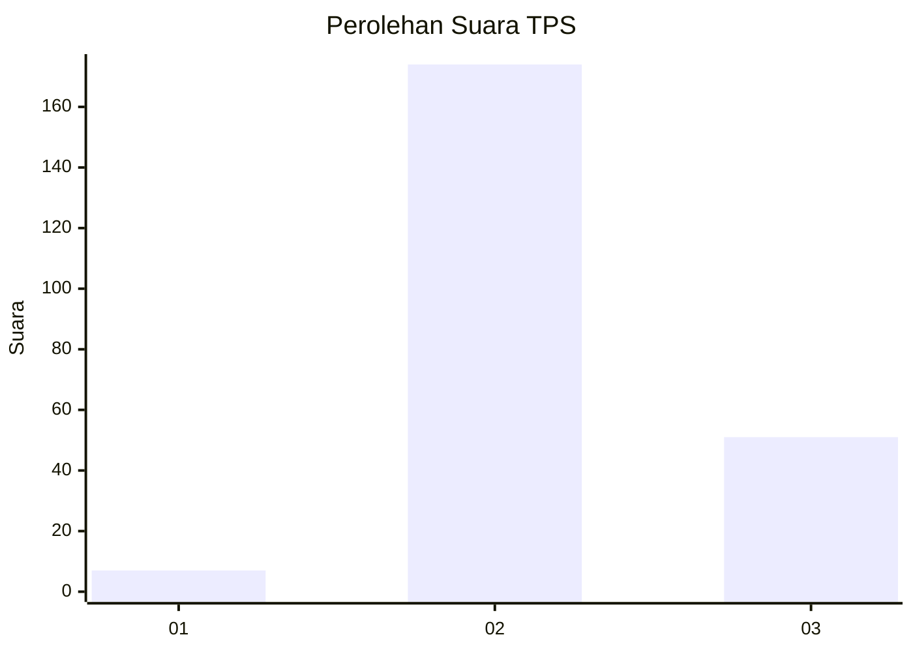
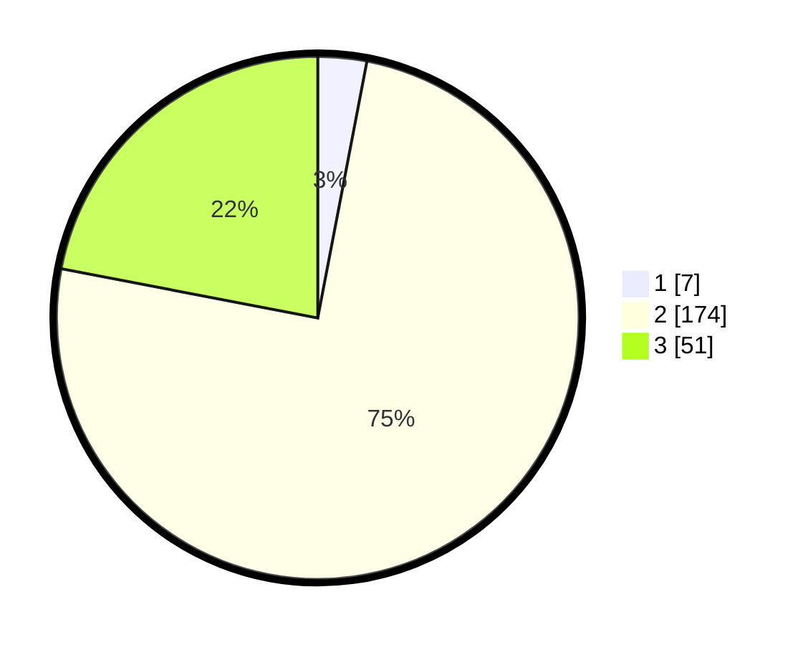

# Hasil

## Grafik

## Tabel

| No. | Nama Paslon    | Suara | Suara (raw) | Persentase |
|:--- |:-------------- | -----:| -----------:| ----------:|
| 1   | ANIES MUHAIMIN | 7     | [7][p-1]    | 3,02       |
| 2   | PRABOWO GIBRAN | 174   | [174][p-2]  | 75,00      |
| 3   | GANJAR MAHFUD  | 51    | [51][p-3]   | 21,98      |

[p-1]: https://github.com/gigit-pemilu/pemilu-2024-51-bali/blob/main/pilpres/hitung-suara/sub/51-bali/sub/03-badung/sub/05-kuta-selatan/sub/1004-benoa/sub/066-tps/sub/paslon-1.txt
[p-2]: https://github.com/gigit-pemilu/pemilu-2024-51-bali/blob/main/pilpres/hitung-suara/sub/51-bali/sub/03-badung/sub/05-kuta-selatan/sub/1004-benoa/sub/066-tps/sub/paslon-2.txt
[p-3]: https://github.com/gigit-pemilu/pemilu-2024-51-bali/blob/main/pilpres/hitung-suara/sub/51-bali/sub/03-badung/sub/05-kuta-selatan/sub/1004-benoa/sub/066-tps/sub/paslon-3.txt

## Foto C Plano

https://sirekap-obj-formc.kpu.go.id/baaa/pemilu/ppwp/51/03/05/10/04/5103051004066-20240214-192818--b82be3cb-7dea-48a0-89d1-8e97da68c1d3.jpg

https://sirekap-obj-formc.kpu.go.id/baaa/pemilu/ppwp/51/03/05/10/04/5103051004066-20240214-195456--3b44729f-79e7-4646-b91b-264e146675e3.jpg

https://sirekap-obj-formc.kpu.go.id/baaa/pemilu/ppwp/51/03/05/10/04/5103051004066-20240214-195611--09a376e9-488f-4704-809a-5ab010e00621.jpg

## Metadata

| Key        | Value               |
| ---------- | ------------------- |
| Time Stamp | 2024-02-25 18:00:00 |

