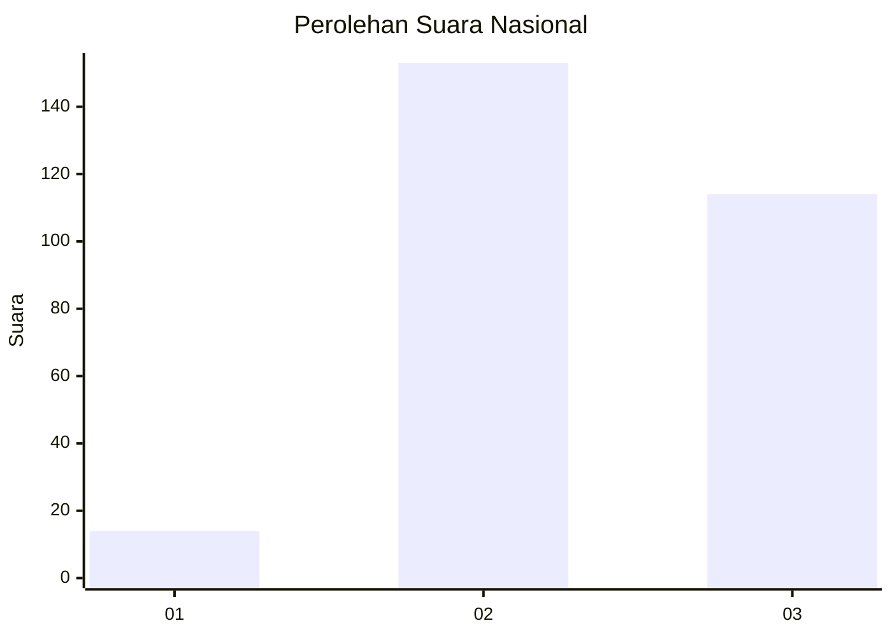
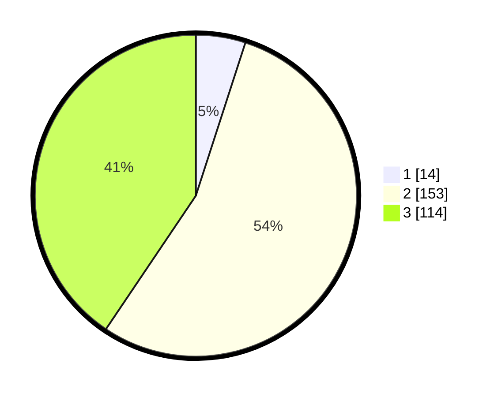

# Hasil

## Grafik

## Tabel

| No. | Nama Paslon    | Suara | Suara (raw) | Persentase |
|:--- |:-------------- | -----:| -----------:| ----------:|
| 1   | ANIES MUHAIMIN | 14    | [14][p-1]   | 4,98       |
| 2   | PRABOWO GIBRAN | 153   | [153][p-2]  | 54,45      |
| 3   | GANJAR MAHFUD  | 114   | [114][p-3]  | 40,57      |

[p-1]: https://github.com/gigit-pemilu/pemilu-2024/blob/main/pilpres/hitung-suara/sub/51-bali/sub/03-badung/sub/05-kuta-selatan/sub/1004-benoa/sub/068-tps/sub/paslon-1.txt
[p-2]: https://github.com/gigit-pemilu/pemilu-2024/blob/main/pilpres/hitung-suara/sub/51-bali/sub/03-badung/sub/05-kuta-selatan/sub/1004-benoa/sub/068-tps/sub/paslon-2.txt
[p-3]: https://github.com/gigit-pemilu/pemilu-2024/blob/main/pilpres/hitung-suara/sub/51-bali/sub/03-badung/sub/05-kuta-selatan/sub/1004-benoa/sub/068-tps/sub/paslon-3.txt

## Foto C Plano

https://sirekap-obj-formc.kpu.go.id/e6a1/pemilu/ppwp/51/03/05/10/04/5103051004068-20240215-232620--41664513-6c63-41e4-ac78-e61c05975409.jpg

https://sirekap-obj-formc.kpu.go.id/e6a1/pemilu/ppwp/51/03/05/10/04/5103051004068-20240215-232623--e5313b75-f0c9-4681-8e39-af546b6ea536.jpg

https://sirekap-obj-formc.kpu.go.id/e6a1/pemilu/ppwp/51/03/05/10/04/5103051004068-20240215-232622--c8103c3e-a8bc-474c-880b-5d6e4d1cb353.jpg

## Metadata

| Key        | Value               |
| ---------- | ------------------- |
| Time Stamp | 2024-02-21 13:00:00 |

## DATA PEMILIH TETAP

Jumlah pemilih dalam DPT: **295**.
 * L: **142**.
 * P: **153**.

## DATA PENGGUNA HAK PILIH

Jumlah pengguna hak pilih dalam DPT: **272**.
 * L: **132**.
 * P: **140**.

Jumlah pengguna hak pilih dalam DPTb: **3**.
 * L: **2**.
 * P: **1**.

Jumlah pengguna hak pilih dalam DPK: **6**.
 * L: **3**.
 * P: **3**.

Jumlah pengguna hak pilih: **281**.
 * L: **137**.
 * P: **144**.

## JUMLAH SUARA SAH DAN TIDAK SAH

JUMLAH SELURUH SUARA SAH: **281**.

JUMLAH SUARA TIDAK SAH: **0**.

JUMLAH SELURUH SUARA SAH DAN SUARA TIDAK SAH: **281**.

