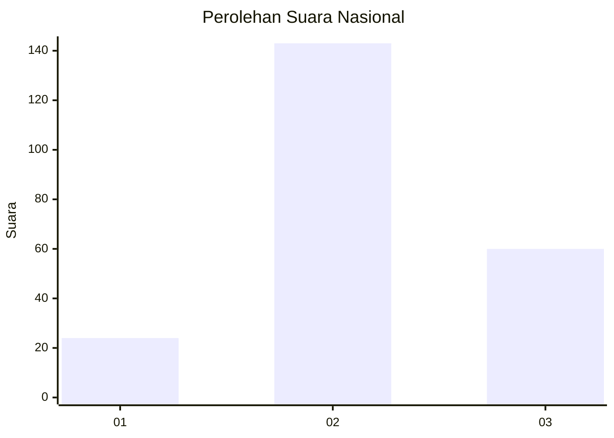
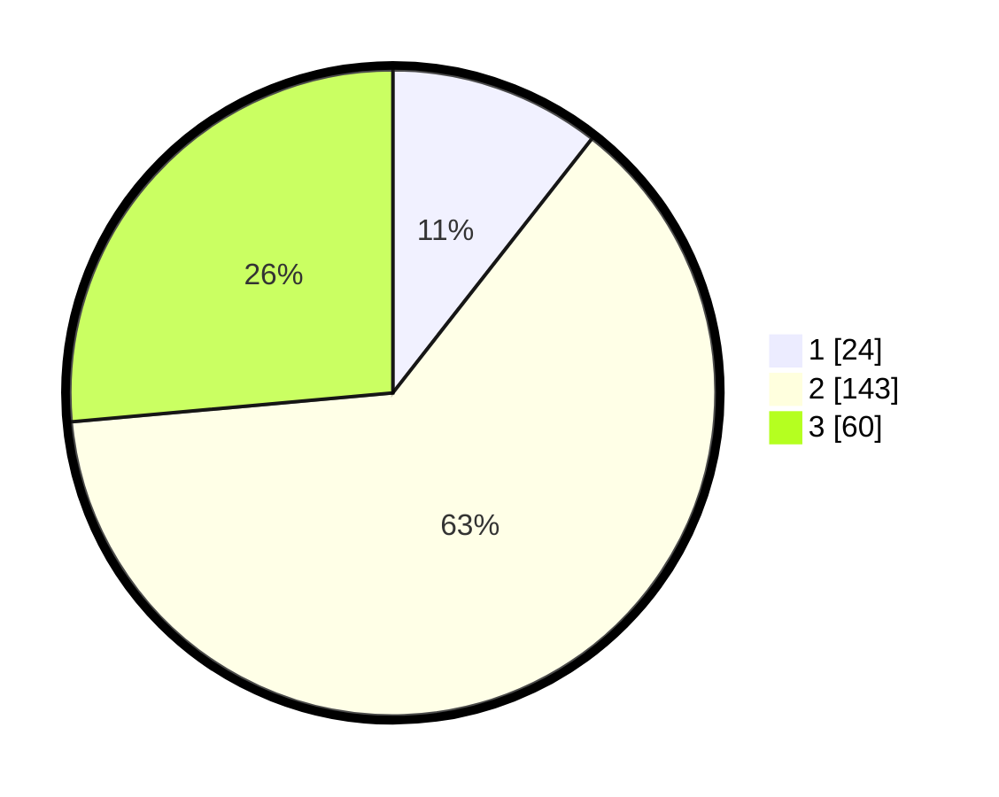

# Hasil

## Grafik

## Tabel

| No. | Nama Paslon    | Suara | Suara (raw) | Persentase |
|:--- |:-------------- | -----:| -----------:| ----------:|
| 1   | ANIES MUHAIMIN | 24    | [24][p-1]   | 10,57      |
| 2   | PRABOWO GIBRAN | 143   | [143][p-2]  | 63,00      |
| 3   | GANJAR MAHFUD  | 60    | [60][p-3]   | 26,43      |

[p-1]: https://github.com/gigit-pemilu/pemilu-2024/blob/main/pilpres/hitung-suara/sub/51-bali/sub/03-badung/sub/05-kuta-selatan/sub/1004-benoa/sub/069-tps/sub/paslon-1.txt
[p-2]: https://github.com/gigit-pemilu/pemilu-2024/blob/main/pilpres/hitung-suara/sub/51-bali/sub/03-badung/sub/05-kuta-selatan/sub/1004-benoa/sub/069-tps/sub/paslon-2.txt
[p-3]: https://github.com/gigit-pemilu/pemilu-2024/blob/main/pilpres/hitung-suara/sub/51-bali/sub/03-badung/sub/05-kuta-selatan/sub/1004-benoa/sub/069-tps/sub/paslon-3.txt

## Foto C Plano

https://sirekap-obj-formc.kpu.go.id/c5c5/pemilu/ppwp/51/03/05/10/04/5103051004069-20240215-114707--d488eda8-64f6-48c0-a766-744a37945265.jpg

https://sirekap-obj-formc.kpu.go.id/c5c5/pemilu/ppwp/51/03/05/10/04/5103051004069-20240215-114725--acbf31f6-a155-4583-93db-bda94882f591.jpg

https://sirekap-obj-formc.kpu.go.id/c5c5/pemilu/ppwp/51/03/05/10/04/5103051004069-20240215-114728--d6188a0e-32f0-4777-9521-a3cbe0583f07.jpg

## Metadata

| Key        | Value               |
| ---------- | ------------------- |
| Time Stamp | 2024-02-24 22:31:28 |

