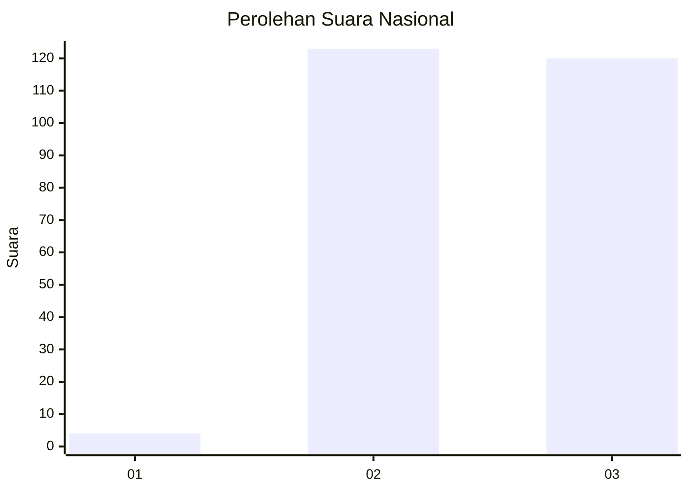
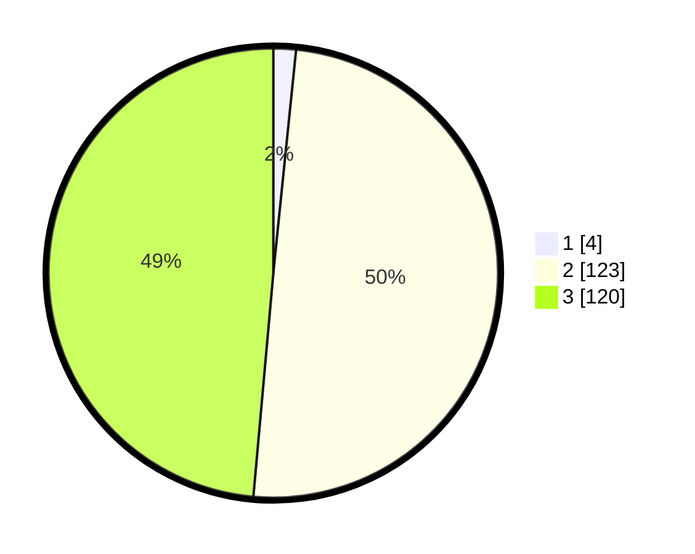

# Hasil

## Grafik

## Tabel

| No. | Nama Paslon    | Suara | Suara (raw) | Persentase |
|:--- |:-------------- | -----:| -----------:| ----------:|
| 1   | ANIES MUHAIMIN | 4     | [4][p-1]    | 1,62       |
| 2   | PRABOWO GIBRAN | 123   | [123][p-2]  | 49,80      |
| 3   | GANJAR MAHFUD  | 120   | [120][p-3]  | 48,58      |

[p-1]: https://github.com/gigit-pemilu/pemilu-2024/blob/main/pilpres/hitung-suara/sub/51-bali/sub/03-badung/sub/05-kuta-selatan/sub/1004-benoa/sub/070-tps/sub/paslon-1.txt
[p-2]: https://github.com/gigit-pemilu/pemilu-2024/blob/main/pilpres/hitung-suara/sub/51-bali/sub/03-badung/sub/05-kuta-selatan/sub/1004-benoa/sub/070-tps/sub/paslon-2.txt
[p-3]: https://github.com/gigit-pemilu/pemilu-2024/blob/main/pilpres/hitung-suara/sub/51-bali/sub/03-badung/sub/05-kuta-selatan/sub/1004-benoa/sub/070-tps/sub/paslon-3.txt

## Foto C Plano

https://sirekap-obj-formc.kpu.go.id/9472/pemilu/ppwp/51/03/05/10/04/5103051004070-20240214-225742--2829e92b-aad9-4bf0-b2c7-a35c73da714d.jpg

https://sirekap-obj-formc.kpu.go.id/9472/pemilu/ppwp/51/03/05/10/04/5103051004070-20240214-230143--ee65eb8b-b59a-46e1-949e-deea5661299b.jpg

https://sirekap-obj-formc.kpu.go.id/9472/pemilu/ppwp/51/03/05/10/04/5103051004070-20240214-230422--54b41295-a9ca-43db-bb2f-bab90df8d7f4.jpg

## Metadata

| Key        | Value               |
| ---------- | ------------------- |
| Time Stamp | 2024-02-24 22:31:28 |

