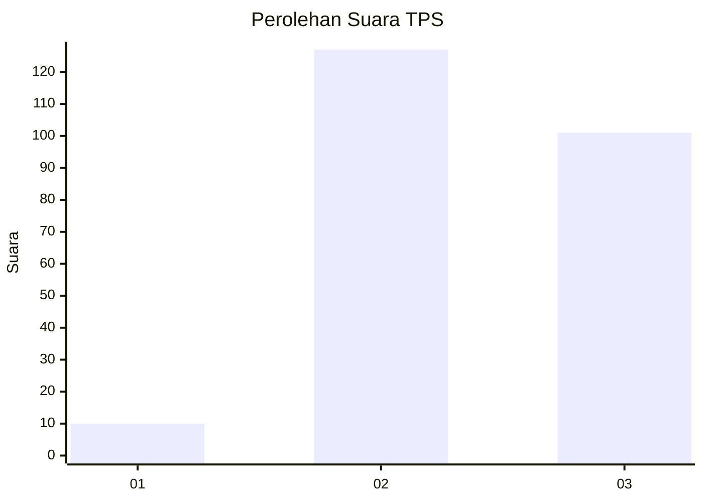
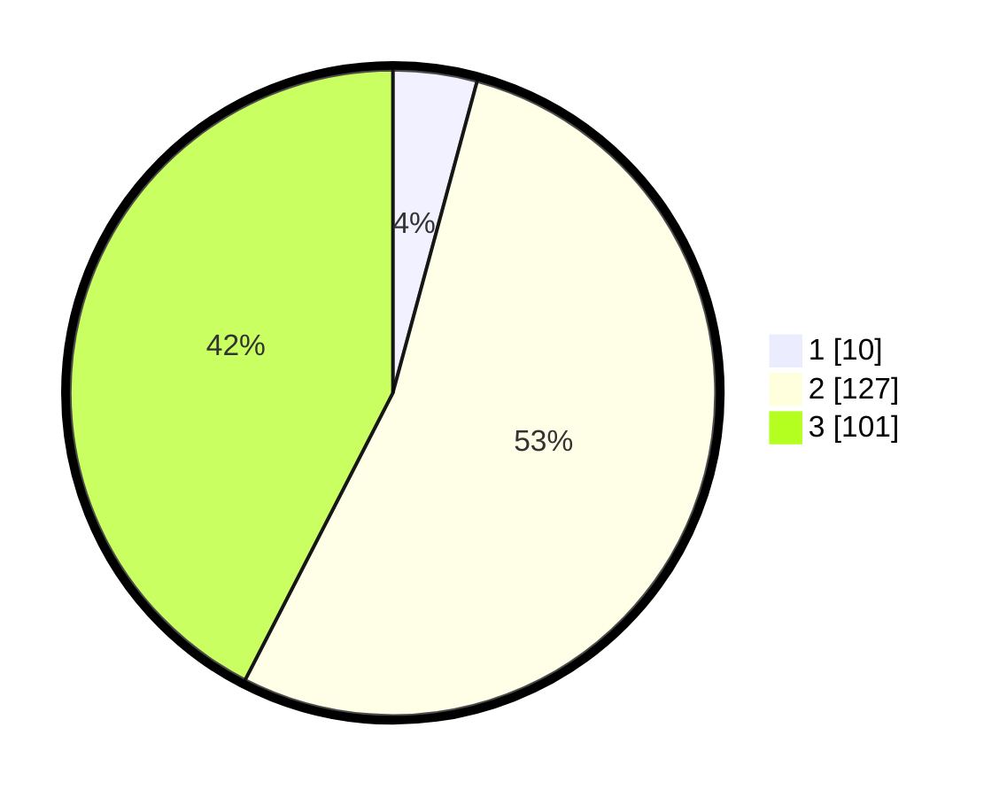

# Hasil

## Grafik

## Tabel

| No. | Nama Paslon    | Suara | Suara (raw) | Persentase |
|:--- |:-------------- | -----:| -----------:| ----------:|
| 1   | ANIES MUHAIMIN | 10    | [10][p-1]   | 4,20       |
| 2   | PRABOWO GIBRAN | 127   | [127][p-2]  | 53,36      |
| 3   | GANJAR MAHFUD  | 101   | [101][p-3]  | 42,44      |

[p-1]: https://github.com/gigit-pemilu/pemilu-2024-51-bali/blob/main/pilpres/hitung-suara/sub/51-bali/sub/03-badung/sub/05-kuta-selatan/sub/1004-benoa/sub/072-tps/sub/paslon-1.txt
[p-2]: https://github.com/gigit-pemilu/pemilu-2024-51-bali/blob/main/pilpres/hitung-suara/sub/51-bali/sub/03-badung/sub/05-kuta-selatan/sub/1004-benoa/sub/072-tps/sub/paslon-2.txt
[p-3]: https://github.com/gigit-pemilu/pemilu-2024-51-bali/blob/main/pilpres/hitung-suara/sub/51-bali/sub/03-badung/sub/05-kuta-selatan/sub/1004-benoa/sub/072-tps/sub/paslon-3.txt

## Foto C Plano

https://sirekap-obj-formc.kpu.go.id/1dad/pemilu/ppwp/51/03/05/10/04/5103051004072-20240214-230447--8030a349-6fab-4dd3-a9cf-e898d7d3bb27.jpg

https://sirekap-obj-formc.kpu.go.id/1dad/pemilu/ppwp/51/03/05/10/04/5103051004072-20240214-230538--266db6dd-a272-4e02-8167-1466c559bd0a.jpg

https://sirekap-obj-formc.kpu.go.id/1dad/pemilu/ppwp/51/03/05/10/04/5103051004072-20240214-230632--c2dc868c-e057-48fb-8887-b18af98a6153.jpg

## Metadata

| Key        | Value               |
| ---------- | ------------------- |
| Time Stamp | 2024-02-24 22:31:28 |

