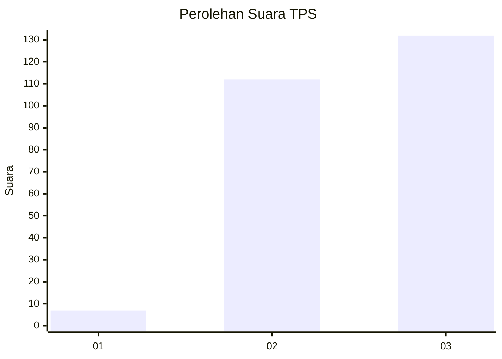
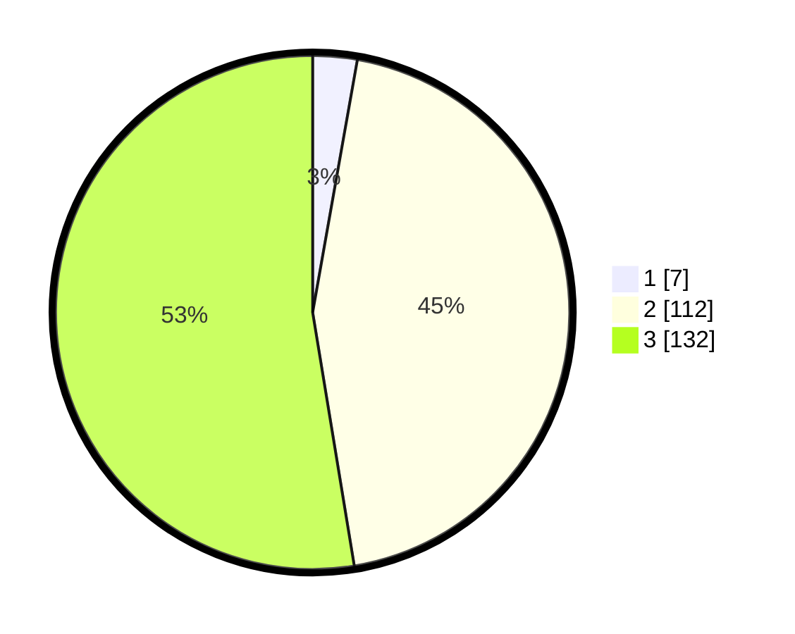

# Hasil

## Grafik

## Tabel

| No. | Nama Paslon    | Suara | Suara (raw) | Persentase |
|:--- |:-------------- | -----:| -----------:| ----------:|
| 1   | ANIES MUHAIMIN | 7     | [7][p-1]    | 2,79       |
| 2   | PRABOWO GIBRAN | 112   | [112][p-2]  | 44,62      |
| 3   | GANJAR MAHFUD  | 132   | [132][p-3]  | 52,59      |

[p-1]: https://github.com/gigit-pemilu/pemilu-2024-51-bali/blob/main/pilpres/hitung-suara/sub/51-bali/sub/03-badung/sub/05-kuta-selatan/sub/1004-benoa/sub/073-tps/sub/paslon-1.txt
[p-2]: https://github.com/gigit-pemilu/pemilu-2024-51-bali/blob/main/pilpres/hitung-suara/sub/51-bali/sub/03-badung/sub/05-kuta-selatan/sub/1004-benoa/sub/073-tps/sub/paslon-2.txt
[p-3]: https://github.com/gigit-pemilu/pemilu-2024-51-bali/blob/main/pilpres/hitung-suara/sub/51-bali/sub/03-badung/sub/05-kuta-selatan/sub/1004-benoa/sub/073-tps/sub/paslon-3.txt

## Foto C Plano

https://sirekap-obj-formc.kpu.go.id/b9ff/pemilu/ppwp/51/03/05/10/04/5103051004073-20240214-230654--23eb50ca-e300-4f88-a404-4c27ec40cc12.jpg

https://sirekap-obj-formc.kpu.go.id/b9ff/pemilu/ppwp/51/03/05/10/04/5103051004073-20240214-231010--10980719-4fa4-40ed-be5f-425a707962fb.jpg

https://sirekap-obj-formc.kpu.go.id/b9ff/pemilu/ppwp/51/03/05/10/04/5103051004073-20240214-231135--dfb30e4a-76a5-409f-993a-952866e8bc6a.jpg

## Metadata

| Key        | Value               |
| ---------- | ------------------- |
| Time Stamp | 2024-02-24 22:31:28 |

