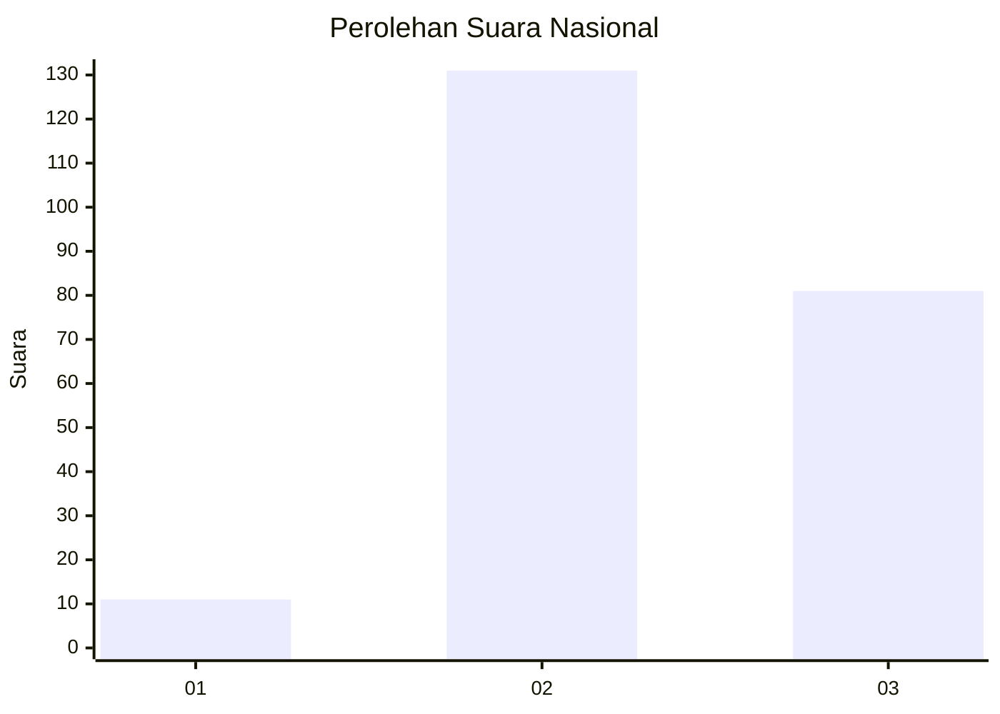
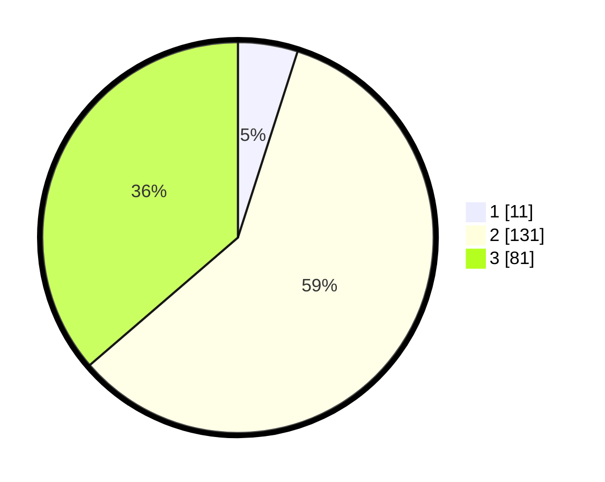

# Hasil

## Grafik

## Tabel

| No. | Nama Paslon    | Suara | Suara (raw) | Persentase |
|:--- |:-------------- | -----:| -----------:| ----------:|
| 1   | ANIES MUHAIMIN | 11    | [11][p-1]   | 4,93       |
| 2   | PRABOWO GIBRAN | 131   | [131][p-2]  | 58,74      |
| 3   | GANJAR MAHFUD  | 81    | [81][p-3]   | 36,32      |

[p-1]: https://github.com/gigit-pemilu/pemilu-2024/blob/main/pilpres/hitung-suara/sub/51-bali/sub/03-badung/sub/05-kuta-selatan/sub/1004-benoa/sub/074-tps/sub/paslon-1.txt
[p-2]: https://github.com/gigit-pemilu/pemilu-2024/blob/main/pilpres/hitung-suara/sub/51-bali/sub/03-badung/sub/05-kuta-selatan/sub/1004-benoa/sub/074-tps/sub/paslon-2.txt
[p-3]: https://github.com/gigit-pemilu/pemilu-2024/blob/main/pilpres/hitung-suara/sub/51-bali/sub/03-badung/sub/05-kuta-selatan/sub/1004-benoa/sub/074-tps/sub/paslon-3.txt

## Foto C Plano

https://sirekap-obj-formc.kpu.go.id/0bfe/pemilu/ppwp/51/03/05/10/04/5103051004074-20240216-083103--b3a17657-1e79-4eb7-924a-c6ce306012e2.jpg

https://sirekap-obj-formc.kpu.go.id/0bfe/pemilu/ppwp/51/03/05/10/04/5103051004074-20240216-021617--59972e85-7607-4831-96dd-1f2bd8234ad2.jpg

https://sirekap-obj-formc.kpu.go.id/0bfe/pemilu/ppwp/51/03/05/10/04/5103051004074-20240216-021612--22bc04e7-1b4d-42b5-8dc9-00dcc3b6a3d7.jpg

## Metadata

| Key        | Value               |
| ---------- | ------------------- |
| Time Stamp | 2024-02-21 12:00:00 |

## DATA PEMILIH TETAP

Jumlah pemilih dalam DPT: **299**.
 * L: **153**.
 * P: **146**.

## DATA PENGGUNA HAK PILIH

Jumlah pengguna hak pilih dalam DPT: **219**.
 * L: **117**.
 * P: **102**.

Jumlah pengguna hak pilih dalam DPTb: **7**.
 * L: **3**.
 * P: **4**.

Jumlah pengguna hak pilih dalam DPK: **0**.
 * L: **0**.
 * P: **0**.

Jumlah pengguna hak pilih: **226**.
 * L: **120**.
 * P: **106**.

## JUMLAH SUARA SAH DAN TIDAK SAH

JUMLAH SELURUH SUARA SAH: **223**.

JUMLAH SUARA TIDAK SAH: **3**.

JUMLAH SELURUH SUARA SAH DAN SUARA TIDAK SAH: **226**.

