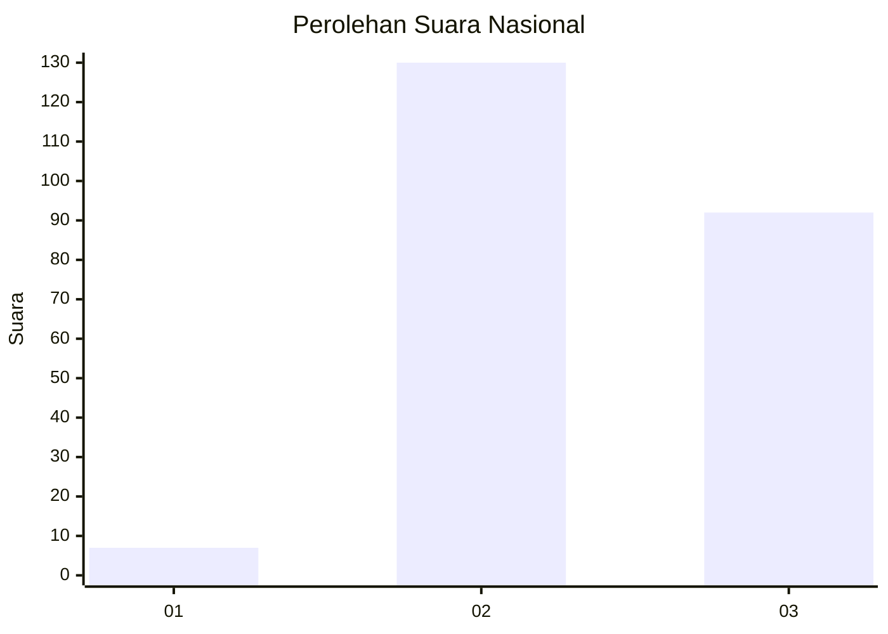
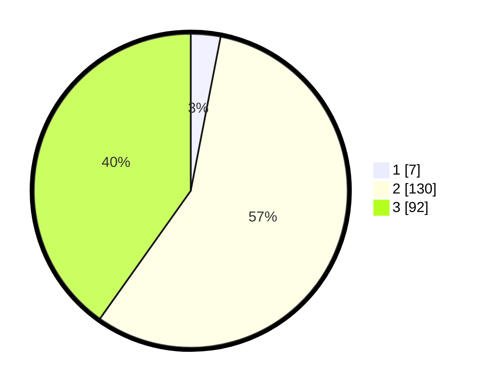

# Hasil

## Grafik

## Tabel

| No. | Nama Paslon    | Suara | Suara (raw) | Persentase |
|:--- |:-------------- | -----:| -----------:| ----------:|
| 1   | ANIES MUHAIMIN | 7     | [7][p-1]    | 3,06       |
| 2   | PRABOWO GIBRAN | 130   | [130][p-2]  | 56,77      |
| 3   | GANJAR MAHFUD  | 92    | [92][p-3]   | 40,17      |

[p-1]: https://github.com/gigit-pemilu/pemilu-2024/blob/main/pilpres/hitung-suara/sub/51-bali/sub/03-badung/sub/05-kuta-selatan/sub/1004-benoa/sub/075-tps/sub/paslon-1.txt
[p-2]: https://github.com/gigit-pemilu/pemilu-2024/blob/main/pilpres/hitung-suara/sub/51-bali/sub/03-badung/sub/05-kuta-selatan/sub/1004-benoa/sub/075-tps/sub/paslon-2.txt
[p-3]: https://github.com/gigit-pemilu/pemilu-2024/blob/main/pilpres/hitung-suara/sub/51-bali/sub/03-badung/sub/05-kuta-selatan/sub/1004-benoa/sub/075-tps/sub/paslon-3.txt

## Foto C Plano

https://sirekap-obj-formc.kpu.go.id/f26d/pemilu/ppwp/51/03/05/10/04/5103051004075-20240214-220856--cefb6fe0-a5a0-4df2-b392-96acf8746964.jpg

https://sirekap-obj-formc.kpu.go.id/f26d/pemilu/ppwp/51/03/05/10/04/5103051004075-20240214-221240--b88edd76-2f0a-44c3-94e1-c2e6bab13e37.jpg

https://sirekap-obj-formc.kpu.go.id/f26d/pemilu/ppwp/51/03/05/10/04/5103051004075-20240214-221334--2b859e96-792a-461b-af51-a736909d7311.jpg

## Metadata

| Key        | Value               |
| ---------- | ------------------- |
| Time Stamp | 2024-02-24 22:31:28 |

