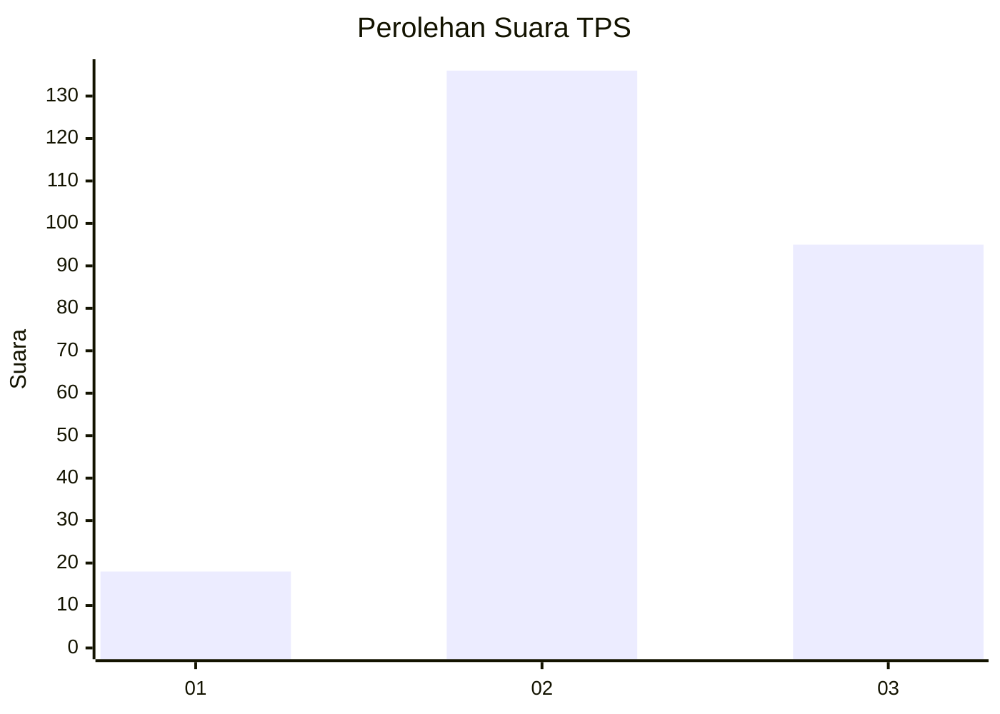
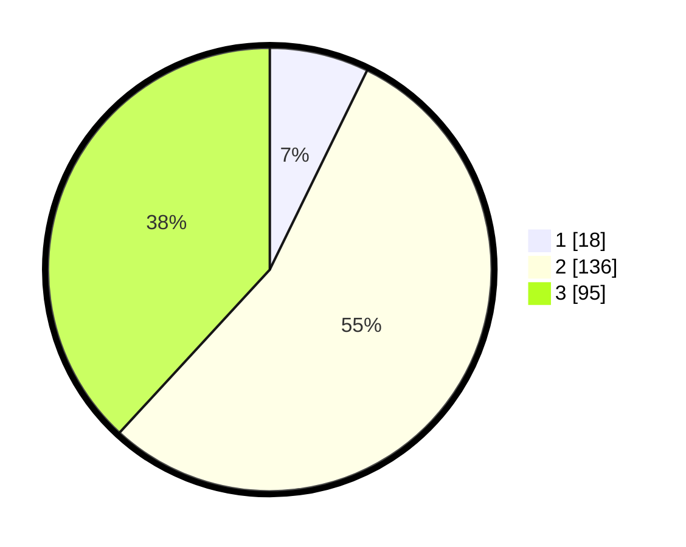

# Hasil

## Grafik

## Tabel

| No. | Nama Paslon    | Suara | Suara (raw) | Persentase |
|:--- |:-------------- | -----:| -----------:| ----------:|
| 1   | ANIES MUHAIMIN | 18    | [18][p-1]   | 7,23       |
| 2   | PRABOWO GIBRAN | 136   | [136][p-2]  | 54,62      |
| 3   | GANJAR MAHFUD  | 95    | [95][p-3]   | 38,15      |

[p-1]: https://github.com/gigit-pemilu/pemilu-2024-51-bali/blob/main/pilpres/hitung-suara/sub/51-bali/sub/03-badung/sub/05-kuta-selatan/sub/1004-benoa/sub/080-tps/sub/paslon-1.txt
[p-2]: https://github.com/gigit-pemilu/pemilu-2024-51-bali/blob/main/pilpres/hitung-suara/sub/51-bali/sub/03-badung/sub/05-kuta-selatan/sub/1004-benoa/sub/080-tps/sub/paslon-2.txt
[p-3]: https://github.com/gigit-pemilu/pemilu-2024-51-bali/blob/main/pilpres/hitung-suara/sub/51-bali/sub/03-badung/sub/05-kuta-selatan/sub/1004-benoa/sub/080-tps/sub/paslon-3.txt

## Foto C Plano

https://sirekap-obj-formc.kpu.go.id/6b6a/pemilu/ppwp/51/03/05/10/04/5103051004080-20240214-201929--b6add0f7-65d7-440d-9d20-00ae2caa2e2f.jpg

https://sirekap-obj-formc.kpu.go.id/6b6a/pemilu/ppwp/51/03/05/10/04/5103051004080-20240214-201034--e002bf00-d2ed-4e5d-9990-fa27a0bd0426.jpg

https://sirekap-obj-formc.kpu.go.id/6b6a/pemilu/ppwp/51/03/05/10/04/5103051004080-20240214-201206--f371f644-9d51-4e15-acb9-cf135c3b0756.jpg

## Metadata

| Key        | Value               |
| ---------- | ------------------- |
| Time Stamp | 2024-02-24 22:31:28 |

