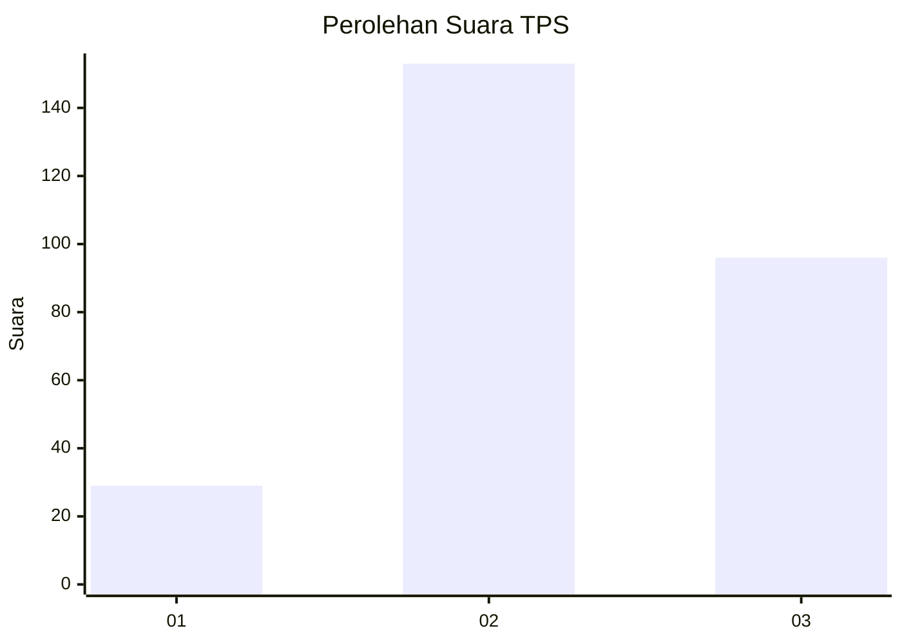
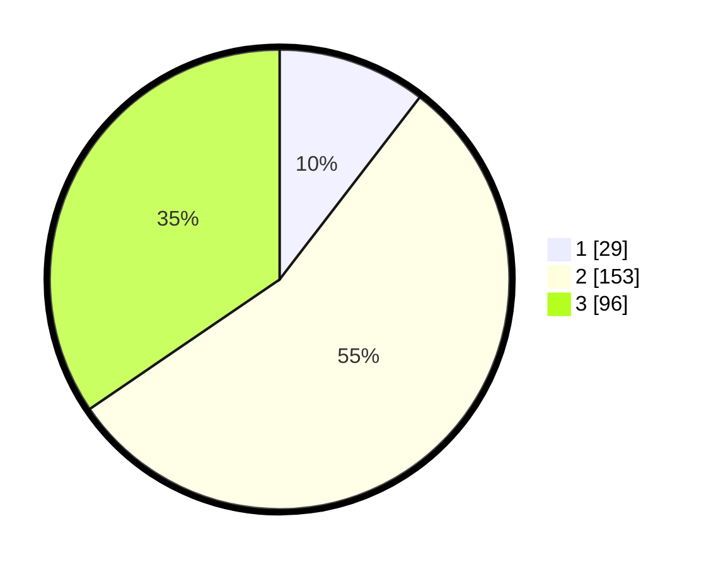

# Hasil

## Grafik

## Tabel

| No. | Nama Paslon    | Suara | Suara (raw) | Persentase |
|:--- |:-------------- | -----:| -----------:| ----------:|
| 1   | ANIES MUHAIMIN | 29    | [29][p-1]   | 10,43      |
| 2   | PRABOWO GIBRAN | 153   | [153][p-2]  | 55,04      |
| 3   | GANJAR MAHFUD  | 96    | [96][p-3]   | 34,53      |

[p-1]: https://github.com/gigit-pemilu/pemilu-2024-51-bali/blob/main/pilpres/hitung-suara/sub/51-bali/sub/03-badung/sub/05-kuta-selatan/sub/1004-benoa/sub/083-tps/sub/paslon-1.txt
[p-2]: https://github.com/gigit-pemilu/pemilu-2024-51-bali/blob/main/pilpres/hitung-suara/sub/51-bali/sub/03-badung/sub/05-kuta-selatan/sub/1004-benoa/sub/083-tps/sub/paslon-2.txt
[p-3]: https://github.com/gigit-pemilu/pemilu-2024-51-bali/blob/main/pilpres/hitung-suara/sub/51-bali/sub/03-badung/sub/05-kuta-selatan/sub/1004-benoa/sub/083-tps/sub/paslon-3.txt

## Foto C Plano

https://sirekap-obj-formc.kpu.go.id/8754/pemilu/ppwp/51/03/05/10/04/5103051004083-20240214-222940--fb5208d4-ab05-4d95-af0e-7309d342d230.jpg

https://sirekap-obj-formc.kpu.go.id/8754/pemilu/ppwp/51/03/05/10/04/5103051004083-20240214-223049--42f14eb2-dd2d-4e08-b5c1-45174071f1f8.jpg

https://sirekap-obj-formc.kpu.go.id/8754/pemilu/ppwp/51/03/05/10/04/5103051004083-20240214-223129--3b489973-e549-4702-9db9-5ac4489ac925.jpg

## Metadata

| Key        | Value               |
| ---------- | ------------------- |
| Time Stamp | 2024-02-24 22:31:28 |

