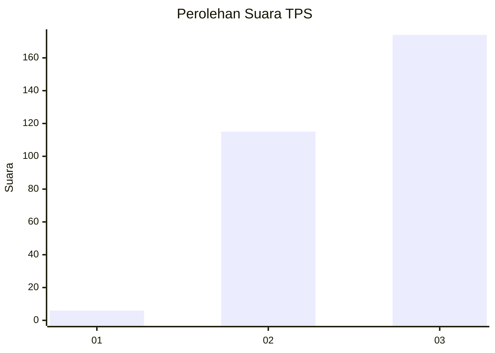
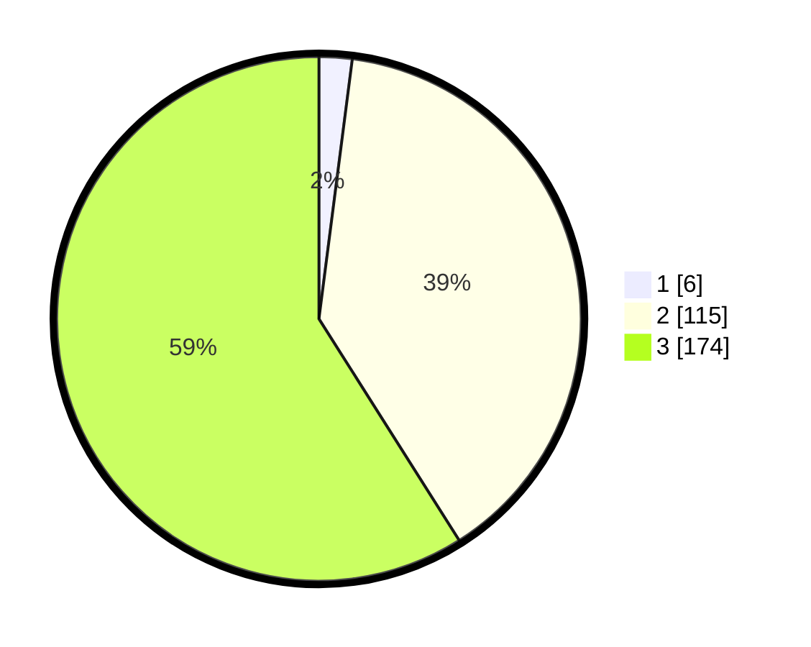

# Hasil

## Grafik

## Tabel

| No. | Nama Paslon    | Suara | Suara (raw) | Persentase |
|:--- |:-------------- | -----:| -----------:| ----------:|
| 1   | ANIES MUHAIMIN | 6     | [6][p-1]    | 2,03       |
| 2   | PRABOWO GIBRAN | 115   | [115][p-2]  | 38,98      |
| 3   | GANJAR MAHFUD  | 174   | [174][p-3]  | 58,98      |

[p-1]: https://github.com/gigit-pemilu/pemilu-2024-51-bali/blob/main/pilpres/hitung-suara/sub/51-bali/sub/03-badung/sub/05-kuta-selatan/sub/1004-benoa/sub/085-tps/sub/paslon-1.txt
[p-2]: https://github.com/gigit-pemilu/pemilu-2024-51-bali/blob/main/pilpres/hitung-suara/sub/51-bali/sub/03-badung/sub/05-kuta-selatan/sub/1004-benoa/sub/085-tps/sub/paslon-2.txt
[p-3]: https://github.com/gigit-pemilu/pemilu-2024-51-bali/blob/main/pilpres/hitung-suara/sub/51-bali/sub/03-badung/sub/05-kuta-selatan/sub/1004-benoa/sub/085-tps/sub/paslon-3.txt

## Foto C Plano

https://sirekap-obj-formc.kpu.go.id/205d/pemilu/ppwp/51/03/05/10/04/5103051004085-20240216-145832--050585b1-8199-4af5-be8d-dc6385f8075a.jpg

https://sirekap-obj-formc.kpu.go.id/205d/pemilu/ppwp/51/03/05/10/04/5103051004085-20240216-153704--413fc7b6-72b8-46f0-b1fe-2989ea27a110.jpg

https://sirekap-obj-formc.kpu.go.id/205d/pemilu/ppwp/51/03/05/10/04/5103051004085-20240216-153328--049f247a-0f66-4504-ab8d-98e94a8e3277.jpg

## Metadata

| Key        | Value               |
| ---------- | ------------------- |
| Time Stamp | 2024-02-21 11:00:00 |

